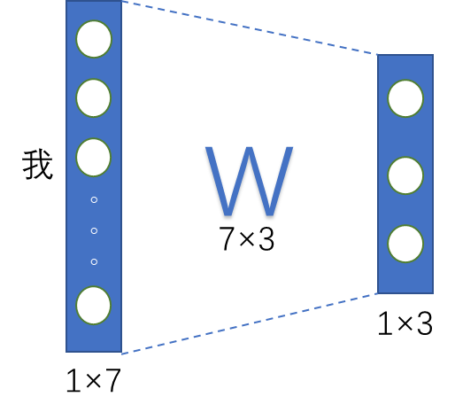
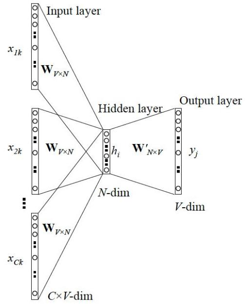

# Homework6：CBOW

## 背景介绍

在自然语言处理领域中，单词的表示方法是使计算机理解我们的文本语言的关键步骤，更是文本分类等多项NLP工作的重要准备。在深度学习方法出现之前，单词表示方法有基于同义词词典的方法、基于计数的方法等[1]。而目前最主流的方法就是使用词向量来表示单词。本文希望通过基于词向量的分布式表示方法对网页介绍文本进行向量化并实现聚类。

基于词向量表示单词的方法都是基于一个简单的先验假设——某个单词的含义由它周围的单词形成，也被称为**“分布式假设”**（Distributional Hypothesis）[2]。单词本身的含义是可以由上下文（语境中）的其他单词来决定的。

这些方法虽然原理简单，并且可以用贴合语言逻辑的手段进行解释，但都需要耗费巨大的人力、计算成本。比如基于计数的方法根据单词周围出现的单词的频数来表示该单词,这就需要生成所有单词的共现矩阵。当单词量较大时，会造成巨大的运算负担。而基于推理的方法使用深度神经网络，只需要学习一部分数据集来更新权重，可以处理词汇量更大的数据库[3]。

 基于推理的方法主要操作就是根据某个单词周围的上下文预测其本身[4]。

文本分类作为信息管理和应用的一种有效手段，主要是根据目标文档的主题或内容，将大量文本按照一定的分类体系或标准，依次归属到一个或多个类别的过程。在支撑主题抽取叫情感分析、舆情分析、垃圾邮件过滤智能问答和推荐系统等方面起着重要的作用[5]。

## CBOW原理介绍

在机器学习任务中，我们经常会使用独热编码（One-Hot Encoding）来表示一些离散的数据。我们同样可以把单词作为离散的特征。使用独热编码，将离散特征的取值扩展到了欧式空间，离散特征的某个取值就对应欧式空间的某个点。将离散型特征使用独热编码，会让特征之间的距离计算更加合理。单词的独热编码表示可表1所示。

| **单词** | **编号** | **One-Hot表示** |
| -------- | -------- | --------------- |
| **我**   | 0        | [1,0,0]         |
| **爱**   | 1        | [0,1,0]         |
| **西电** | 2        | [0,0,1]         |

当我们用独热编码表示单词后，就可以将其作为神经网络的输入。而由于独热编码的表示唯一性，每个单词输入同一个网络得到的输出也保证了唯一性。独热编码向量经过全连接层权重W计算得到输出。神经网络的中间权重W可以被看作单词独热编码的降维表示，能够以更少的空间表示单词。这种表示方法被称为word-embedding，即词向量或者词嵌入。如图所示：

我们需要将神经网络方法带入图一所示的模型中，实现其中一种代表性的算法框架word2vec。word2vec中两种主要的方法为词袋模型（Countinuous bag-of-words,CBOW）和skip-gram模型。CBOW通过上下文预测目标词，有N个上下文单词就有N个输入层外加一个输出层。输出层输出每个单词会成为目标词的概率。而skip-gram模型与之相反，通过输入词预测上下文，有一个输入层和N个输出层。

无论是CBOW还是skip-gram网络，最后中间层通过输出运算W’后输出的都是每个单词的得分。这些得分经过Softmax函数转化后，得到每个单词出现的概率。经过训练，我们的权重W保存着各个单词的分布式表示。通过反复学习，不断更新各个单词的分布式表示，以正确地从上下文预测出应当出现的单词。如此获得的向量很好地对单词含义进行了编码。这就是CBOW的思想。

## 计算公式

