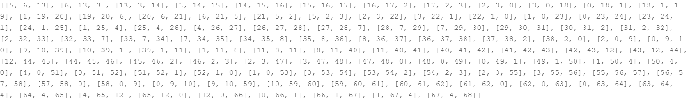

# 7.17Homework3: Next Word Prediction

本文通过构建LSTM网络来实现输入几个词预测下一个词的任务，简称Next Word Prediction。

## 1.LSTM网络介绍

长短期记忆网络是一种特殊的RNN，能够学习长期依赖。它们是由Hochriter  &  Schmidhuber(1997)[1]提出的。所有递归神经网络都具有神经网络重复模块链的形式。在标准RNNs中，这个重复模块将具有非常简单的结构，例如单个tanh层。LSTMs也有这种链状结构，但重复模块有不同的结构。不是只有一个神经网络层，而是有四个，以一种非常特殊的方式相互作用。[2]

LSTM的主要关键是细胞状态:它直接延伸到整个网络链条，其中有一些微小的线性相互作用。信息很容易在传递过程中保持不变。盖茨允许LSTM在细胞状态中添加或删除信息。它们由sigmoid神经网络层和逐点乘法运算组成。LSTM有三个这样的门，用来保护和控制细胞状态。LSTM的第一步是决定从细胞状态中丢弃什么信息。这个决定是由一个叫做“遗忘门”的sigmoid层做出的。它查看$h_{t-1}$和$x_t$，并为单元状态$C_{t-1}$中的每一位输出一个介于0和1之间的数字。1的输出表示“完全保留这个”，而0表示“完全删除这个”。这里$h_{t-1}$是前一个LSTM模块的输出，$x_t$是输入，$h_{t}$是当前LSTM模块的输出，$C{t-1}$是前一个LSTM模块的单元状态输出，$W_f$是权重向量，$b_f$是遗忘门的偏置。$f_t$是遗忘门层的输出。
$$
f_t=\sigma(W_f·[h_{t-1},x_t]+b_f)
$$
下一步是决定在细胞状态下存储什么新信息。这有两个部分:首先，一个称为输入门的sigmoid层决定我们将更新哪些值。接下来，tanh层创建一个新的候选值向量$\widetilde{C_t}$，可以添加到状态中。在下一步中，我们将这两者结合起来创建一个状态更新。$i_t$是输入门的输出，$W_i$是权重向量，$b_i$是输入门的偏置。$W_C$是权重向量，$b_C$是创建新候选值向量$\widetilde{C_t}$的偏差。$C_t$是更新的单元状态。
$$
i_t=\sigma(W_i·[h_{t-1},x_t]+b_i)\\
\widetilde{C_t}=tanh(W_C·[h_{t-1},x_t]+b_C)
$$
我们将旧状态乘以$h_{t-1}$，忘记了之前决定忘记的内容。然后我们把它加$i_{t}·\widetilde{C_t}$。这是新的候选值，根据我们决定更新每个状态值的程度进行缩放。
$$
C_t=f_t*C_{t-1}+i_t*\widetilde{C_t}
$$
最后，我们需要决定输出什么。这个输出将基于我们的细胞状态，但将是一个过滤版本。首先，我们运行一个sigmoid层，它决定了单元状态的哪些部分要输出。然后，我们将单元状态通过tanh(将值保持至-1到1之间)并乘以sigmoid门的输出，这样我们只输出决定输出的部分。这里，$o_t$是输出层的输出，$W_o$是权重向量，$b_o$是输出层的偏置。$h_t$是当前LSTM单元块的输出。
$$
o_t=\sigma(W_o·[h_{t-1},x_t]+b_o)\\
h_t=o_t*tanh(C_t)
$$

## 2.数据集

由于设备条件有限，我们采用了较简易的数据集。我们希望能输出两个单词并预测下一个单词。我们首先通过分词，得到了数据集中的69个词，并按照词频顺序对他们进行编号。最终，我们得到了101条样本。



数据集如下：

> Next Word Prediction is also called Language Modeling. It is the task of predicting what word comes next. It is one of the fundamental tasks of NLP and has many applications. You might be using it daily when you write texts or emails without realizing it.The people's Republic of China, or "China" for short, was founded on October 1, 1949. It is located in the east of Asia and the west coast of the Pacific Ocean. It is a socialist country under the people's democratic dictatorship led by the working class and based on the alliance of workers and peasants.

## 3.实验结果

按照前文的LSTM理论基础，我们编写了LSTM网络来进行下一个词的预测。我们构建了如下代码块所示的网络结构：

```python
embedding_size = 128
hidden_size = 256
num_encoder_lstm_layers = 2
input_vocab_size = vocab_size
epochs = 200
batch_size = 7
class LSTM(paddle.nn.Layer):
    def __init__(self,input_vocab_size,embedding_size,hidden_size):
        super(LSTM, self).__init__()
        self.emb = paddle.nn.Embedding(input_vocab_size, embedding_size)
        self.lstm = paddle.nn.LSTM(input_size=embedding_size, 
                                   hidden_size=hidden_size, 
                                   num_layers=num_encoder_lstm_layers)
        self.linear = paddle.nn.Linear(in_features=2*hidden_size,out_features=input_vocab_size,weight_attr=None)
        
    def forward(self,input_word):
        input_word = paddle.to_tensor(input_word)
        embedded = self.emb(input_word)
        
        # embedded = paddle.reshape(embedded,shape=[-1,input_vocab_size, embedding_size])
        #passing the embedding to lstm model
        output, hidden = self.lstm(embedded)
        #reshaping
        logits=paddle.reshape(output,shape=[-1,2*hidden_size])
        # print(logits)
        #fully connected layer
        logits = self.linear(logits)
        return logits,hidden
```

使用binary cross entropy作为损失函数[3]，并采用Adam优化器进行优化。

最终，我们编写了函数，能够输入固定长度英文并输出下一个单词，并且在训练200个epoch的情况下模型在数据集上的正确率为68.21%。

## 4.引用

[1]Hochreiter, S., Schmidhuber, J., 1997. Lstm can solve hard long time lag  problems, in: Advances in neural information processing systems, pp. 473–479.

[2]Partha Pratim Barman and Abhijit Boruah. A RNN based Approach for next word prediction in Assamese Phonetic Transcription[J]. Procedia Computer Science, 2018, 143 : 117-123.

[3][binary_cross_entropy_with_logits-API文档-PaddlePaddle深度学习平台](https://www.paddlepaddle.org.cn/documentation/docs/zh/api/paddle/nn/functional/binary_cross_entropy_with_logits_cn.html)