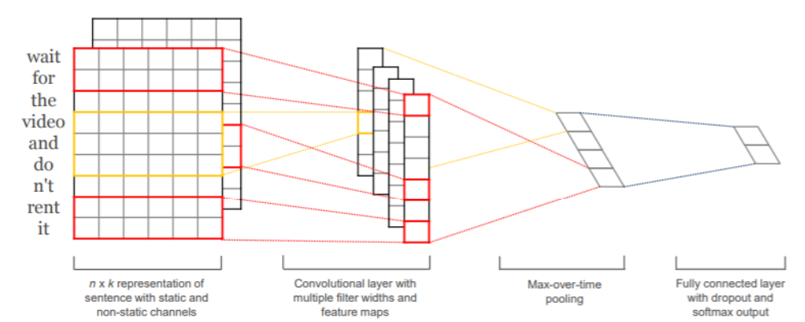
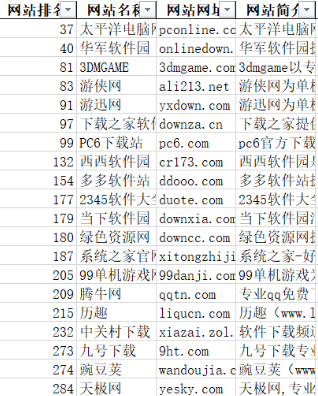

# 7.18Homework8：TextCNN调研

## 1.TextCNN原理介绍

卷积神经网络不仅仅可应用于图像处理领域，同时也可以应用于文本、语音等任务的处理中。由于其稀疏交互的特性，即**卷积核尺度远小于输入的维度**，这样每个输出神经元仅与前一层特定局部区域内的神经元存在连接权重（即产生交互），像图像、文本等数据中都具有局部的特征结构，可以借助卷积神经网络来进行处理。

TextCNN网络是2014年提出的用来做文本分类的卷积神经网络，由于其结构简单、效果好，在文本分类、推荐等NLP领域应用广泛。2014 年 Yoon Kim 提出的 TextCNN 首次运用卷积神经网络进行文本分类。

TextCNN的结构比较简单，输入数据首先通过一个embedding layer，得到输入语句的embedding表示，然后通过一个convolution layer，提取语句的特征，最后通过一个fully connected layer得到最终的输出，整个模型的结构如下图：

第一层为Embedding层。这一层的功能为将自然语言的单词或者字分布式表示，思路于Word2vec中的完全相同。可以使用预训练好的词向量，也可以直接在训练textcnn的过程中训练出一套词向量，不过前者比或者快100倍不止。如果使用预训练好的词向量，又分为static方法和no-static方法，前者是指在训练textcnn过程中不再调节词向量的参数，后者在训练过程中调节词向量的参数，所以，后者的结果比前者要好。更为一般的做法是：不要在每一个batch中都调节emdbedding层，而是每个100个batch调节一次，这样可以减少训练的时间，又可以微调词向量。
第二层为卷积层。卷积层与传统 CNN 的卷积层原理一致，但是卷积核的宽度一定等于词向量大小。因此卷积核只会进行高度方向的移动，每次步进都会划过完整的单词，保证了词语作为语言中的最小粒度。池化层与传统 CNN 的池化层也基本一致，方法包括 1-MAX池化、K-MAX 池化（选出每个特征向量中最大的 K 个特征）和平均池化等。[2]

## 2.实验过程

假设现在有一个文本分类的任务，我们通过爬虫爬取了各个网站的简介，并对网站进行类别标注。算法需要对一段介绍文本进行分类来判断这个网站是是属于哪个类别。我们一共划分了体育、经济、娱乐、科技、购物五类网站。

在实验之前进行比较常规的数据预处理。随后，先下载停用词表去除文本中的停用词，再根据python中的jieba库来对文本进行分词。预处理完成后，使用 sklearn 提供的 split 方法将古诗词按 0.25 的比例生成训练集和测试集，并通过使用 word2vec 方法，将文本分词后的词汇集合转化成词向量。在 TextCNN 网络结构上，我们在经典的一层卷积的卷积神经网络上添加了两层卷积层和一层全连接层，其中两个全连接层分别采用 relu 和 softmax 激活函数，以进行五分类。

## 3.引用

[1]A Sensitivity Analysis of (and Practitioners' Guide to) Convolutional Neural Networks for Sentence Classification.Ye Zhang,Byton Wallace.

[2]史沛卓,陈凯天,钟叶珂,雷向欣.基于TextCNN的中国古诗文分类方法研究[J].电子技术与软件工程,2021,{4}(10):190-192.