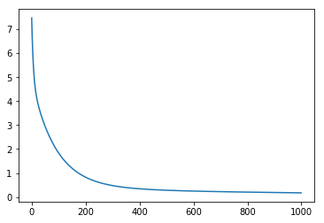

**深度学习发展历史**
	1943年Warren S.McCulloch和Walter H.Pitts Jr提出MCP人工神经元模型，当时是希望能够用计算机来模拟人的神经元反应的过程，该模型将神经元简化为了三个过程：输入信号线性加权，求和，非线性激活（阈值法）。
	1958年Rosenblatt发明了感知器算法。该算法使用MCP模型对输入的多维数据进行二分类，且能够使用梯度下降法从训练样本中自动学习更新权值。1962年，该方法被证明为能够收敛，理论与实践效果引起第一次神经网络的浪潮。
	1969年，美国数学家及人工智能先驱Minsky在其著作中证明了感知器本质上是一种线性模型，只能处理线性分类问题，就连最简单的XOR（亦或）问题都无法正确分类。这等于直接宣判了感知器的死刑，神经网络的研究也陷入了近20年的停滞。
	1986年Hinton发明了适用于多层感知器（MLP）的BP算法，并采用Sigmoid进行非线性映射，有效解决了非线性分类和学习的问题。该方法引起了神经网络的第二次热潮。
	1989年，Robert Hecht-Nielsen证明了MLP的万能逼近定理，即对于任何闭区间内的一个连续函数f，都可以用含有一个隐含层的BP网络来逼近该定理的发现极大的鼓舞了神经网络的研究人员。
	1989年，LeCun发明了卷积神经网络-LeNet，并将其用于数字识别，且取得了较好的成绩，不过当时并没有引起足够的注意。
	1997年，LSTM模型被发明，尽管该模型在序列建模上的特性非常突出，但由于正处于NN的下坡期，也没有引起足够的重视。
	1986年，决策树方法被提出，很快ID3，ID4，CART等改进的决策树方法相继出现，到目前仍然是非常常用的一种机器学习方法。该方法也是符号学习方法的代表。
	1995年，线性SVM被统计学家Vapnik提出。该方法的特点有两个：由非常完美的数学理论推导而来（统计学与凸优化等），符合人的直观感受（最大间隔）。
	1997年，AdaBoost被提出，该方法是PAC理论在机器学习实践上的代表，也催生了集成方法这一类。该方法通过一系列的弱分类器集成，达到强分类器的效果。
	2000年，KernelSVM被提出，核化的SVM通过一种巧妙的方式将原空间线性不可分的问题，通过Kernel映射成高维空间的线性可分问题，成功解决了非线性分类的问题，且分类效果非常好。至此也更加终结了NN时代。
	2001年，随机森林被提出，这是集成方法的另一代表，该方法的理论扎实，比AdaBoost更好的抑制过拟合问题，实际效果也非常不错。
	2006年，DL元年，这一年，Hinton提出了深层网络训练中梯度消失问题的解决方案：无监督预训练对权值进行初始化+有监督训练微调。其主要思想是先通过自学习的方法学习到训练数据的结构（自动编码器），然后在该结构上进行有监督训练微调。
	2011年，ReLU激活函数被提出，该激活函数能够有效的抑制梯度消失问题。
	2011年，微软首次将DL应用在语音识别上，取得了重大突破。
	2012年，Hinton课题组为了证明深度学习的潜力，首次参加ImageNet图像识别比赛，其通过构建的CNN网络AlexNet一举夺得冠军，且碾压第二名（SVM方法）的分类性能。也正是由于该比赛，CNN吸引到了众多研究者的注意。
	2015，DeepResidualNet发明。

**人工智能、机器学习、深度学习的区别与联系**
	人工智能最初是一种概念，即人们梦想使用计算机创造出一种与人类有同样智慧特性的机器。现在人工智能是计算机科学的一个分支，它企图了解智能的实质，并生产出一种新的能以人类智能相似的方式做出反应的智能机器。
	机器学习是实现人工智能的一种方法，是一门多领域交叉学科，涉及概率论、统计学、逼近论、凸分析、算法复杂度理论等多门学科。专门研究计算机怎样模拟或实现人类的学习行为，以获取新的知识或技能，重新组织已有的知识结构使之不断改善自身的性能。，也是人工智能的核心。
	深度学习是机器学习重要的一个研究方向，使用深度神经网络来解决各种机器学习和人工智能领域的问题。
	他们三者是包含与被包含的关系，从大到小来看：人工智能——>机器学习——>深度学习。

**神经元**
	
	一个神经元通常具有多个树突，主要用来接受传入信息；而轴突只有一条，轴突尾端有许多轴突末梢可以给其他多个神经元传递信息。轴突末梢跟其他神经元的树突产生连接，从而传递信号。这个连接的位置在生物学上叫做“突触”。突触之间的交流通过神经递质实现。
	对神经元进行抽象处理得到他的数学模型，将神经元接受的输入信息当做神经元模型的多个输入，对各个输入进行各自权值处理并求和，即线性加权过程通过非线性函数之后将结果进行输出。
   
**单层感知机**
	上面神经元的基本模型其实就是一个感知机的模型。1958年，计算科学家Rosenblatt提出的由两层神经元组成的神经网络。
   在“感知器”中，有两个层次。分别是输入层和输出层。输入层里的“输入单元”只负责传输数据，不做计算。输出层里的“输出单元”则需要对前面一层的输入进行计算。
　　我们把需要计算的层次称之为“计算层”，并把拥有一个计算层的网络称之为“单层神经网络”。有一些文献会按照网络拥有的层数来命名，例如把“感知器”称为两层神经网络。
　　
**多层感知机**
   多层感知机（MLP，Multilayer Perceptron）也叫人工神经网络（ANN，Artificial Neural Network），除了输入输出层，它中间可以有多个隐层，最简单的MLP只含一个隐层，即三层的结构。
   多层感知机层与层之间是全连接的。多层感知机最底层是输入层，中间是隐藏层，最后是输出层。 

**前向传播**
	设激活函数是σ ( z )，隐藏层和输出层的输出值为a，则对于下图的三层DNN，利用和感知机一样的思路，可以利用上一层的输出计算下一层的输出，也就是所谓的DNN前向传播算法。
   DNN的前向传播算法也就是利用我们的若干个权重系数矩阵W和偏倚向量b来和输入值向量x进行一系列线性运算和激活运算，从输入层开始，一层层的向后计算，一直到运算到输出层，得到输出结果为止。
   输入: 总层数L，所有隐藏层和输出层对应的矩阵W，偏倚向量b，输入值向量x
输出：输出层的输出al


**反向传播**
以分类为例，最终总是有误差的，那么怎么减少误差呢，当前应用广泛的一个算法就是梯度下降算法，但是求梯度就要求偏导数，下面以图中字母为例讲解一下。
设最终总误差为EE，对于输出那么EE#对于输出结点yl的偏导数是yl - tl，其中tl是真实值∂yl∂zl∂yl∂zl是指上面提到的激活函数，zlzl是上面提到的加权和，那么这一层的EE对zlzl的偏导数为∂E∂zl=∂E∂yl∂yl∂zl∂E∂zl=∂E∂yl∂yl∂zl。同理，下一层也是这么计算，（只不过∂E∂yk∂E∂yk计算方法变了），一直反向传播到输入层，最后有∂E∂xi=∂E∂yj∂yj∂zj∂E∂xi=∂E∂yj∂yj∂zj 且 ∂zj∂xi=wij∂zj∂xi=wij
然后调整这些过程中的权值，再不断进行前向传播和反向传播的过程，最终得到一个比较好的结果。


```python
# 查看当前挂载的数据集目录, 该目录下的变更重启环境后会自动还原
# View dataset directory. 
# This directory will be recovered automatically after resetting environment. 
!ls /home/aistudio/data
```

    data269


```python
# 查看工作区文件, 该目录下的变更将会持久保存. 请及时清理不必要的文件, 避免加载过慢.
# View personal work directory. 
# All changes under this directory will be kept even after reset. 
# Please clean unnecessary files in time to speed up environment loading. 
!ls /home/aistudio/work
```

    housing.data


```python
# 如果需要进行持久化安装, 需要使用持久化路径, 如下方代码示例:
# If a persistence installation is required, 
# you need to use the persistence path as the following: 
!mkdir /home/aistudio/external-libraries
!pip install beautifulsoup4 -t /home/aistudio/external-libraries
```

    mkdir: cannot create directory ‘/home/aistudio/external-libraries’: File exists
    Looking in indexes: https://mirror.baidu.com/pypi/simple/
    Collecting beautifulsoup4
    [?25l  Downloading https://mirror.baidu.com/pypi/packages/d1/41/e6495bd7d3781cee623ce23ea6ac73282a373088fcd0ddc809a047b18eae/beautifulsoup4-4.9.3-py3-none-any.whl (115kB)
         |████████████████████████████████| 122kB 20.2MB/s eta 0:00:01
    [?25hCollecting soupsieve>1.2; python_version >= "3.0" (from beautifulsoup4)
      Downloading https://mirror.baidu.com/pypi/packages/36/69/d82d04022f02733bf9a72bc3b96332d360c0c5307096d76f6bb7489f7e57/soupsieve-2.2.1-py3-none-any.whl
    Installing collected packages: soupsieve, beautifulsoup4
    Successfully installed beautifulsoup4-4.9.3 soupsieve-2.2.1
    WARNING: Target directory /home/aistudio/external-libraries/soupsieve already exists. Specify --upgrade to force replacement.
    WARNING: Target directory /home/aistudio/external-libraries/soupsieve-2.2.1.dist-info already exists. Specify --upgrade to force replacement.
    WARNING: Target directory /home/aistudio/external-libraries/beautifulsoup4-4.9.3.dist-info already exists. Specify --upgrade to force replacement.
    WARNING: Target directory /home/aistudio/external-libraries/bs4 already exists. Specify --upgrade to force replacement.


```python
# 同时添加如下代码, 这样每次环境(kernel)启动的时候只要运行下方代码即可: 
# Also add the following code, 
# so that every time the environment (kernel) starts, 
# just run the following code: 
import sys 
sys.path.append('/home/aistudio/external-libraries')
```

请点击[此处](https://ai.baidu.com/docs#/AIStudio_Project_Notebook/a38e5576)查看本环境基本用法.  <br>
Please click [here ](https://ai.baidu.com/docs#/AIStudio_Project_Notebook/a38e5576) for more detailed instructions. 


```python
#python numpy实现双层神经网络房价预测
import numpy as np
import random
import json
import matplotlib
import matplotlib.pyplot as plt
from mpl_toolkits.mplot3d import Axes3D
def load_data():
    # 从文件导入数据
    datafile = './work/housing.data'
    data = np.fromfile(datafile, sep=' ')

    # 每条数据包括14项，其中前面13项是影响因素，第14项是相应的房屋价格中位数
    feature_names = [ 'CRIM', 'ZN', 'INDUS', 'CHAS', 'NOX', 'RM', 'AGE', \
                      'DIS', 'RAD', 'TAX', 'PTRATIO', 'B', 'LSTAT', 'MEDV' ]
    feature_num = len(feature_names)

    # 将原始数据进行Reshape，变成[N, 14]这样的形状
    data = data.reshape([data.shape[0] // feature_num, feature_num])

    # 将原数据集拆分成训练集和测试集
    # 这里使用80%的数据做训练，20%的数据做测试
    # 测试集和训练集必须是没有交集的
    ratio = 0.8
    offset = int(data.shape[0] * ratio)
    training_data = data[:offset]

    # 计算训练集的最大值，最小值，平均值
    maximums, minimums, avgs = training_data.max(axis=0), training_data.min(axis=0), \
                                 training_data.sum(axis=0) / training_data.shape[0]

    # 对数据进行归一化处理
    for i in range(feature_num):
        #print(maximums[i], minimums[i], avgs[i])
        data[:, i] = (data[:, i] - minimums[i]) / (maximums[i] - minimums[i])

    # 训练集和测试集的划分比例
    training_data = data[:offset]
    test_data = data[offset:]
    return training_data, test_data
# 获取数据
training_data, test_data = load_data()
x = training_data[:, :-1]
y = training_data[:, -1:]
# 查看数据
#print(x[0])
#print(y[0])
class Network(object):
    def __init__(self, num_of_weights):
        # 随机产生w的初始值
        # 为了保持程序每次运行结果的一致性，此处设置固定的随机数种子
        np.random.seed(0)
        self.w1 = np.random.randn(num_of_weights, 1)
        self.b1 = 0.2
        np.random.seed(1)
        self.w2 = np.random.randn(num_of_weights, 1)
        self.b2 = 0.
        
        
    def forward(self, x):
        z1 = np.dot(x, self.w1) + self.b1
        z2 = np.dot(x, self.w2) + self.b1
        z =z1 + z2 + self.b2
        return z
    
    def loss(self, z, y):
        error = z - y
        num_samples = error.shape[0]
        cost = error * error
        cost = np.sum(cost) / num_samples
        return cost
    
    def gradient(self, x, y):
        z = self.forward(x)
        z1 = self.forward(x)
        z2 = self.forward(x)
        gradient_b2 = (z - y)
        gradient_b2 = np.mean(gradient_b2)
        gradient_w1 = (z-y)*x
        gradient_w1 = np.mean(gradient_w1, axis=0)
        gradient_w1 = gradient_w1[:, np.newaxis]
        gradient_w2 = (z-y)*x
        gradient_w2 = np.mean(gradient_w2, axis=0)
        gradient_w2 = gradient_w2[:, np.newaxis]
        gradient_b1 = (z - y)
        gradient_b1 = np.mean(gradient_b1)        
        return gradient_b2,gradient_w1,gradient_w2,gradient_b1
    
    def update(self, gradient_b2,gradient_w1,gradient_w2,gradient_b1, eta = 0.01):
        self.w1 = self.w1 - eta * gradient_w1
        self.w2 = self.w2 - eta * gradient_w2
        self.b1 = self.b1 - eta * gradient_b1
        self.b2 = self.b2 - eta * gradient_b2
        
    def train(self, x, y, iterations=100, eta=0.01):
        losses = []
        for i in range(iterations):
            z = self.forward(x)
            L = self.loss(z, y)
            gradient_b2,gradient_w1,gradient_w2,gradient_b1 = self.gradient(x, y)
            self.update(gradient_b2,gradient_w1,gradient_w2,gradient_b1, eta)
            losses.append(L)
            if (i+1) % 10 == 0:
                print('iter {}, loss {}'.format(i, L))
        return losses

# 获取数据
train_data, test_data = load_data()
x = train_data[:, :-1]
y = train_data[:, -1:]
# 创建网络
net = Network(13)
num_iterations=1000
# 启动训练
losses = net.train(x,y, iterations=num_iterations, eta=0.01)

# 画出损失函数的变化趋势
plot_x = np.arange(num_iterations)
plot_y = np.array(losses)
plt.plot(plot_x, plot_y)
plt.show()
```

    iter 9, loss 5.008962647338311
    iter 19, loss 4.113722853029151
    iter 29, loss 3.6423425680297323
    iter 39, loss 3.281732016539723
    iter 49, loss 2.9704776158578627
    iter 59, loss 2.6941275885361007
    iter 69, loss 2.447254104231053
    iter 79, loss 2.22639458799293
    iter 89, loss 2.02871339893448
    iter 99, loss 1.8517258880978686
    iter 109, loss 1.6932221509418974
    iter 119, loss 1.551230444372803
    iter 129, loss 1.4239903535743328
    iter 139, loss 1.3099299127577537
    iter 149, loss 1.2076453766401147
    iter 159, loss 1.1158831958420816
    iter 169, loss 1.033523929957471
    iter 179, loss 0.9595678851350226
    iter 189, loss 0.8931222903963989
    iter 199, loss 0.8333898476583954
    iter 209, loss 0.7796585082630183
    iter 219, loss 0.7312923446169984
    iter 229, loss 0.6877233996242835
    iter 239, loss 0.6484444091640602
    iter 249, loss 0.6130023040885555
    iter 259, loss 0.5809924082342142
    iter 269, loss 0.5520532578858193
    iter 279, loss 0.5258619761206873
    iter 289, loss 0.5021301425919316
    iter 299, loss 0.48060010567762235
    iter 309, loss 0.4610416896083046
    iter 319, loss 0.44324925426188266
    iter 329, loss 0.4270390698475693
    iter 339, loss 0.41224697274770256
    iter 349, loss 0.3987262723997758
    iter 359, loss 0.3863458823274528
    iter 369, loss 0.37498865131011194
    iter 379, loss 0.36454987325263155
    iter 389, loss 0.3549359566137372
    iter 399, loss 0.3460632363018002
    iter 409, loss 0.3378569127778838
    iter 419, loss 0.33025010474058225
    iter 429, loss 0.32318300322682586
    iter 439, loss 0.3166021162660877
    iter 449, loss 0.31045959438906234
    iter 459, loss 0.30471262833087837
    iter 469, loss 0.2993229111965752
    iter 479, loss 0.2942561581848829
    iter 489, loss 0.2894816777058967
    iter 499, loss 0.28497198838858634
    iter 509, loss 0.2807024770636631
    iter 519, loss 0.2766510933337741
    iter 529, loss 0.2727980768130233
    iter 539, loss 0.26912571353750653
    iter 549, loss 0.26561811842327715
    iter 559, loss 0.26226104098273595
    iter 569, loss 0.25904169180918313
    iter 579, loss 0.25594858760600736
    iter 589, loss 0.25297141277514895
    iter 599, loss 0.25010089579212713
    iter 609, loss 0.24732869878478797
    iter 619, loss 0.24464731890246638
    iter 629, loss 0.2420500002136177
    iter 639, loss 0.23953065500513776
    iter 649, loss 0.23708379347726094
    iter 659, loss 0.2347044609356805
    iter 669, loss 0.23238818167873979
    iter 679, loss 0.23013090886344756
    iter 689, loss 0.22792897971076972
    iter 699, loss 0.22577907547913542
    iter 709, loss 0.22367818569624284
    iter 719, loss 0.22162357619385117
    iter 729, loss 0.21961276053899179
    iter 739, loss 0.21764347449856625
    iter 749, loss 0.21571365321315888
    iter 759, loss 0.21382141079060013
    iter 769, loss 0.21196502206079967
    iter 779, loss 0.21014290626103904
    iter 789, loss 0.2083536124456158
    iter 799, loss 0.20659580643578987
    iter 809, loss 0.2048682591456799
    iter 819, loss 0.20316983613734363
    iter 829, loss 0.2014994882739784
    iter 839, loss 0.1998562433542019
    iter 849, loss 0.1982391986228914
    iter 859, loss 0.19664751406523948
    iter 869, loss 0.19508040640066812
    iter 879, loss 0.19353714370215305
    iter 889, loss 0.19201704057447475
    iter 899, loss 0.19051945383201294
    iter 909, loss 0.18904377862305408
    iter 919, loss 0.18758944495324206
    iter 929, loss 0.1861559145658676
    iter 939, loss 0.1847426781412065
    iter 949, loss 0.18334925278115446
    iter 959, loss 0.1819751797490073
    iter 969, loss 0.18062002243745293
    iter 979, loss 0.17928336454071822
    iter 989, loss 0.1779648084093726
    iter 999, loss 0.17666397356858898





```python
#paddle实现双层神经网络房价预测
import paddle
from paddle.nn import Linear
import paddle.nn.functional as F
import numpy as np
import matplotlib
import matplotlib.pyplot as plt
import os
import random
def load_data():
    # 从文件导入数据
    datafile = './work/housing.data'
    data = np.fromfile(datafile, sep=' ', dtype=np.float32)

    # 每条数据包括14项，其中前面13项是影响因素，第14项是相应的房屋价格中位数
    feature_names = [ 'CRIM', 'ZN', 'INDUS', 'CHAS', 'NOX', 'RM', 'AGE', \
                      'DIS', 'RAD', 'TAX', 'PTRATIO', 'B', 'LSTAT', 'MEDV' ]
    feature_num = len(feature_names)

    # 将原始数据进行Reshape，变成[N, 14]这样的形状
    data = data.reshape([data.shape[0] // feature_num, feature_num])

    # 将原数据集拆分成训练集和测试集
    # 这里使用80%的数据做训练，20%的数据做测试
    # 测试集和训练集必须是没有交集的
    ratio = 0.8
    offset = int(data.shape[0] * ratio)
    training_data = data[:offset]

    # 计算train数据集的最大值，最小值，平均值
    maximums, minimums, avgs = training_data.max(axis=0), training_data.min(axis=0), \
                                 training_data.sum(axis=0) / training_data.shape[0]
    
    # 记录数据的归一化参数，在预测时对数据做归一化
    global max_values
    global min_values
    global avg_values
    max_values = maximums
    min_values = minimums
    avg_values = avgs

    # 对数据进行归一化处理
    for i in range(feature_num):
        data[:, i] = (data[:, i] - avgs[i]) / (maximums[i] - minimums[i])

    # 训练集和测试集的划分比例
    training_data = data[:offset]
    test_data = data[offset:]
    return training_data, test_data
class Regressor(paddle.nn.Layer):

    # self代表类的实例自身
    def __init__(self):
        # 初始化父类中的一些参数
        super(Regressor, self).__init__()
        
        # 定义一层全连接层，输入维度是13，输出维度是1
        self.fc = Linear(in_features=13, out_features=1)
        self.act = paddle.nn.Sigmoid()
        self.fc2 = paddle.nn.Linear(in_features=10, out_features=1)
    
    # 网络的前向计算
    def forward(self, inputs):
        x = self.fc(inputs)
        return x
# 声明定义好的线性回归模型
model = Regressor()
# 开启模型训练模式
model.train()
# 加载数据
training_data, test_data = load_data()
# 定义优化算法，使用随机梯度下降SGD
# 学习率设置为0.01
opt = paddle.optimizer.SGD(learning_rate=0.01, parameters=model.parameters())
EPOCH_NUM = 10   # 设置外层循环次数
BATCH_SIZE = 10  # 设置batch大小

# 定义外层循环
for epoch_id in range(EPOCH_NUM):
    # 在每轮迭代开始之前，将训练数据的顺序随机的打乱
    np.random.shuffle(training_data)
    # 将训练数据进行拆分，每个batch包含10条数据
    mini_batches = [training_data[k:k+BATCH_SIZE] for k in range(0, len(training_data), BATCH_SIZE)]
    # 定义内层循环
    for iter_id, mini_batch in enumerate(mini_batches):
        x = np.array(mini_batch[:, :-1]) # 获得当前批次训练数据
        y = np.array(mini_batch[:, -1:]) # 获得当前批次训练标签（真实房价）
        # 将numpy数据转为飞桨动态图tensor形式
        house_features = paddle.to_tensor(x)
        prices = paddle.to_tensor(y)
        
        # 前向计算
        predicts = model(house_features)
        
        # 计算损失
        loss = F.square_error_cost(predicts, label=prices)
        avg_loss = paddle.mean(loss)
        if iter_id%20==0:
            print("epoch: {}, iter: {}, loss is: {}".format(epoch_id, iter_id, avg_loss.numpy()))
        
        # 反向传播
        avg_loss.backward()
        # 最小化loss,更新参数
        opt.step()
        # 清除梯度
        opt.clear_grad()

# 保存模型参数，文件名为LR_model.pdparams
paddle.save(model.state_dict(), 'LR_model.pdparams')
print("模型保存成功，模型参数保存在LR_model.pdparams中")
def load_one_example():
    # 从上边已加载的测试集中，随机选择一条作为测试数据
    idx = np.random.randint(0, test_data.shape[0])
    idx = -10
    one_data, label = test_data[idx, :-1], test_data[idx, -1]
    # 修改该条数据shape为[1,13]
    one_data =  one_data.reshape([1,-1])

    return one_data, label
# 参数为保存模型参数的文件地址
model_dict = paddle.load('LR_model.pdparams')
model.load_dict(model_dict)
model.eval()

# 参数为数据集的文件地址
one_data, label = load_one_example()
# 将数据转为动态图的variable格式 
one_data = paddle.to_tensor(one_data)
predict = model(one_data)

# 对结果做反归一化处理
predict = predict * (max_values[-1] - min_values[-1]) + avg_values[-1]
# 对label数据做反归一化处理
label = label * (max_values[-1] - min_values[-1]) + avg_values[-1]

print("Inference result is {}, the corresponding label is {}".format(predict.numpy(), label))
```

    epoch: 0, iter: 0, loss is: [0.05365043]
    epoch: 0, iter: 20, loss is: [0.09618521]
    epoch: 0, iter: 40, loss is: [0.0267882]
    epoch: 1, iter: 0, loss is: [0.02718393]
    epoch: 1, iter: 20, loss is: [0.04753923]
    epoch: 1, iter: 40, loss is: [0.10560463]
    epoch: 2, iter: 0, loss is: [0.11071634]
    epoch: 2, iter: 20, loss is: [0.0349807]
    epoch: 2, iter: 40, loss is: [0.03577711]
    epoch: 3, iter: 0, loss is: [0.04978322]
    epoch: 3, iter: 20, loss is: [0.04606231]
    epoch: 3, iter: 40, loss is: [0.15120089]
    epoch: 4, iter: 0, loss is: [0.02655281]
    epoch: 4, iter: 20, loss is: [0.06915595]
    epoch: 4, iter: 40, loss is: [0.02645713]
    epoch: 5, iter: 0, loss is: [0.07028259]
    epoch: 5, iter: 20, loss is: [0.02720477]
    epoch: 5, iter: 40, loss is: [0.05303243]
    epoch: 6, iter: 0, loss is: [0.03828095]
    epoch: 6, iter: 20, loss is: [0.03983556]
    epoch: 6, iter: 40, loss is: [0.05357898]
    epoch: 7, iter: 0, loss is: [0.00382383]
    epoch: 7, iter: 20, loss is: [0.03967518]
    epoch: 7, iter: 40, loss is: [0.01905488]
    epoch: 8, iter: 0, loss is: [0.05705719]
    epoch: 8, iter: 20, loss is: [0.02869581]
    epoch: 8, iter: 40, loss is: [0.02749251]
    epoch: 9, iter: 0, loss is: [0.00814354]
    epoch: 9, iter: 20, loss is: [0.02823475]
    epoch: 9, iter: 40, loss is: [0.01072248]
    模型保存成功，模型参数保存在LR_model.pdparams中
    Inference result is [[19.665342]], the corresponding label is 19.700000762939453

