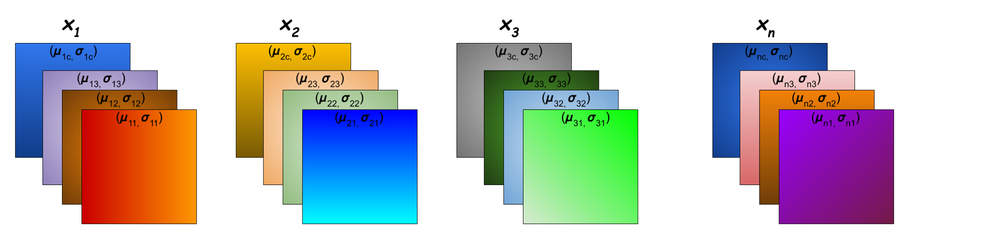

# 实例归一化

## 概念

实例归一化（Instance Normalization, IN）在计算归一化统计量时取每个单独样本的单独通道上的数据，即**单通道、单样本**进行计算其均值及方差。

$\mu_{nc} = \frac{1}{HW}\sum_{j=1}^{H}\sum_{k=1}^{W} x_{ncjk}$

$\delta^2_{nc} = \frac{1}{HW}\sum_{j=1}^{H}\sum_{k=1}^{W}(x_{ncjk}-\mu_{nc})^2$

$\hat{x} = \frac{x - \mu_{nc}}{\sqrt{\mu^2_{nc}+\in}}$

## 应用场景

实例归一化是非常简单的算法，适用于生成模型中，如图片风格迁移等，尤其适用于**批量较小**且**单独考虑像素点的场景中**，因为其计算归一化统计量时没有混合批量和通道之间的数据。

而在**MLP**、**RNN**等场景下，每个通道只有一个数据，故无法应用实例归一化。

当feature map比较小时，此时实例归一化的采样数据较少，得到的归一化统计量不再具有代表性。
