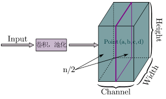

## 局部响应归一化详解

### 1.概念

​		在深度学习中，归一化是将需要处理的数据通过某种算法限制在一定范围内的一种操作，一方面有助于快速收敛，另一方面对局部神经元的活动创建竞争机制，使得其中响应比较大的值变得相对更大，并抑制其他反馈较小的神经元，增强了模型的泛化能力。

​		局部响应归一化（Local Response Normalization），简称LRN，是在深度学习中用于提高准确度，且一般会在激活、池化后进行的一种处理方法，通常应用于Alexnet中。在介绍LRN之前，我们首先引入神经生物学中“侧抑制”的概念。侧抑制（lateral inhibitio），即被激活的神经元抑制相邻的神经元。LRN层就是模仿生物神经系统的侧抑制机制来实现局部抑制，对局部神经元的活动创建竞争机制，使得响应比较大的值相对更大，从而提高模型的泛化能力，特别是在使用ReLU激活函数时，这种“侧抑制”很有效 ，因此在Alexnet里使用效果较好。

### 2.算法流程

​		局部响应归一化的公式如下：
$$
b_{x, y}^{i}=a_{x, y}^{i} /\left(k+\alpha \sum_{j=\max (0, i-n / 2)}^{\min (N-1, i+n / 2)}\left(a_{x, y}^{j}\right)^{2}\right)^{\beta}
$$
​		式中：a表示卷积和池化操作后的输出，该结果是一个四维数组[batch,height,width,channel]。batch为批次数、height为图片高度、width为图片宽度、channel为通道数，也可以理解为处理后的图片深度。$a_{x, y}^{i}$表示这个输出结构中的一个位置[a,b,c,d]，可以理解成在某一张图中的某一个通道下的某个高度和某个宽度位置的点，即第a张图的第d个通道下的高度为b宽度为c的点。a，n/2，k，α，β分别表示函数中的input，depth_radius，bias，alpha，beta，其中n/2，k，α和β都是自定义的。特别注意：∑叠加的方向是沿着通道方向的，即每个点值的平方和是沿着a中的第3维channel方向的，也就是一个点同方向的前面n/2个通道和后n/2个通道的点的平方和，共n+1个点。 i表示第i个核在位置（x,y）运用激活函数ReLU后的输出；n为同一位置上临近的kernal map的数目，N表示kernal的总数。参数K，n，α，β都是超参数，一般设置k=2，n=5，alpha=1*e-4，beta=0.75。示意图如下：



​		TensorFlow框架下的代码：


```
import tensorflow as tf
import numpy as np
x = np.array([i for i in range(1,33)]).reshape([2,2,2,4])

y = tf.nn.lrn(input=x,depth_radius=2,bias=0,alpha=1,beta=1)
with tf.Session() as sess:
    print(x)
    print('#############')
    print(y.eval())
```


### 3. 作用

1. **神经学的启发**；在神经生物学中，有一个概念叫做侧抑制（lateral inhibitio ），指的是被激活的神经元会抑制它周围的神经元，局部响应归一化就是借鉴“侧抑制”的思想来实现局部抑制，使用ReLU激活函数时的局部抑制更明显。

2. **削弱数据差异**；归一化数据处理可以消除数据之间的量纲差异，便于数据利用与快速计算。

3. **增强网络泛化能力**；对局部神经元的活动创建竞争机制，使得其中响应比较大的值变得相对更大，并抑制其他反馈较小的神经元，增强了模型的泛化能力。LRN通过在相邻卷积核生成的feature map之间引入竞争，从而有些本来在feature map中显著的特征更显著，而在相邻的其他feature map中被抑制，这样让不同卷积核产生的feature map之间的相关性变小。

   

### 4. 应用场景

​		LRN层在AlexNet提出并应用，其对局部神经元的活动创建竞争机制，使得其中响应比较大的值变得相对更大，并抑制其他反馈较小的神经元，增强了模型的泛化能力。


