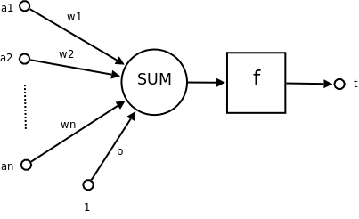
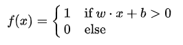

# 基于 DNN 模型的点击率预估模型

## 实验简介

点击率（Click Through Rate，CTR）是指对广告推广活动展示的点击次数比值。CTR 的计算方法是将广告推广活动的点击次数除以展示总数量，再将结果用百分比的形式表示。

比如，一个公司投放的广告推广活动产生了 10000 次展示量，并在 App Store 中产生了 500 次点击量，则此次推广活动的 CTR 为 5%. 

CTR是衡量互联网广告效果的一项重要指标，它是“推荐系统/计算广告”等领域的重要指标，对其进行预估是商品推送/广告投放等决策的基础。简单来说，CTR预估对每次广告的点击情况做出预测，预测用户是点击还是不点击。

CTR预估模型综合考虑各种因素、特征，在大量历史数据上训练，最终对商业决策提供帮助。本项目实现了使用深度神经网络（DNN）模型对 CTR 进行预测。

## 数据格式

使用的数据集是 Kaggle 的 Criteo 数据集，包括文件 `test.txt` 和 `train.txt`。

训练数据集中的每一行表示一个广告的记录。每一行有 40 个由制表符分隔的字段。第一个字段记录此广告是否被点击，用 `0` 或 `1` 表示。之后的 13 个字段记录广告的整数特征。之后的 26 个字段记录广告的类别特征。

测试数据集中的数据格式与训练数据集中的类似，但其中没有第一个字段（是否被点击）。

由于原始数据集过大，这里使用它的一部分数据并重新格式化，存为文件 `sample_train.txt`。

## 模型简介

深度神经网络（Deep Neural Networks，DNN）是深度学习的基础。

### 感知机

感知机（Perceptron）是一种二分类的线性分类模型，它接受实例的特征向量作为输入并将预测的实例类别作为输出，如下图所示。



其输入与输出之间有线性关系：



感知机模型只能用于二分类，且无法适用于非线性模型。

### 深度神经网络

将多个感知机连接起来就构成了深度神经网络。

DNN 有多层感知机，层与层之间是全连接的，也就是说，第i层的任意一个神经元一定与第i+1层的任意一个神经元相连。既不是输入层也不是输出层的叫作“隐藏层”。隐藏层可以有多层，它增强了模型的表达能力和复杂度。

DNN 的激活函数可以不是简单的符号函数。常见的有 Sigmoid 函数、正切函数、Softmax 函数和 ReLu 函数等。复杂的激活函数同样增强了模型的表达能力。

## 环境安装

在终端中运行下述命令，安装 `paddle-rec`：

```sh
pip install paddle-rec
```

## 构建模型

在 `/home/aistudio/work/dat` 目录下创建文件 `model.py`、`config.yaml`。

### 输入层

CTR-DNN模型的数据输入层包括三个，分别是：dense_input用于输入连续数据，维度由超参数dense_input_dim指定，数据类型是归一化后的浮点型数据。sparse_inputs用于记录离散数据，在Criteo数据集中，共有26个slot，所以我们创建了名为1~26的26个稀疏参数输入，数据类型为整数；最后是每条样本的label，代表了是否被点击，数据类型是整数，0代表负样例，1代表正样例。

Embedding层
首先介绍Embedding层的搭建方式：Embedding层的输入是sparse_input，由超参的sparse_feature_number和sparse_feature_dimshape定义。需要特别解释的是is_sparse参数，当我们指定is_sprase=True后，计算图会将该参数视为稀疏参数，反向更新以及分布式通信时，都以稀疏的方式进行，会极大的提升运行效率，同时保证效果一致。

各个稀疏的输入通过Embedding层后，将其合并起来，置于一个list内，以方便进行concat的操作。

FC层
将离散数据通过embedding查表得到的值，与连续数据的输入进行concat操作，合为一个整体输入，作为全链接层的原始输入。我们共设计了4层FC，每层FC的输出维度由超参fc_sizes指定，每层FC都后接一个relu激活函数，每层FC的初始化方式为符合正态分布的随机初始化，标准差与上一层的输出维度的平方根成反比。

Loss及Auc计算
预测的结果通过一个输出 `shape` 为2的FC层给出，该FC层的激活函数是 Softmax，会给出每条样本分属于正负样本的概率。
每条样本的损失由交叉熵给出，交叉熵的输入维度为 `[batch_size,2]`，数据类型为float，label的输入维度为 `[batch_size,1]`，数据类型为 `int`。
该batch的损失avg_cost是各条样本的损失之和
此模型会同时计算预测的auc，auc的结果由 `fluid.layers.auc()` 给出，该层的返回值有三个，分别是从第一个batch累计到当前batch的全局auc: auc，最近几个batch的auc: batch_auc，以及auc_states: _，auc_states包含了batch_stat_pos, batch_stat_neg, stat_pos, stat_neg信息。batch_auc为近20个batch的平均值，由参数 `slide_steps=20` 指定，roc曲线的离散化的临界数值设置为4096，由 `num_thresholds=2**12` 指定。

```py
# model.py
import math

import paddle.fluid as fluid

from paddlerec.core.utils import envs
from paddlerec.core.model import ModelBase


class Model(ModelBase):
    def __init__(self, config):
        ModelBase.__init__(self, config)

    def _init_hyper_parameters(self):
        self.is_distributed = False
        self.distributed_embedding = False

        if envs.get_fleet_mode().upper() == "PSLIB":
            self.is_distributed = True

        if envs.get_global_env("hyper_parameters.distributed_embedding",
                               0) == 1:
            self.distributed_embedding = True

        self.sparse_feature_number = envs.get_global_env(
            "hyper_parameters.sparse_feature_number")
        self.sparse_feature_dim = envs.get_global_env(
            "hyper_parameters.sparse_feature_dim")
        self.learning_rate = envs.get_global_env(
            "hyper_parameters.optimizer.learning_rate")

    def net(self, input, is_infer=False):
        self.sparse_inputs = self._sparse_data_var[1:]
        self.dense_input = self._dense_data_var[0]
        self.label_input = self._sparse_data_var[0]

        def embedding_layer(input):
            if self.distributed_embedding:
                emb = fluid.contrib.layers.sparse_embedding(
                    input=input,
                    size=[
                        self.sparse_feature_number, self.sparse_feature_dim
                    ],
                    param_attr=fluid.ParamAttr(
                        name="SparseFeatFactors",
                        initializer=fluid.initializer.Uniform()))
            else:
                emb = fluid.layers.embedding(
                    input=input,
                    is_sparse=True,
                    is_distributed=self.is_distributed,
                    size=[
                        self.sparse_feature_number, self.sparse_feature_dim
                    ],
                    param_attr=fluid.ParamAttr(
                        name="SparseFeatFactors",
                        initializer=fluid.initializer.Uniform()))
            emb_sum = fluid.layers.sequence_pool(input=emb, pool_type='sum')
            return emb_sum

        sparse_embed_seq = list(map(embedding_layer, self.sparse_inputs))
        concated = fluid.layers.concat(
            sparse_embed_seq + [self.dense_input], axis=1)

        fcs = [concated]
        hidden_layers = envs.get_global_env("hyper_parameters.fc_sizes")

        for size in hidden_layers:
            output = fluid.layers.fc(
                input=fcs[-1],
                size=size,
                act='relu',
                param_attr=fluid.ParamAttr(
                    initializer=fluid.initializer.Normal(
                        scale=1.0 / math.sqrt(fcs[-1].shape[1]))))
            fcs.append(output)

        predict = fluid.layers.fc(
            input=fcs[-1],
            size=2,
            act="softmax",
            param_attr=fluid.ParamAttr(initializer=fluid.initializer.Normal(
                scale=1 / math.sqrt(fcs[-1].shape[1]))))

        self.predict = predict

        auc, batch_auc, _ = fluid.layers.auc(input=self.predict,
                                             label=self.label_input,
                                             num_thresholds=2**12,
                                             slide_steps=20)
        if is_infer:
            self._infer_results["AUC"] = auc
            self._infer_results["BATCH_AUC"] = batch_auc
            return

        self._metrics["AUC"] = auc
        self._metrics["BATCH_AUC"] = batch_auc
        cost = fluid.layers.cross_entropy(
            input=self.predict, label=self.label_input)
        avg_cost = fluid.layers.reduce_mean(cost)
        self._cost = avg_cost

    def optimizer(self):
        optimizer = fluid.optimizer.Adam(self.learning_rate, lazy_mode=True)
        return optimizer

    def infer_net(self):
        pass
```

config.yaml 的内容如下

```yaml
debug: false
workspace: "."

dataset:
  - name: train_sample
    type: DataLoader
    batch_size: 5
    data_path: "{workspace}/dat/"
    sparse_slots: "click 1 2 3 4 5 6 7 8 9 10 11 12 13 14 15 16 17 18 19 20 21 22 23 24 25 26"
    dense_slots: "dense_feature:13"
  - name: infer_sample
    type: DataLoader
    batch_size: 5
    data_path: "{workspace}/dat/"
    sparse_slots: "click 1 2 3 4 5 6 7 8 9 10 11 12 13 14 15 16 17 18 19 20 21 22 23 24 25 26"
    dense_slots: "dense_feature:13"

hyper_parameters:
    optimizer:
        class: Adam
        learning_rate: 0.001
        strategy: async
    sparse_inputs_slots: 27
    sparse_feature_number: 1000001
    sparse_feature_dim: 9
    dense_input_dim: 13
    fc_sizes: [512, 256, 128, 32]
    distributed_embedding: 0


mode: [train_runner,infer_runner]
# if infer, change mode to "infer_runner" and change phase to "infer_phase"

runner:
  - name: train_runner
    class: train
    epochs: 1
    device: cpu
    init_model_path: ""
    save_checkpoint_interval: 1
    save_inference_interval: 1
    save_checkpoint_path: "increment"
    save_inference_path: "inference"
    print_interval: 1
    phases: phase1
  - name: infer_runner
    class: infer
    device: cpu
    init_model_path: "increment/0"
    print_interval: 1
    phases: infer_phase
    

phase:
- name: phase1
  model: "{workspace}/model.py"
  dataset_name: train_sample
  thread_num: 1
- name: infer_phase
  model: "{workspace}/model.py"
  dataset_name: infer_sample
  thread_num: 1
```

## 模型训练

在终端中运行下述命令来训练模型：

```sh
python -m paddlerec.run -m config.yaml
```
