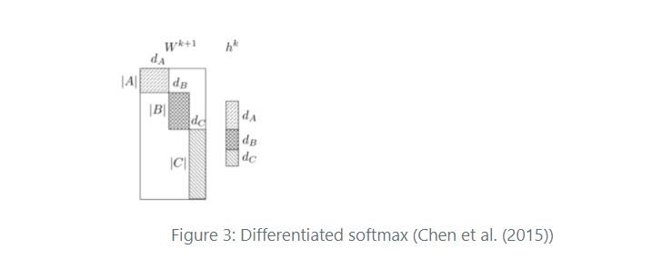

## softmax训练词向量

分层 softmax (H-Softmax) 是受 Morin 和 Bengio (2005) [3] 提出的二叉树启发的近似。 H-Softmax 本质上是将平坦的 softmax 层替换为一个以词为叶子的分层层，如图 1 所示。这允许我们将计算一个词的概率分解为一系列概率计算，这使我们免于 必须计算所有单词的昂贵归一化。 用 H-Softmax 替换 softmax 层可以为单词预测任务带来至少 50 × 50 倍的加速，因此对于低延迟任务（例如谷歌新消息应用 Allo 中的实时通信）至关重要。

我们可以将常规的 softmax 视为深度为1的树，其中 V 中的每个单词作为叶节点。 计算一个词的 softmax 概率然后需要对所有词的概率进行归一化。

平衡二叉树的深度是log2(|V|)，因此，最多只需要计算log2(|V|)个节点就能得到目标词语的概率值。注意，得到的概率值已经经过了标准化，因为二叉树所有叶子节点组成一个概率分布，所有叶子节点的概率值总和等于1。我们可以简单地验证一下，在图1的根节点（Node o）处，两个分枝的概率和必须为1。之后的每个节点，它的两个子节点的概率值之和等于节点本身的概率值。因为整条搜索路径没有概率值的损失，所以最底层所有叶子节点的概率值之和必定等于1，hierarchical softmax定义了词表V中所有词语的标准化概率分布。

具体说来，当遍历树的时候，我们需要能够计算左侧分枝或是右侧分枝的概率值。为此，给每个节点分配一个向量表示。与常规的softmax做法不同，这里不是给每个输出词语w生成词向量v’w，而是给每个节点n计算一个向量v’n。总共有|V|-1个节点，每个节点都有自己独一无二的向量表示，H-Softmax方法用到的参数与常规的softmax几乎一样。于是，在给定上下文c时，就能够计算节点n左右两个分枝的概率：

上式与常规的softmax大致相同。现在需要计算h与树的每个节点的向量v’n的内积，而不是与每个输出词语的向量计算。而且，现在只需要计算一个概率值，这里就是偏向n节点右枝的概率值。相反的，偏向左枝的概率值是1−p(right|n,c)

显然，树形的结构非常重要。若我们让模型在各个节点的预测更方便，比如路径相近的节点概率值也相近，那么凭直觉系统的性能肯定还会提升。沿着这个思路，Morin和Bengio使用WordNet的同义词集作为树簇。然而性能依旧不如常规的softmax方法。Mnih和Hinton[8]将聚类算法融入到树形结构的学习过程，递归地将词集分为两个集合，效果终于和softmax方法持平，计算量有所减小。

值得注意的是，此方法只是加速了训练过程，因为我们可以提前知道将要预测的词语（以及其搜索路径）。在测试过程中，被预测词语是未知的，仍然无法避免计算所有词语的概率值。

在实践中，一般不用“左节点”和“右节点”，而是给每个节点赋一个索引向量，这个向量表示该节点的搜索路径。如图2所示，如果约定该位为0表示向左搜索，该位为1表示向右搜索，那词语“cat”的向量就是011。

Differential Softmax (D-Softmax)。 D-Softmax基于的假设是并不是所有词语都需要相同数量的参数：多次出现的高频词语需要更多的参数去拟合，而较少见的词语就可以用较少的参数。传统的softmax层用到了dx|V|的稠密矩阵来存放输出的词向量表示v′w∈ℝd，论文中采用了稀疏矩阵。他们将词向量v′w按照词频分块，每块区域的向量维度各不相同。分块数量和对应的维度是超参数，可以根据需要调整

图3中，A区域的词向量维度是dA（这个分块是高频词语，向量的维度较高），B和C区域的词向量维度分别是dB和dC。其余空白区域的值为0。

隐藏层h的输出被视为是各个分块的级联，比如图3中h层的输出是由三个长度分别为dA、dB、dC的向量级联而成。D-Softmax只需计算各个向量段与h对应位置的内积，而不需整个矩阵和向量参与计算。

由于大多数的词语只需要相对较少的参数，计算softmax的复杂度得到降低，训练速度因此提升。相对于H-Softmax方法，D-Softmax的优化方法在测试阶段仍然有效。Chen在2015年的论文中提到D-Softmax是测试阶段最快的方法，同时也是准确率最高的之一。但是，由于低频词语的参数较少，D-Softmax对这部分数据的建模能力较弱。