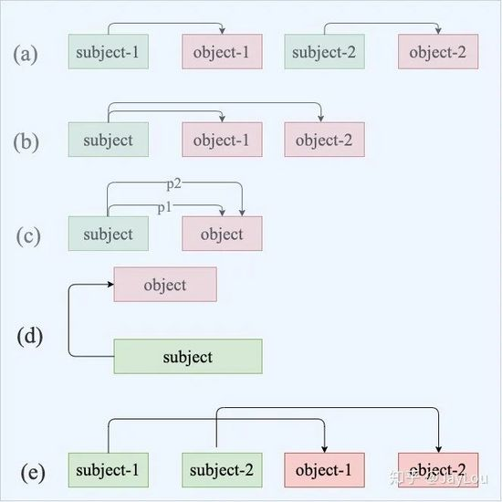

# 一、 基于层次softmax训练词向量
## 1.1 通过huffman tree构建层次softmax

首先对所有在V词表的词，根据词频来构建huffman tree。其中，词频越大，则路径越短，编码信息越少。构建结果如图所示。

 
 
  在该树中，所有的叶子节点构成了词 V，中间节点则共有V-1个，上面的每个叶子节点存在唯一的从根到该节点的path。

  上图假设我们需要计算w2的输出概率，我们定义从根节点开始，每次经过中间节点，做一个二分类任务（左边或者右边），所以我们定义中间节点的n左边概率为 ：
  
  
 
  那么右边概率为：
  
  
 
  从根节点到w2，我们可以计算概率值为：
  
 
 
 ## 1.2 训练过程

 Huffman树中每一叶子结点代表一个label，在每一个非叶子节点处都需要作一次二分类，走左边的概率和走右边的概率，这里用逻辑回归的公式表示。

 

 每个abel都会有又一条路径，对于训练样本的特征向量Xi和对应的label Yi，预测出来Xi的样本属于所对应的label是Yi的概率:

 

 其中，

 

 当模型是条件概率分布，损失函数可用对数函数表示，经验风险最小化等价于极大似然估计：

 

此时，目标函数为

 

将上述所用到的式子不断的带入带入再带入，变换变换再变换，就变成了一个只关于θj的式子，用随机梯度上升法求出当θj取何值时式子的值最大。

# 二、 LSTM可实现其他类型的NLP任务

## 2.1 序列到类别——文本分类

* 准备数据集
* 将数据集中的所有字映射为字典，使得每个字都有唯一的标号对应
* 实现embedding层
* 添加LSTM层进行特征抽取

## 2.2 同步的序列到序列——中英翻译

* 准备数据集
* 使用LSTM编码，由encoder得到整句话的embedding，将输入转化成了一个向量
* 将上述得到的向量放到decoder中解码，即将得到的embedding逐次解码映射到词典中的某个词，找出概率最高的词，然后作为输出

## 2.3 异步的序列到序列——古诗生成

* 数据处理，按照字的出现频率建立字符集词典，根据词典得到每个字对应的索引号，建立从字符到索引号和索引号到字符两个字典。
* 生成训练集
* 建立模型，使用两个LSTM叠加上一个全连接层再进行训练
* 输入文本，开始预测

