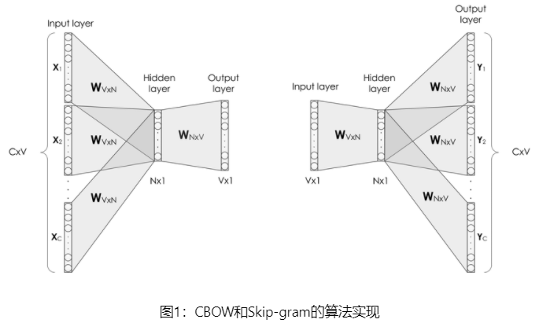
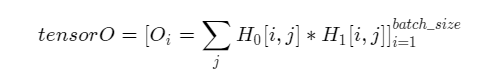

# 词向量模型之CBOW模型的原理与实现

# CBOW的原理

2013年，Mikolov提出了经典的word2vec算法，该算法通过上下文来学习语义信息。word2vec包含两个经典模型，CBOW（Continuous Bag-of-Words）和Skip-gram.

我们重点介绍一下CBOW模型的原理：

举个例子：Two boys are playing basketball.

在这个句子中我们定'are'为中心词，则Two，boys，playing，basketball为上下文。CBOW模型的原理就是**利用上下文来预测中心词**，即利用Two，boys，playing，basketball预测中心词：are。这样一来，are的语义就会分别传入上下文的信息中。不难想到，经过大量样本训练，一些量词，比如one，two就会自动找到它们的同义词，**因为它们都具有are等中心词的语义**。

## CBOW的算法实现

对比Skip-gram，CBOW和Skip-gram的算法实现如 **图1** 所示。**CBOW的算法实现过程如下：**

如 图1所示，CBOW是一个具有3层结构的神经网络，分别是：

- **Input Layer（输入层）**：接收one-hot张量 $V \in R^{1 \times \text{vocab\_size}}$ 作为网络的输入，里面存储着当前句子中上下文单词的one-hot表示。
- **Hidden Layer（隐藏层）**：将张量$V$乘以一个word embedding张量$W^1 \in R^{\text{vocab\_size} \times \text{embed\_size}}$，并把结果作为隐藏层的输出，得到一个形状为$R^{1 \times \text{embed\_size}}$的张量，里面存储着当前句子上下文的词向量。
- **Output Layer（输出层）**：将隐藏层的结果乘以另一个word embedding张量$W^2 \in R^{\text{embed\_size} \times \text{vocab\_size}}$，得到一个形状为$R^{1 \times \text{vocab\_size}}$的张量。这个张量经过softmax变换后，就得到了使用当前上下文对中心的预测结果。根据这个softmax的结果，我们就可以去训练词向量模型。

在实际操作中，使用一个滑动窗口（一般情况下，长度是奇数），从左到右开始扫描当前句子。每个扫描出来的片段被当成一个小句子，每个小句子中间的词被认为是中心词，其余的词被认为是这个中心词的上下文。

CBOW算法和skip-gram算法最本质的区别就是：**CBOW算法是以上下文预测中心词，而skip-gram算法是以中心城预测上下文。**

### CBOW的理想实现

使用神经网络实现CBOW中，模型接收的输入应该有2个不同的tensor：

- 代表当前上下文的tensor：假设我们称之为context_words V，一般来说，这个tensor是一个形状为[batch_size, vocab_size]的one-hot tensor，表示在一个mini-batch中，每组上下文中每一个单词的ID。

- 代表目标词的tensor：假设我们称之为target_words T，一般来说，这个tensor是一个形状为[batch_size, 1]的整型tensor，这个tensor中的每个元素是一个[0, vocab_size-1]的值，代表目标词的ID。

在理想情况下，我们可以这样实现CBOW：把上下文中的每一个单词，依次作为输入，把当前句子中的中心词作为标签，构建神经网络进行学习，实现上下文预测中心词。具体过程如下：
1. 声明一个形状为[vocab_size, embedding_size]的张量，作为需要学习的词向量，记为W_0。对于给定的输入V，即某一个上下文的单词，使用向量乘法，将V乘以W_0，这样就得到了一个形状为[batch_size, embedding_size]的张量，记为H=V*W_0。这个张量H就可以看成是经过词向量查表后的结果。
2. 声明另外一个需要学习的参数W_1，这个参数的形状为[embedding_size, vocab_size]。将上一步得到的H去乘以W_1，得到一个新的tensor O=H*W_1，此时的O是一个形状为[batch_size, vocab_size]的tensor，表示当前这个mini-batch中的每一组上下文中的每一个单词预测出的目标词的概率。
3. 使用softmax函数对mini-batch中每个中心词的预测结果做归一化，即可完成网络构建。

### CBOW的实际实现

和课程中讲解的skip-gram一样，在实际中，为避免过于庞大的计算量，我们通常采用负采样的方法，来避免查询整个此表，从而将多分类问题转换为二分类问题。具体实现过程如图：

在实现的过程中，通常会让模型接收3个tensor输入：

- 代表上下文单词的tensor：假设我们称之为context_words V，一般来说，这个tensor是一个形状为[batch_size, vocab_size]的one-hot tensor，表示在一个mini-batch中每个中心词具体的ID。

- 代表目标词的tensor：假设我们称之为target_words T，一般来说，这个tensor同样是一个形状为[batch_size, vocab_size]的one-hot tensor，表示在一个mini-batch中每个目标词具体的ID。

- 代表目标词标签的tensor：假设我们称之为labels L，一般来说，这个tensor是一个形状为[batch_size, 1]的tensor，每个元素不是0就是1（0：负样本，1：正样本）。

模型训练过程如下：
1. 首先遍历上下文，得到上下文中的一个单词，用V（上下文）去查询W_0，用T（目标词）去查询W_1，分别得到两个形状为[batch_size, embedding_size]的tensor，记为H_1和H_2。
1. 点乘这两个tensor，最终得到一个形状为[batch_size]的tensor

1. 使用随即负采样得到一些负样本（0），同时以目标词作为正样本（1），输入值标签信息label。
1. 使用sigmoid函数作用在O上，将上述点乘的结果归一化为一个0-1的概率值，作为预测概率，根据标签信息label训练这个模型即可。
