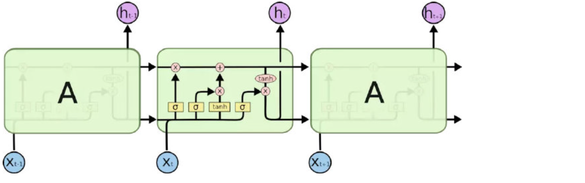
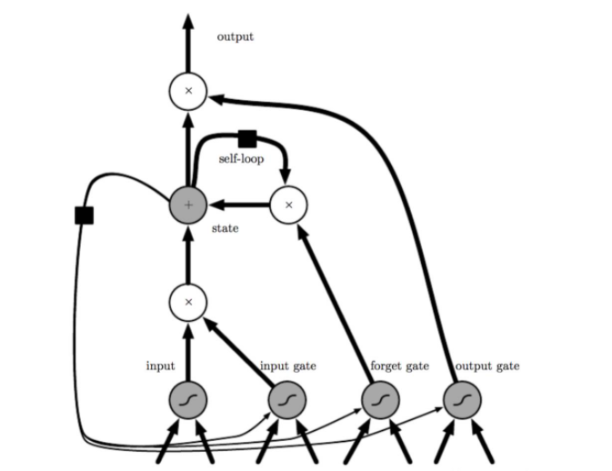
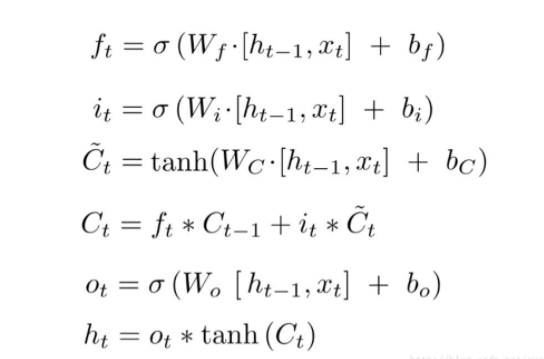
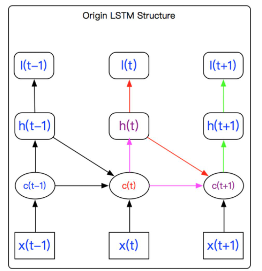
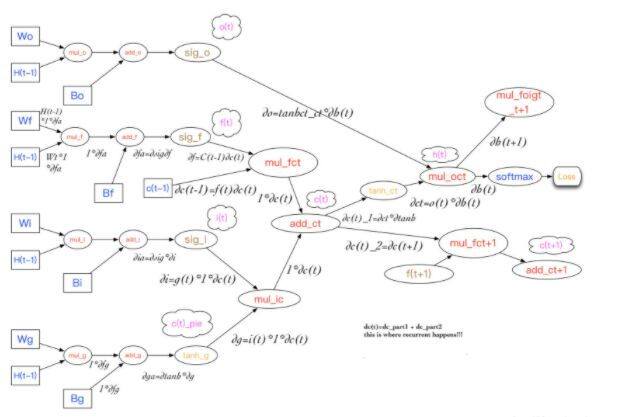
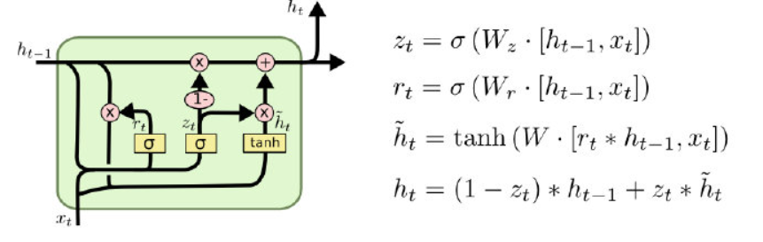

## LSTM

LSTM算法全称为Long short-term memory，最早由 Sepp Hochreiter和Jürgen Schmidhuber于1997年提出[6]，是一种特定形式的RNN（Recurrent neural network，循环神经网络），而RNN是一系列能够处理序列数据的神经网络的总称。这里要注意循环神经网络和递归神经网络（Recursive neural network）的区别。

一般地，RNN包含如下三个特性：

**i**   循环神经网络能够在每个时间节点产生一个输出，且隐单元间的连接是循环的；

**ii**  循环神经网络能够在每个时间节点产生一个输出，且该时间节点上的输出仅与下一时间节点的隐单元有循环连接；

**iii**  循环神经网络包含带有循环连接的隐单元，且能够处理序列数据并输出单一的预测。

RNN还有许多变形，例如双向RNN（Bidirectional RNN）等。然而，RNN在处理长期依赖（时间序列上距离较远的节点）时会遇到巨大的困难，因为计算距离较远的节点之间的联系时会涉及雅可比矩阵的多次相乘，这会带来梯度消失（经常发生）或者梯度膨胀（较少发生）的问题，这样的现象被许多学者观察到并独立研究。

为了解决该问题，研究人员提出了许多解决办法，例如ESN（Echo State Network），增加有漏单元（Leaky Units）等等。其中最成功应用最广泛的就是门限RNN（Gated RNN），而LSTM就是门限RNN中最著名的一种。有漏单元通过设计连接间的权重系数，从而允许RNN累积距离较远节点间的长期联系；而门限RNN则泛化了这样的思想，允许在不同时刻改变该系数，且允许网络忘记当前已经累积的信息。

LSTM就是这样的门限RNN，其单一节点的结构如下图1所示。LSTM的巧妙之处在于通过增加输入门限，遗忘门限和输出门限，使得自循环的权重是变化的，这样一来在模型参数固定的情况下，不同时刻的积分尺度可以动态改变，从而避免了梯度消失或者梯度膨胀的问题。

根据LSTM网络的结构，每个LSTM单元的计算公式如下图2所示，其中Ft表示遗忘门限，It表示输入门限， ̃Ct表示前一时刻cell状态、Ct表示cell状态（这里就是循环发生的地方），Ot表示输出门限，Ht表示当前单元的输出，Ht-1表示前一时刻单元的输出。

### BPTT

介绍完LSTM算法的原理之后，自然要了解如何训练LSTM网络。与前馈神经网络类似，LSTM网络的训练同样采用的是误差的反向传播算法（BP），不过因为LSTM处理的是序列数据，所以在使用BP的时候需要将整个时间序列上的误差传播回来。LSTM本身又可以表示为带有循环的图结构，也就是说在这个带有循环的图上使用反向传播时我们称之为BPTT（back-propagation through time）。

下面我们通过图3和图4来解释BPTT的计算过程。从图3中LSTM的结构可以看到，当前cell的状态会受到前一个cell状态的影响，这体现了LSTM的recurrent特性。同时在误差反向传播计算时，可以发现h(t)的误差不仅仅包含当前时刻T的误差，也包括T时刻之后所有时刻的误差，即back-propagation through time的含义，这样每个时刻的误差都可以经由h(t)和c(t+1)迭代计算。

为了直观地表示整个计算过程，在参考神经网络计算图的基础上，LSTM的计算图如图4所示，从计算图上面可以清晰地看出LSTM的forward propagation和back propagation过程。如图，H(t-1)的误差由H(t)决定，且要对所有的gate layer传播回来的梯度求和，c(t-1)由c(t)决定，而c(t)的误差由两部分，一部分是h(t)，另一部分是c(t+1)。所以在计算c(t)反向传播误差的时候，需要传入h(t)和c(t+1)，而h(t)在更新的时候需要加上h(t+1)。这样就可以从时刻T向后计算任一时刻的梯度，利用随机梯度下降完成权重系数的更新。

**LSTM算法的一些变形**

LSTM算法的变形有很多，最主要的有两种，分别如下：

a）GRU

LSTM算法的变形里面GRU（Gated Recurrent Unit）是使用最为广泛的一种，最早由Cho等人于2014年提出[7]。GRU与LSTM的区别在于使用同一个门限来代替输入门限和遗忘门限，即通过一个“更新”门限来控制cell的状态，该做法的好处是计算得以简化，同时模型的表达能力也很强，所以GRU也因此越来越流行。

b）Peephole LSTM

Peephole LSTM由Gers和Schmidhuber在2000年提出[8]，Peephole的含义是指允许当前时刻的门限Gate“看到”前一时刻cell的状态，这样在计算输入门限，遗忘门限和输出门限时需要加入表示前一时刻cell状态的变量。同时，另外一些Peephole LSTM的变种会允许不同的门限“看到”前一时刻cell的状态。