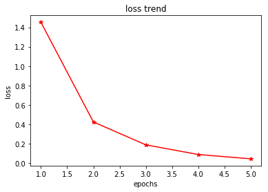
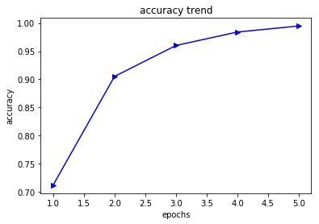

# 引言

本次文章将主要介绍fastText模型，首先会从模型的简介开始，然后进行模型原理分析，最后与Wordvec（跳字模型（Skip-Gram）、连续词袋模型（CWOB））做对比。

注：Word2vec主要指跳字模型（Skip-Gram）、连续词袋模型（CWOB）


# fastText模型的概述

    fastText是facebook开源的一个词向量与文本分类工具，在2016年开源，典型应用场景是“带监督的文本分类问题”。提供简单而高效的文本分类和表征学习的方法，性能比肩深度学习而且速度更快。

    fastText结合了自然语言处理和机器学习中最成功的理念。这些包括了使用词袋以及n-gram袋表征语句，还有使用子字(subword)信息，并通过隐藏表征在类别间共享信息。


# fastText基本原理分析

 英语单词通常有其内部结构和形成方式。例如，我们可以从“dog”，“dogs”和“dogcatcher”的字面上推测它们的关系。这些词都有同一个词根“dog”，但使用不同的后缀来改变词的含义。而且，这个关联可以推广至其他词汇。例如，“dog”和“dogs”的关系如同“cat”和“cats”的关系，“boy”和“boyfriend”的关系如同“girl”和“girlfriend”的关系。这一特点并非为英语所独有。在法语和西班牙语中，很多动词根据场景不同有40多种不同的形态，而在芬兰语中，一个名词可能有15种以上的形态。事实上，构词学（morphology）作为语言学的一个重要分支，研究的正是词的内部结构和形成方式

 在fastText中，每个中心词被表示成子词的集合。下面我们用单词“where”作为例子来了解子词是如何产生的。首先，我们在单词的首尾分别添加特殊字符“<”和“>”以区分作为前后缀的子词。然后，将单词当成一个由字符构成的序列来提取n元语法。例如，当n=3时，我们得到所有长度为3的子词：“<wh>”“whe”“her”“ere”“<re>”以及特殊子词“<where>”。

  ‍‍在fastText中，对于一个词w，我们将它所有长度在3∼6的子词和特殊子词的并集记为Gw。那么词典则是所有词的子词集合的并集。假设词典中子词g的向量为zg，那么跳字模型中词w的作为中心词的向量vw则应该表示成:‍‍

fastText的其余部分同跳字模型(Skip-Gram)一致。


# fastText模型分析

 fastText方法包含三部分，模型架构，层次SoftMax和N-gram特征。

## 模型架构
    fastText的架构和word2vec中的CBOW的架构类似，因为它们的作者都是Facebook的科学家Tomas Mikolov，而且确实fastText也算是words2vec所衍生出来的。

    连续词袋模型（CWOB）模型图如下：


 fastText模型如下：


 fastText 模型输入一个词的序列（一段文本或者一句话)，输出这个词序列属于不同类别的概率。序列中的词和词组组成特征向量，特征向量通过线性变换映射到中间层，中间层再映射到标签。 fastText 在预测标签时使用了非线性激活函数，但在中间层不使用非线性激活函数。

## 层序softmax
    关于层序softmax，其目的就是减少计算量。这个问题前面也已经介绍过了，不过为了文章的完整性，这里重复再写一次。

 在某些文本分类任务中类别很多，计算线性分类器的复杂度高。为了改善运行时间，fastText 模型使用了层次 Softmax 技巧。层次 Softmax 技巧建立在哈弗曼编码的基础上，对标签进行编码，能够极大地缩小模型预测目标的数量。

    fastText 也利用了类别（class）不均衡这个事实（一些类别出现次数比其他的更多），通过使用 Huffman 算法建立用于表征类别的树形结构。因此，频繁出现类别的树形结构的深度要比不频繁出现类别的树形结构的深度要小，这也使得进一步的计算效率更高。


    其中构造Huffman树的方法为：假设有n个权值，则构造出来的Huffman树有n个叶子结点。若n个权值分别为{w1,w2,…,wn}。

将{w1,w2,…,wn}当做n棵树（每棵树1个结点）组成的森林。
选择根结点权值最小的两棵树，合并，获得一棵新树，且新树的根结点权值为其左、右子树根结点权值之和。词频大的结点作为左孩子结点，词频小的作为右孩子结点。
从森林中删除被选中的树，保留新树。
重复2、3步，直至森林中只剩下一棵树为止。
N-Gram特征
 fastText 可以用于文本分类和句子分类。不管是文本分类还是句子分类，我们常用的特征是词袋模型。但词袋模型不能考虑词之间的顺序，因此 fastText 还加入了 N-gram 特征。“我 爱 她” 这句话中的词袋模型特征是 “我”，“爱”, “她”。这些特征和句子 “她 爱 我” 的特征是一样的。如果加入 2-Ngram，第一句话的特征还有 “我-爱” 和 “爱-她”，这两句话 “我 爱 她” 和 “她 爱 我” 就能区别开来了。当然啦，为了提高效率，我们需要过滤掉低频的 N-gram。


# fastText和Word2vec模型对比

 在word2vec中，我们并没有直接利用构词学中的信息。无论是在跳字模型还是连续词袋模型中，我们都将形态不同的单词用不同的向量来表示。例如，“dog”和“dogs”分别用两个不同的向量表示，而模型中并未直接表达这两个向量之间的关系。

与跳字模型相比，fastText要表示向量之间的关系，所以其词典规模更大，造成模型参数更多，同时一个词的向量需要对所有子词向量求和，继而导致计算复杂度更高。但与此同时，较生僻的复杂单词，甚至是词典中没有的单词，可能会从同它结构类似的其他词那里获取更好的词向量表示。

运行ipynb中的代码，损失和准确率结果如下图所示





词向量表示


```python
import fasttext 
# skipgram model
model = fasttext.skipgram('data.txt','model')
print model.words # 输出为一个词向量字典
# cbow model
model = fasttext.cbow('data.txt', 'model')
print model.words 

#其中data.txt是一个utf-8编码文件，默认的n-grams范围：3-6

#程序输出为两个文件：model.bin and model.vec

#model.vec 是一个每行为一个词向量的文本文件，model.bin是一个包含词典模型和所有超参数的二进制文件

#获取OOV词的词向量表示
print model['king']  # 获得单词king的词向量表示

model.bin可以使用如下方式重建模型：
model = fasttext.load_model('model.bin')
print model.words # list of words in dictionary
print model['king'] # get the vector of the word 'king'
```

文本分类


```python
#使用方式为：
classifier = fasttext.supervised('data.train.txt', 'model', label_prefix='__label__') #　原作者使用模型方法
#其中data.train.txt是每行包含标签的文本文件，默认标签前缀为__label__

#模型建立好以后，可以用来检测测试集上的准确度：
result = classifier.test('test.txt')
print 'P@1:', result.precision  # 准确率
print 'R@1:', result.recall  # 召回率
print 'Number of examples:', result.nexamples  # 测试样本数量

#也可以使用训练好的模型进行预测：
texts = ['example very long text 1', 'example very longtext 2']
labels = classifier.predict(texts)
print labels  # 返回为一个二元数组[[labels]]

# 或者同时包含概率值
labels = classifier.predict_proba(texts)
print labels

#也可以返回最可能的k个标签值：
labels = classifier.predict(texts, k=3)
print labels

# 同时包含概率值
labels = classifier.predict_proba(texts, k=3)
print labels
```

# fasttext python使用帮助文档
fasttext 有基于skipgram和cbow两种方式训练方式，以下给出一些常用的各个模型参数帮助文档：

（1）skipgram(params)


```python
input_file     training file path (required)  # 训练文件路径
output         output file path (required)  # 输出文件路径
lr             learning rate [0.05]  # 学习率
lr_update_rate change the rate of updates for the learning rate [100]  # 学习率的更新速度
dim            size of word vectors [100]  # 词向量维度
ws             size of the context window [5]  # 窗口宽度大小
epoch          number of epochs [5]  # 迭代次数
min_count      minimal number of word occurences [5]  # 最小词频数
neg            number of negatives sampled [5]  # 负样本个数
word_ngrams    max length of word ngram [1]  # 词ngram的最大长度
loss           loss function {ns, hs, softmax} [ns]  # 损失函数
bucket         number of buckets [2000000]  # 
minn           min length of char ngram [3]  # 字符ngram的最小长度
maxn           max length of char ngram [6]  # 字符ngram的最大长度
thread         number of threads [12]  # 线程数
t              sampling threshold [0.0001]  # 
silent         disable the log output from the C++ extension [1]
encoding       specify input_file encoding [utf-8]  # 输入文件格式

示例说明：model = fasttext.skipgram('train.txt', 'model', lr=0.1, dim=300)
```

（2）cbow(params)


```python
input_file     training file path (required)
output         output file path (required)
lr             learning rate [0.05]
lr_update_rate change the rate of updates for the learning rate [100]
dim            size of word vectors [100]
ws             size of the context window [5]
epoch          number of epochs [5]
min_count      minimal number of word occurences [5]
neg            number of negatives sampled [5]
word_ngrams    max length of word ngram [1]
loss           loss function {ns, hs, softmax} [ns]
bucket         number of buckets [2000000]
minn           min length of char ngram [3]
maxn           max length of char ngram [6]
thread         number of threads [12]
t              sampling threshold [0.0001]
silent         disable the log output from the C++ extension [1]
encoding       specify input_file encoding [utf-8]

示例说明：model = fasttext.cbow('train.txt', 'model', lr=0.1, dim=300)
```

（3）skipgram和cbow模型的返回值字段参数


```python
model.model_name       # Model name  模型名称
model.words            # List of words in the dictionary  词典单词向量列表
model.dim              # Size of word vector  词向量维度
model.ws               # Size of context window  内容窗口大小
model.epoch            # Number of epochs  迭代训练次数
model.min_count        # Minimal number of word occurences  
model.neg              # Number of negative sampled  负样本个数
model.word_ngrams      # Max length of word ngram  词ngram的最大长度
model.loss_name        # Loss function name  损失函数名称
model.bucket           # Number of buckets  
model.minn             # Min length of char ngram  字符ngram的最小长度
model.maxn             # Max length of char ngram  字符ngram的最大长度
model.lr_update_rate   # Rate of updates for the learning rate  学习率更新速度
model.t                # Value of sampling threshold  样本门限值
model.encoding         # Encoding of the model  模型编码
model[word]            # Get the vector of specified word  返回给定词的预测词向量
```

（4）supervised(params)


```python
input_file             training file path (required)  # 训练文件路径
output                 output file path (required)  # 输出文件路径
label_prefix           label prefix ['__label__']  # 标签前缀
lr                     learning rate [0.1]  # 学习率
lr_update_rate         change the rate of updates for the learning rate [100]  # 学习率的更新速度
dim                    size of word vectors [100]  # 词向量维度
ws                     size of the context window [5]  # 内容窗口大小
epoch                  number of epochs [5]  # 迭代次数
min_count              minimal number of word occurences [1] 最小词频数
neg                    number of negatives sampled [5]  # 负样本个数
word_ngrams            max length of word ngram [1]  # 词ngram的最大长度
loss                   loss function {ns, hs, softmax} [softmax]  # 损失函数
bucket                 number of buckets [0]  
minn                   min length of char ngram [0]  # 字符ngram的最小长度
maxn                   max length of char ngram [0]  # 字符ngram的最大长度
thread                 number of threads [12]
t                      sampling threshold [0.0001]  # 
silent                 disable the log output from the C++ extension [1]
encoding               specify input_file encoding [utf-8]  # 默认编码
pretrained_vectors     pretrained word vectors (.vec file) for supervised learning []  # 是否保持词向量输出文件model.vec，默认不保持

示例说明：classifier = fasttext.supervised('train.txt', 'model', label_prefix='__myprefix__', thread=4)
```

（5）supervised模型返回值字段参数


```python
classifier.labels                  # List of labels  标签列表
classifier.label_prefix            # Prefix of the label  标签前缀
classifier.dim                     # Size of word vector  词向量维度
classifier.ws                      # Size of context window  内容窗口大小
classifier.epoch                   # Number of epochs  迭代次数
classifier.min_count               # Minimal number of word occurences  
classifier.neg                     # Number of negative sampled  负样本个数
classifier.word_ngrams             # Max length of word ngram  词ngram的最大长度
classifier.loss_name               # Loss function name  损失函数名称
classifier.bucket                  # Number of buckets  
classifier.minn                    # Min length of char ngram  字符ngram的最小长度
classifier.maxn                    # Max length of char ngram  字符ngram的最大长度
classifier.lr_update_rate          # Rate of updates for the learning rate  学习率的更新速度
classifier.t                       # Value of sampling threshold  
classifier.encoding                # Encoding that used by classifier  分类器使用编码
classifier.test(filename, k)       # Test the classifier  用分类器进行测试
classifier.predict(texts, k)       # Predict the most likely label  使用分类器进行文本预测
classifier.predict_proba(texts, k) # Predict the most likely label include their probability  使用分类器进行文本预测类别并且返回他们的概率值
```

