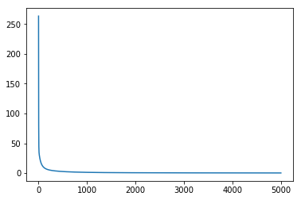

请点击[此处](https://ai.baidu.com/docs#/AIStudio_Project_Notebook/a38e5576)查看本环境基本用法.  <br>
Please click [here ](https://ai.baidu.com/docs#/AIStudio_Project_Notebook/a38e5576) for more detailed instructions. 

一、深度学习发展历史
  作为机器学习的一个重要分支，深度学习近年来在全球范围内都引起了广泛的关注。然而深度学习在火热之前已经经历了一段漫长的发展历程，接下来我们简单了解一下。
  1943 年，心理学家麦卡·洛克和数学逻辑学家皮兹发表论文《神经活动中内在思想的逻辑演算》，在此论文中提出了 MP 模型。MP 模型是模仿神经元的结构和工作原理，构造出的一个基于神经网络的数学模型，本质上是一种“模拟人类大脑”的神经元模型（这里有必要说明的是，我们说的“模拟”，更准确的说法其实应该是“参考”，计算机领域的“人工神经网络”的确受到了生物学上的“神经网络”的启发，但是两者相差万里，没有直接的可比性）。MP 模型作为人工神经网络的起源，开创了人工神经网络的新时代，也奠定了神经网络模型的基础。
  1949 年，加拿大著名心理学家唐纳德·赫布在《行为的组织》中提出了一种基于无监督学习的规则——赫伯学习规则（Hebb Rule）。赫伯学习规则模仿人类认知世界的过程建立一种“网络模型”，该网络模型针对训练集进行大量的训练并提取训练集的统计特征，然后按照样本的相似程度进行分类，把相互之间联系密切的样本分为一类，这样就把样本分成了若干类。海布学习规则与“条件反射”机理一致，为以后的神经网络学习算法奠定了基础，具有重大的历史意义。
  20 世纪 50 年代末，在 MP 模型和赫伯学习规则的研究基础上，美国科学家罗森·布拉特发现了一种类似于人类学习过程的学习算法——感知器学习，并于 1957 年正式提出了由两层神经元组成的神经网络，即“感知器”。感知器本质上是一种线性模型，可以对输入的训练集数据进行二分类，且能够在训练集中自动更新权值。感知器的提出吸引了大量科学家研究人工神经网络，对神经网络的发展具有里程碑式的意义。但随着研究的深入，人们发现了感知器模型所存在的不足，它甚至无法解决最简单的线性不可分问题（例如异或问题）。由于这一不足以及没有及时推广感知器到多层神经网络中，在 20 世纪 70 年代，人工神经网络进入了第一个寒冬期，人工神经网络的发展也受到了很大的阻碍甚至质疑。
  1982 年，著名物理学家约翰·霍普菲尔德发明了 Hopfield 网络。Hopfield 神经网络是一种结合存储系统和二元系统的循环神经网络。Hopfield 网络也可以模拟人类的记忆，根据激活函数的选取不同，有连续型和离散型两种类型，分别用于优化计算和联想记忆。但由于容易陷入局部最小值的缺陷，该算法并未在当时引起很大的轰动。
  直到 1986 年，深度学习之父杰弗里·辛顿提出了一种适用于多层感知器的反向传播算法——BP 算法 。BP 算法在传统神经网络正向传播的基础上，增加了误差的反向传播过程。反向传播过程不断地调整神经元之间的权值和阈值，直到输出的误差达到减小到允许的范围之内，或达到预先设定的训练次数为止。BP 算法解决了非线性分类问题，让人工神经网络再次引起了人们广泛的关注。
  但是由于八十年代计算机的硬件水平有限，运算能力跟不上，以及当神经网络的层数增加时，BP 算法会出现“梯度消失”的问题等等。这使得 BP 算法的发展受到了很大的限制。再加上 90 年代中期，以 SVM 为代表的其它浅层机器学习算法被提出，并在分类、回归问题上均取得了很好的效果，其原理相较于神经网络模型具有更好的可解释性，所以人工神经网络的发展再次进入了瓶颈期。
  2006 年，杰弗里·辛顿以及他的学生鲁斯兰·萨拉赫丁诺夫正式提出了深度学习的概念。他们在世界顶级学术期刊《Science》发表的一篇文章中详细的给出了“梯度消失”问题的解决方案——通过无监督的学习方法逐层训练算法，再使用有监督的反向传播算法进行调优。该深度学习方法的提出，立即在学术圈引起了巨大的反响，以斯坦福大学、多伦多大学为代表的众多世界知名高校纷纷投入巨大的人力、财力进行深度学习领域的相关研究，而后又迅速蔓延到工业界中。
  2012 年，在著名的 ImageNet 图像识别大赛中，杰弗里·辛顿领导的小组采用深度学习模型 AlexNet 一举夺冠。AlexNet 采用 ReLU 激活函数，极大程度上上解决了梯度消失问题，并采用 GPU 极大的提高了模型的运算速度。同年，由斯坦福大学著名的吴恩达教授和世界顶尖计算机专家 JeffDean 共同主导的深度神经网络——DNN 技术在图像识别领域取得了惊人的成绩，在 ImageNet 评测中成功的把错误率从 26％ 降低到了 15％。深度学习技术在世界大赛的脱颖而出，又进一步吸引了学术界和工业界对于深度学习领域的关注。
  随着深度学习技术的不断进步以及计算机硬件算力的不断提升，2014 年，Facebook 基于深度学习技术的 DeepFace 项目，在人脸识别方面的准确率已经能达到 97% 以上，跟人类识别的准确率几乎没有差别。这样的结果也再一次证明了深度学习技术在图像识别方面的一骑绝尘。
  2016 年，谷歌公司基于深度强化学习开发的 AlphaGo 以 4:1 的比分战胜了国际顶尖围棋高手李世石，深度学习的热度一时无两。后来，AlphaGo 又接连和众多世界级围棋高手过招，均取得了完胜。这也证明了在围棋界，基于深度学习技术的机器人几乎已经超越了人类。
  2017 年，基于深度强化学习技术的 AlphaGo 升级版 AlphaGo Zero 横空出世。其采用“从零开始”、“无师自通”的学习模式，以 100:0 的比分轻而易举打败了之前的 AlphaGo。除了围棋，它还精通国际象棋等其它棋类游戏，可以说是真正的棋类“天才”。此外在这一年，深度学习相关技术也在医疗、金融、艺术、无人驾驶等多个领域均取得了显著的成果。所以，也有专家把 2017 年看作是深度学习甚至是人工智能发展最为突飞猛进的一年。
  深度学习发展到今天已经越来越趋于成熟，尤其是图像方面。无论是科研还是应用，大家也越来越理性，而不是像早些时候，把深度学习视为“万能的”，盲目的去跟风。当然，这一领域也还有许多问题需要解决，还有很多有趣、有挑战性的方向可以研究。
  

二、人工智能、机器学习、深度学习的区别和联系
  人工智能（Artificial intelligence）简称AI。人工智能是计算机科学的一个分支，它企图了解智能的本质，并生产出一种新的能以人类智能相似的方式做出反应的智能机器，是研究、开发用于模拟、延伸和扩展人的智能的理论、方法、技术及应用系统的一门新的技术科学。
  机器学习（MachineLearning）简称ML。机器学习属于人工智能的一个分支，也是人工智能的和核心。机器学习理论主要是设计和分析一些让计算机可以自动”学习“的算法。
  深度学习（DeepLearning）简称DL。最初的深度学习是利用深度神经网络来解决特征表达的一种学习过程。深度神经网络本身并不是一个全新的概念，可大致理解为包含多个隐含层的神经网络结构。
  机器学习是一种实现人工智能的方法，深度学习是一种机器学习的一个分支。
  

三、神经元、单层感知机、多层感知机
  （1）神经元：神经元是生物神经网络的基本组成单位，有细胞体、轴突、树突三部分组成传入的神经元冲动经整合使细胞膜的电位升高，当电位升高到超过动作电位的阙值时，神经元为兴奋状态，产生神经冲动由轴突经神经末梢传出;传入神经元的冲动经整合使细胞膜电位降低，当电位降低到低于动作电位阈值时，神经元为抑制状态，不产生神经冲动。
  （2）单层感知机：输入层和输出层为同一层的神经网络模型。单层感知器可以用来区分线性可分的数据，并且一定可以在有限的迭代次数中收敛。从使用过程来看，单层的感知器其实看起来是相当简单的：对假设函数进行训练，直到对所有的样本都满足经过假设函数计算出来的结果与预期结果一致，就结束了。单层感知器能够用来模拟逻辑函数，例如逻辑非NOT、逻辑或非XOR、逻辑或OR、逻辑与AND和逻辑与非NAND等，但是不能用来模拟逻辑异或XOR。 除了输入之外，偏置（bias）也经常被用于每个神经元，它在通过转换函数之前被加到输入的加权和上。权值也经常被应用于偏置上。偏置决定了多少输入激活（输入的加权和）才能激发神经元进入兴奋状态。偏置往往被设定为1，而偏置的权值可以通过学习算法加以调整。 
  （3）多层感知机：输入层和输出层不是同一层的神经网络模型。多层感知机可以模拟任何复杂函数，函数的复杂性取决于网络输入个数和隐层个数。多层神经网络不仅包含并行结构，还包含串行结构，整个网络更加复杂，能够实现更复杂的功能。多层神经网络可以分为输入层、隐含层、输出层，其中隐含层的层数可以根据需要进行设计，实现的功能越强大，则对应的层数应设计得越多，以实现网络的复杂映射。1986年，Rumelhart和 McCelland及其研究小组在多层神经网络模型的基础上，提出了多层神经网络权值修正的反向传播学习算法——BP算法。利用这一算法，开发者不用关心“黑箱”中的内容，只需关注对应的输入和输出，这大大简化了神经网络的开发，证明了多层神经网络具有极强的学习能力。至今BP算法仍然是最常用的神经网络学习算法之一。
多层神经网络(指普通多层神经网络，不包括深度神经网络)拥有众多优势，但也有一定的不足,列举如下:
  多层神经网络在处理大数据时，需要人为提取大量原始数据的特征输入，在忽略个体之间差异的同时又要保留总体的相似特征。例如神经网络可能将哈＋奇犬和狼归为同一种，却将草地上的哈士奇犬与雪地上的哈士奇犬分为不同种类。前者是神经网终对特征不够敏感,无法提取有效特征;后者是神经网络对无关项过于敏感，从而干扰结果。
  多层神经网络能表示的非线性关系的复杂度取决于神经网络的层数，层数越多越逼近真实函数，与之相矛盾的是层数越多网络越难训练，若使用链式法则进行参数训练,则会因为网络太深而很难将深层信息反馈到浅层。
  多层神经网络因为不含时间参数而无法处理时间序列问题，在进行自然语言处理时,这种多层神经网络就显得十分力不从心。


四、什么是前向传播
前向传播就是从输入层开始，信号输入神经元，经过加权偏置激活函数的处理输出，成为下一级的输入参数，如此往复直到输出层输出。对于前向传播来说，不管维度多高，其过程都可以用如下公式表示


五、什么是反向传播
反向传播算法（Backpropagation）是目前用来训练人工神经网络（Artificial Neural Network，ANN）的最常用且最有效的算法。其主要思想是：
（1）将训练集数据输入到ANN的输入层，经过隐藏层，最后达到输出层并输出结果，这是ANN的前向传播过程；
（2）由于ANN的输出结果与实际结果有误差，则计算估计值与实际值之间的误差，并将该误差从输出层向隐藏层反向传播，直至传播到输入层；
（3）在反向传播的过程中，根据误差调整各种参数的值；不断迭代上述过程，直至收敛。


上图是一个三层人工神经网络，layer1至layer3分别是输入层、隐藏层和输出层。


实验一：使用numpy和python对波士顿房价数据集进行预测，数据集共506个样本，14个特征，最后一个特征作为样本的标签。


```python
import numpy as np
import pandas as pd
import matplotlib.pyplot as plt
from sklearn.metrics import r2_score
import math
#导入numpy，pandas
```

定义一个load_data函数来完成数据的导入，进行归一化和标准化处理，并按8：2划分训练集和测试集。


```python
def load_data():
    # 从文件导入数据
    data1 = pd.read_csv(r'data/data7802/boston_house_prices.csv',header=None,sep=',')
    data = np.array(data1.iloc[2:508 , 0:14].values.astype(float))

    # 每条数据包括14项，其中前面13项是影响因素，第14项是相应的房屋价格中位数
    feature_names = [ 'CRIM', 'ZN', 'INDUS', 'CHAS', 'NOX', 'RM', 'AGE', \
                      'DIS', 'RAD', 'TAX', 'PTRATIO', 'B', 'LSTAT', 'MEDV' ]
    feature_num = len(feature_names)

    # 将原数据集拆分成训练集和测试集
    # 这里使用80%的数据做训练，20%的数据做测试
    # 测试集和训练集必须是没有交集的
    ratio = 0.8
    offset = int(data.shape[0] * ratio)
    training_data = data[:offset]

    # 计算训练集的最大值，最小值，平均值
    maximums, minimums, avgs = training_data.max(axis=0), training_data.min(axis=0), \
                                 training_data.sum(axis=0) / training_data.shape[0]

    # 对数据进行归一化处理
    for i in range(feature_num):
        print(maximums[i], minimums[i], avgs[i])
        data[:, i] = (data[:, i] - minimums[i]) / (maximums[i] - minimums[i])

    # 训练集和测试集的划分比例
    training_data = data[:offset]
    test_data = data[offset:]
    return training_data, test_data
```


```python
# 获取数据
training_data, test_data = load_data()
x = training_data[:, :-1]
y = training_data[:, -1:]
```

    88.9762 0.00632 1.9158993069306933
    100.0 0.0 14.232673267326733
    25.65 0.46 9.502326732673266
    1.0 0.0 0.08663366336633663
    0.871 0.385 0.5317319306930693
    8.78 3.561 6.333108910891089
    100.0 2.9 64.42747524752475
    12.1265 1.1296 4.174213613861386
    24.0 1.0 6.78960396039604
    666.0 187.0 352.91089108910893
    22.0 12.6 18.026237623762373
    396.9 70.8 379.9717574257426
    37.97 1.73 11.354950495049504
    50.0 5.0 24.175742574257427


```python
hidden_dim = 100

w1 = np.random.randn(x.shape[1],hidden_dim)
w2 = np.random.randn(hidden_dim,y.shape[1])

lr = 1e-06
```


```python
losses = []
for i in range(5000):
    #迭代500次
    #前向传播
    h = x.dot(w1) #隐藏层
    h_relu = np.maximum(h,0) #relu激活函数
    y_hat = h_relu.dot(w2)
    
    #计算损失
    loss = np.square(y_hat - y).sum()/len(y_hat)
    losses.append(loss)
    
    #计算梯度
    y_hat_grad = 2.0*(y_hat-y)
    w2_grad = h_relu.T.dot(y_hat_grad)
    h_relu_grad = y_hat_grad.dot(w2.T)
    h_grad = h_relu_grad.copy()
    h_grad[h < 0] = 0
    w1_grad = x.T.dot(h_grad)
    
    #更新参数
    w1 = w1 - lr*w1_grad
    w2 = w2 - lr*w2_grad
    print("epoch "+str(i)+" loss:",loss)
```

    epoch 4999 loss: 0.2691376292372099


```python
# 画出损失函数的变化趋势
plot_x = np.arange(len(losses))
plot_y = np.array(losses)
plt.plot(plot_x, plot_y)
plt.show()
```





```python
#测试集进行验证
test = test_data[:, 0:13]
test_label = test_data[:, [13]]

h = test.dot(w1) #隐藏层
h_relu = np.maximum(h,0) #relu激活函数
test_label_pred = h_relu.dot(w2)

a_loss = np.sqrt(((test_label_pred - test_label) ** 2).mean())
print(a_loss)
r2=r2_score(test_label, test_label_pred, multioutput='variance_weighted')
print(r2)
```

    1.6073095822479009
    -193.56271675741664


使用均方误差和r2决定系数对模型进行评估，发现该模型在此数据集上的效果不佳

实验二：使用paddle构建网络进行训练


```python
import paddle
from paddle.nn import Linear
import paddle.nn.functional as F
import numpy as np
import os
import random
import paddle.fluid as fluid
#加载飞桨、Numpy和相关类库
```


```python
def load_data():
    # 从文件导入数据
    data1 = pd.read_csv(r'data/data7802/boston_house_prices.csv',header=None,sep=',')
    data = np.array(data1.iloc[2:508 , 0:14].values.astype(np.float32))

    # 每条数据包括14项，其中前面13项是影响因素，第14项是相应的房屋价格中位数
    feature_names = [ 'CRIM', 'ZN', 'INDUS', 'CHAS', 'NOX', 'RM', 'AGE', \
                      'DIS', 'RAD', 'TAX', 'PTRATIO', 'B', 'LSTAT', 'MEDV' ]
    feature_num = len(feature_names)

    # 将原数据集拆分成训练集和测试集
    # 这里使用80%的数据做训练，20%的数据做测试
    # 测试集和训练集必须是没有交集的
    ratio = 0.8
    offset = int(data.shape[0] * ratio)
    training_data = data[:offset]

    # 计算训练集的最大值，最小值，平均值
    maximums, minimums, avgs = training_data.max(axis=0), training_data.min(axis=0), \
                                 training_data.sum(axis=0) / training_data.shape[0]

    # 对数据进行归一化处理
    for i in range(feature_num):
        print(maximums[i], minimums[i], avgs[i])
        data[:, i] = (data[:, i] - minimums[i]) / (maximums[i] - minimums[i])

    # 训练集和测试集的划分比例
    training_data = data[:offset]
    test_data = data[offset:]
    return training_data, test_data
```

数据集已经导入过，直接使用


```python
class Regressor(paddle.nn.Layer):#用类方法定义网络
    def __init__(self):
        super(Regressor, self).__init__()
        
        # 定义两层全连接层，输入维度是13，输出维度是1,隐含层有100个节点
        self.fc1 = Linear(in_features=13, out_features=100)
        self.fc2 = Linear(in_features=100, out_features=1)
    
    # 网络的前向计算
    def forward(self, inputs):
        x = self.fc1(inputs)
        x = fluid.layers.relu(x)
        x = self.fc2(x)
        return x
```


```python
model = Regressor()
# 开启模型训练模式
model.train()
# 加载数据
training_data, test_data = load_data()
# 定义优化算法，使用随机梯度下降SGD
# 学习率设置为0.01
opt = paddle.optimizer.SGD(learning_rate=0.01, parameters=model.parameters())
```

    88.9762 0.00632 1.9158992
    100.0 0.0 14.232674
    25.65 0.46 9.502327
    1.0 0.0 0.08663366
    0.871 0.385 0.53173196
    8.78 3.561 6.3331094
    100.0 2.9 64.427475
    12.1265 1.1296 4.174214
    24.0 1.0 6.789604
    666.0 187.0 352.9109
    22.0 12.6 18.026237
    396.9 70.8 379.97174
    37.97 1.73 11.35495
    50.0 5.0 24.175743


```python
EPOCH_NUM = 100   # 设置外层循环次数
BATCH_SIZE = 10  # 设置batch大小

# 定义外层循环
for epoch_id in range(EPOCH_NUM):
    # 在每轮迭代开始之前，将训练数据的顺序随机的打乱
    np.random.shuffle(training_data)
    # 将训练数据进行拆分，每个batch包含10条数据
    mini_batches = [training_data[k:k+BATCH_SIZE] for k in range(0, len(training_data), BATCH_SIZE)]
    # 定义内层循环
    for iter_id, mini_batch in enumerate(mini_batches):
        x = np.array(mini_batch[:, :-1]) # 获得当前批次训练数据
        y = np.array(mini_batch[:, -1:]) # 获得当前批次训练标签（真实房价）
        # 将numpy数据转为飞桨动态图tensor形式
        house_features = paddle.to_tensor(x)
        prices = paddle.to_tensor(y)
        
        # 前向计算
        predicts = model(house_features)
        
        # 计算损失
        loss = F.square_error_cost(predicts, label=prices)
        avg_loss = paddle.mean(loss)
        if iter_id%20==0:
            print("epoch: {}, iter: {}, loss is: {}".format(epoch_id, iter_id, avg_loss.numpy()))
        
        # 反向传播
        avg_loss.backward()
        # 最小化loss,更新参数
        opt.step()
        # 清除梯度
        opt.clear_grad()
```

    epoch: 0, iter: 0, loss is: [0.04490466]
    epoch: 0, iter: 20, loss is: [0.06407665]
    epoch: 0, iter: 40, loss is: [0.07365322]
    epoch: 1, iter: 0, loss is: [0.02133229]
    epoch: 1, iter: 20, loss is: [0.05208566]
    epoch: 1, iter: 40, loss is: [0.07672812]
    epoch: 2, iter: 0, loss is: [0.03593235]
    epoch: 2, iter: 20, loss is: [0.03379483]
    epoch: 2, iter: 40, loss is: [0.04916742]
    epoch: 3, iter: 0, loss is: [0.06237083]
    epoch: 3, iter: 20, loss is: [0.01173034]
    epoch: 3, iter: 40, loss is: [0.01411961]
    epoch: 4, iter: 0, loss is: [0.02946856]
    epoch: 4, iter: 20, loss is: [0.01954151]
    epoch: 4, iter: 40, loss is: [0.00289395]
    epoch: 5, iter: 0, loss is: [0.00452339]
    epoch: 5, iter: 20, loss is: [0.04497802]
    epoch: 5, iter: 40, loss is: [0.01073659]
    epoch: 6, iter: 0, loss is: [0.0435303]
    epoch: 6, iter: 20, loss is: [0.01416587]
    epoch: 6, iter: 40, loss is: [0.00427914]
    epoch: 7, iter: 0, loss is: [0.00484181]
    epoch: 7, iter: 20, loss is: [0.01764464]
    epoch: 7, iter: 40, loss is: [0.02894494]
    epoch: 8, iter: 0, loss is: [0.04335145]
    epoch: 8, iter: 20, loss is: [0.02119408]
    epoch: 8, iter: 40, loss is: [0.00202285]
    epoch: 9, iter: 0, loss is: [0.02610135]
    epoch: 9, iter: 20, loss is: [0.02324148]
    epoch: 9, iter: 40, loss is: [0.03111158]
    epoch: 10, iter: 0, loss is: [0.00830175]
    epoch: 10, iter: 20, loss is: [0.00651917]
    epoch: 10, iter: 40, loss is: [0.03433026]
    epoch: 11, iter: 0, loss is: [0.01738353]
    epoch: 11, iter: 20, loss is: [0.05809493]
    epoch: 11, iter: 40, loss is: [0.00471923]
    epoch: 12, iter: 0, loss is: [0.02936118]
    epoch: 12, iter: 20, loss is: [0.01524136]
    epoch: 12, iter: 40, loss is: [0.00830731]
    epoch: 13, iter: 0, loss is: [0.0216514]
    epoch: 13, iter: 20, loss is: [0.01733912]
    epoch: 13, iter: 40, loss is: [0.01140046]
    epoch: 14, iter: 0, loss is: [0.00981071]
    epoch: 14, iter: 20, loss is: [0.00314584]
    epoch: 14, iter: 40, loss is: [0.00870521]
    epoch: 15, iter: 0, loss is: [0.00286364]
    epoch: 15, iter: 20, loss is: [0.05665671]
    epoch: 15, iter: 40, loss is: [0.01492799]
    epoch: 16, iter: 0, loss is: [0.02012215]
    epoch: 16, iter: 20, loss is: [0.03719641]
    epoch: 16, iter: 40, loss is: [0.0045194]
    epoch: 17, iter: 0, loss is: [0.02527224]
    epoch: 17, iter: 20, loss is: [0.05763504]
    epoch: 17, iter: 40, loss is: [0.13267636]
    epoch: 18, iter: 0, loss is: [0.00710251]
    epoch: 18, iter: 20, loss is: [0.0033664]
    epoch: 18, iter: 40, loss is: [0.00777091]
    epoch: 19, iter: 0, loss is: [0.01876554]
    epoch: 19, iter: 20, loss is: [0.01307998]
    epoch: 19, iter: 40, loss is: [0.03718825]
    epoch: 20, iter: 0, loss is: [0.01525825]
    epoch: 20, iter: 20, loss is: [0.00442699]
    epoch: 20, iter: 40, loss is: [0.01962748]
    epoch: 21, iter: 0, loss is: [0.01723921]
    epoch: 21, iter: 20, loss is: [0.02242143]
    epoch: 21, iter: 40, loss is: [0.00287119]
    epoch: 22, iter: 0, loss is: [0.01226738]
    epoch: 22, iter: 20, loss is: [0.00582784]
    epoch: 22, iter: 40, loss is: [0.00663388]
    epoch: 23, iter: 0, loss is: [0.00928915]
    epoch: 23, iter: 20, loss is: [0.00356971]
    epoch: 23, iter: 40, loss is: [0.01232313]
    epoch: 24, iter: 0, loss is: [0.00310504]
    epoch: 24, iter: 20, loss is: [0.00500375]
    epoch: 24, iter: 40, loss is: [0.01101853]
    epoch: 25, iter: 0, loss is: [0.01404633]
    epoch: 25, iter: 20, loss is: [0.02029141]
    epoch: 25, iter: 40, loss is: [0.01397359]
    epoch: 26, iter: 0, loss is: [0.01936462]
    epoch: 26, iter: 20, loss is: [0.0021653]
    epoch: 26, iter: 40, loss is: [0.00251542]
    epoch: 27, iter: 0, loss is: [0.01054017]
    epoch: 27, iter: 20, loss is: [0.01896592]
    epoch: 27, iter: 40, loss is: [0.00320919]
    epoch: 28, iter: 0, loss is: [0.01329817]
    epoch: 28, iter: 20, loss is: [0.00289977]
    epoch: 28, iter: 40, loss is: [0.04580568]
    epoch: 29, iter: 0, loss is: [0.01443986]
    epoch: 29, iter: 20, loss is: [0.01511495]
    epoch: 29, iter: 40, loss is: [0.00731004]
    epoch: 30, iter: 0, loss is: [0.0082208]
    epoch: 30, iter: 20, loss is: [0.0523911]
    epoch: 30, iter: 40, loss is: [0.00120348]
    epoch: 31, iter: 0, loss is: [0.00743067]
    epoch: 31, iter: 20, loss is: [0.0051002]
    epoch: 31, iter: 40, loss is: [0.00201032]
    epoch: 32, iter: 0, loss is: [0.01371952]
    epoch: 32, iter: 20, loss is: [0.00739108]
    epoch: 32, iter: 40, loss is: [0.03896511]
    epoch: 33, iter: 0, loss is: [0.01144285]
    epoch: 33, iter: 20, loss is: [0.00908038]
    epoch: 33, iter: 40, loss is: [0.01879119]
    epoch: 34, iter: 0, loss is: [0.03468473]
    epoch: 34, iter: 20, loss is: [0.00831622]
    epoch: 34, iter: 40, loss is: [0.00580995]
    epoch: 35, iter: 0, loss is: [0.03107214]
    epoch: 35, iter: 20, loss is: [0.00452798]
    epoch: 35, iter: 40, loss is: [0.01807929]
    epoch: 36, iter: 0, loss is: [0.04268509]
    epoch: 36, iter: 20, loss is: [0.00516278]
    epoch: 36, iter: 40, loss is: [0.00996445]
    epoch: 37, iter: 0, loss is: [0.00561767]
    epoch: 37, iter: 20, loss is: [0.014762]
    epoch: 37, iter: 40, loss is: [0.00207955]
    epoch: 38, iter: 0, loss is: [0.00386997]
    epoch: 38, iter: 20, loss is: [0.0080968]
    epoch: 38, iter: 40, loss is: [0.01920636]
    epoch: 39, iter: 0, loss is: [0.00601032]
    epoch: 39, iter: 20, loss is: [0.00799485]
    epoch: 39, iter: 40, loss is: [0.00174838]
    epoch: 40, iter: 0, loss is: [0.01530202]
    epoch: 40, iter: 20, loss is: [0.00780871]
    epoch: 40, iter: 40, loss is: [0.00335159]
    epoch: 41, iter: 0, loss is: [0.02228154]
    epoch: 41, iter: 20, loss is: [0.02288668]
    epoch: 41, iter: 40, loss is: [0.00396635]
    epoch: 42, iter: 0, loss is: [0.01377822]


```python
#测试集进行验证
xx = test_data[:, 0:13]
yy = test_data[:, [13]]

house_features = paddle.to_tensor(xx)
prices = paddle.to_tensor(yy)

yy_pred = model(house_features)

a_loss = np.sqrt(((yy_pred.numpy() - yy) ** 2).mean())
print(a_loss)
r2=r2_score(yy, yy_pred, multioutput='variance_weighted')
print(r2)
```
