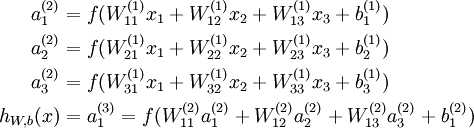

# 1、深度学习发展历史

1.第一次兴起--神经网络启蒙
1943年 由神经科学家麦卡洛克(W.S.McCilloch) 和数学家皮兹（W.Pitts）在《数学生物物理学公告》上发表论文《神经活动中内在思想的逻辑演算》（A Logical Calculus of the Ideas Immanent in Nervous Activity）。建立了神经网络和数学模型，称为MCP模型。所谓MCP模型，其实是按照生物神经元的结构和工作原理构造出来的一个抽象和简化了的模型，也就诞生了所谓的“模拟大脑”，人工神经网络的大门由此开启。MCP当时是希望能够用计算机来模拟人的神经元反应的过程，该模型将神经元简化为了三个过程：输入信号线性加权，求和，非线性激活（阈值法）
1958年 计算机科学家罗森布拉特（ Rosenblatt）提出了两层神经元组成的神经网络，称之为“感知器”(Perceptrons)。第一次将MCP用于机器学习（machine learning）分类(classification)。“感知器”算法算法使用MCP模型对输入的多维数据进行二分类，且能够使用梯度下降法从训练样本中自动学习更新权值。1962年,该方法被证明为能够收敛，理论与实践效果引起第一次神经网络的浪潮。

2.第一次低谷---成也萧何败也萧何
1969年，美国数学家及人工智能先驱 Marvin Minsky 在其著作中证明了感知器本质上是一种线性模型（linear model），只能处理线性分类问题，就连最简单的XOR（亦或）问题都无法正确分类。这等于直接宣判了感知器的死刑，神经网络的研究也陷入了将近20年的停滞。

3.第二次兴起--BP网络与激活函数
1986年由神经网络之父 Geoffrey Hinton 在1986年发明了适用于多层感知器（MLP）的BP（Backpropagation）算法，并采用Sigmoid进行非线性映射，有效解决了非线性分类和学习的问题。该方法引起了神经网络的第二次热潮。注：Sigmoid 函数是一个在生物学中常见的S型的函数，也称为S型生长曲线。在信息科学中，由于其单增以及反函数单增等性质，Sigmoid函数常被用作神经网络的阈值函数，将变量映射到0,1之间

4.第二次低谷--屋漏偏逢连夜雨
1991年BP算法被指出存在梯度消失问题，也就是说在误差梯度后项传递的过程中，后层梯度以乘性方式叠加到前层，由于Sigmoid函数的饱和特性，后层梯度本来就小，误差梯度传到前层时几乎为0，因此无法对前层进行有效的学习，该问题直接阻碍了深度学习的进一步发展。
此外90年代中期，支持向量机算法诞生（SVM算法）等各种浅层机器学习模型被提出，SVM也是一种有监督的学习模型，应用于模式识别，分类以及回归分析等。支持向量机以统计学为基础，和神经网络有明显的差异，支持向量机等算法的提出再次阻碍了深度学习的发展。

5.第三次兴起--待到秋来九月八，我花开后百花杀。冲天香阵透长安，满城尽带黄金甲。
发展期 2006年 - 2012年
2006年，加拿大多伦多大学教授、机器学习领域泰斗、神经网络之父—— Geoffrey Hinton 和他的学生 Ruslan Salakhutdinov 在顶尖学术刊物《科学》上发表了一篇文章，该文章提出了深层网络训练中梯度消失问题的解决方案：无监督预训练对权值进行初始化+有监督训练微调。斯坦福大学、纽约大学、加拿大蒙特利尔大学等成为研究深度学习的重镇，至此开启了深度学习在学术界和工业界的浪潮。
2011年，ReLU激活函数被提出，该激活函数能够有效的抑制梯度消失问题。2011年以来，微软首次将DL应用在语音识别上，取得了重大突破。微软研究院和Google的语音识别研究人员先后采用DNN技术降低语音识别错误率20％~30％，是语音识别领域十多年来最大的突破性进展。2012年，DNN技术在图像识别领域取得惊人的效果，在ImageNet评测上将错误率从26％降低到15％。
在这一年，DNN还被应用于制药公司的DrugeActivity预测问题，并获得世界最好成绩。
6.爆发期 2012 - 2017
2012年，Hinton课题组为了证明深度学习的潜力，首次参加ImageNet图像识别比赛，其通过构建的CNN网络AlexNet一举夺得冠军，且碾压第二名（SVM方法）的分类性能。也正是由于该比赛，CNN吸引到了众多研究者的注意。

# 2、人工智能、机器学习、深度学习有什么区别和联系？

人工智能、机器学习和深度学习覆盖的技术范畴是逐层递减的。人工智能是最宽泛的概念。机器学习是当前比较有效的一种实现人工智能的方式。深度学习是机器学习算法中最热门的一个分支，近些年取得了显著的进展，并替代了大多数传统机器学习算法。三者的关系如图1所示，即：人工智能 > 机器学习 > 深度学习。

图1：

# 3、神经元、单层感知机、多层感知机

神经元：神经网络中每个节点称为神经元，由加权和、非线性变换（激活函数）组成

单层感知机：单层感知器（Single Layer Perceptron）是最简单的神经网络。它包含输入层和输出层，而输入层和输出层是直接相连的。如图2便是一个单层感知器。输出端计算公式为：$$ O = f\left( \sum_{j}^n(i_j*W_j) \right)  （公式一）$$

图2：

多层感知机：多层感知器（Multi-Layer Perceptrons），包含多层计算。相对于单层感知器，输出端从一个变到了多个；输入端和输出端之间也不光只有一层，现在又两层:输出层和隐藏层。如图3就是一个多层感知器。

图3：

# 4、什么是前向传播？

前向传播：即网络如何根据输入X得到输出Y的。以下图为例，这个很容易理解，粗略看一下即可，这里主要是为了统一后面的符号表达。图4：

记$ w^l_j{_k} $为第l−1层第k个神经元到第l层第j个神经元的权重,$ b_j^l $为第l层第j个神经元的偏置，$ a^l_j $为第l层第j个神经元的激活值（激活函数的输出）。不难看出，$ a^l_j $的值取决于上一层神经元的激活:$$ a^l_j=σ(∑_k(w^l_j{_k}a_k^{l−1}+b^l_j) （公式2）$$
将上式重谢为矩阵形式：$$ a^l=σ(w^la^{l−1}+b^l) （公式3）$$
为了方便表示，记 $ z^l=w^la^{l−1}+b^l $为每一层的权重输入， (3)式则变为 $ a^l=σ(z^l) $。利用 (3)式一层层计算网络的激活值，最终能够根据输入X得到相应的输出Y。

# 5、是么是反向传播？

反向传播：反向传播（Backpropagation，缩写为BP）是“误差反向传播”的简称，是一种与最优化方法（如梯度下降法）结合使用的，用来训练人工神经网络的常见方法。 该方法对网络中所有权重计算损失函数的梯度。 这个梯度会反馈给最优化方法，用来更新权值以最小化损失函数。

首先拿一个简单的三层神经网络来举例。如图5:

每个神经元由两部分组成，第一部分（e）是输入值和权重系数乘积的和，第二部分（f(e)）是一个激活函数（非线性函数）的输出， y=f(e)即为某个神经元的输出，如下图6：

反向传播过程：利用反向传播的误差，计算各个神经元（权重）的导数，开始反向传播修改权重，推导过程如下：

图7：

图8：

图9：

图10：到此为止，整个网络的前向，反向传播和权重更新已经完成
