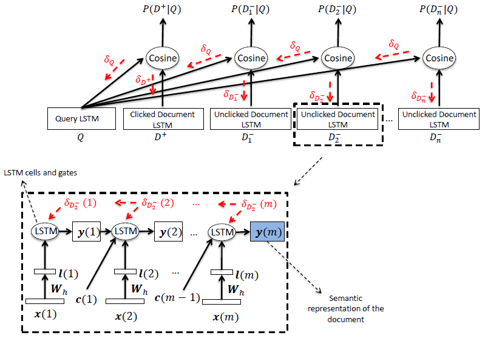
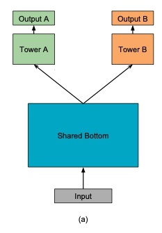
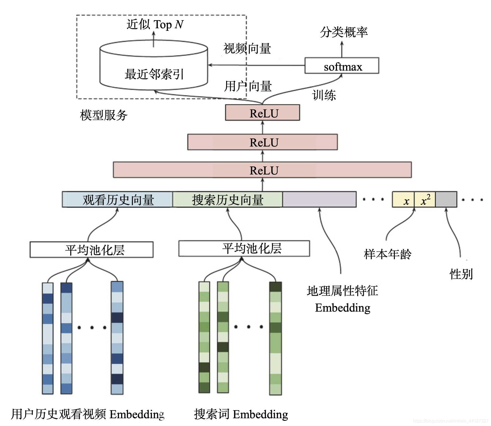
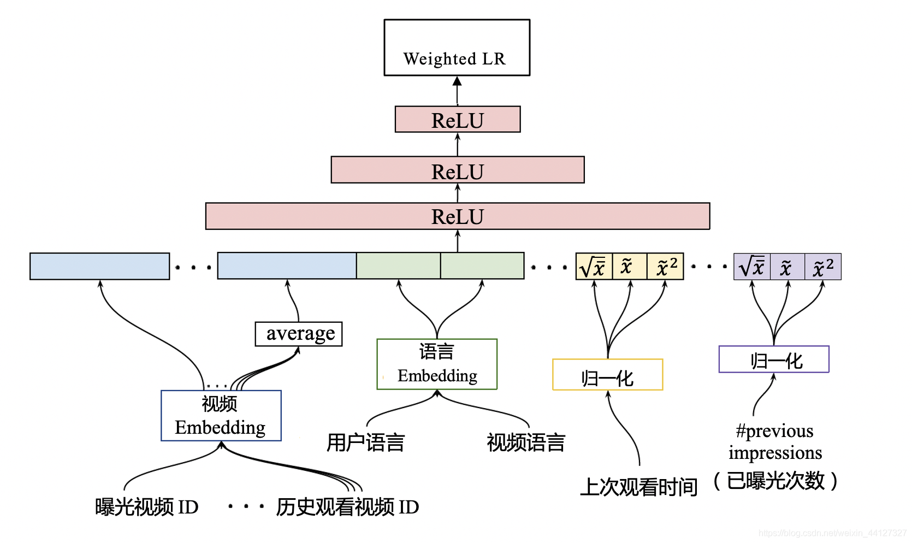

## CNN-DSSM知识点

#### 概念

针对DSSM词袋模型丢失上下文信息的缺点，CLSM应运而生，又叫 CNN-DSSM。CNN-DSSM 与 DSSM 的区别主要在于输入层和表示层。CNN-DSSM在输入层中，除了letter-trigram，还加入了了word-trigram，而CNN-DSSM的表示层由一个神经网络构成。

#### 模型

#### 

word-trigram其实就是一个包含了上下文信息的滑动窗口，而表示层中的卷积层就是提取滑动窗口下的上下文特征。

##### （1）卷积层——Convolutional layer

**卷积层的作用是提取滑动窗口下的上下文特征。** 以下图为例，假设输入层是一个 302`*`90000（302 行，9 万列）的矩阵，代表 302 个字向量（Query 的和 Doc 的长度一般小于 300，这里少了就补全，多了就截断），每个字向量有 9 万维。而卷积核是一个 3`*`90000 的权值矩阵，卷积核以步长为 1 向下移动，得到的 feature map 是一个 300`*`1 的矩阵，feature map 的计算公式是(输入层维数 302-卷积核大小 3 步长 1)/步长 1=300。而这样的卷积核有 300 个，所以形成了 300 个 300`*`1 的 feature map 矩阵。 

##### （2）池化层——Max pooling layer

池化层的作用是为句子找到**全局的上下文特征**。池化层以 Max-over-time pooling 的方式，每个 feature map 都取最大值，得到一个 300 维的向量。Max-over-pooling 可以解决可变长度的句子输入问题（因为不管 Feature Map 中有多少个值，只需要提取其中的最大值）。不过我们在上一步已经做了句子的定长处理（固定句子长度为 302），所以就没有可变长度句子的问题。最终池化层的输出为各个 Feature Map 的最大值，即一个 300`*`1 的向量。这里多提一句，之所以 Max pooling 层要保持固定的输出维度，是因为下一层全链接层要求有固定的输入层数，才能进行训练。

##### （3）全连接层——Semantic layer

最后通过全连接层把一个 300 维的向量转化为一个 128 维的低维语义向量。全连接层采用 tanh 函数：
$$
tanh(x)=\frac{1-e^{-2x}}{1+e^{-2x}}
$$

#### 作用与应用场景

能够解决DSSM词袋模型丢失上下文的缺点。可以运用在上下文信息联系比较紧密的场景。同时需要保证所需要保留的具有特征的上下文特征间距不能太远。

#### 优缺点

**优点：**

CNN-DSSM 通过卷积层提取了==滑动窗口下的上下文信息==，又通过池化层提取了==全局的上下文信息==，上下文信息得到较为有效的保留。

**缺点：**

对于间隔较远的上下文信息，难以有效保留。 举个例子，I grew up in France... I speak fluent French，显然 France 和 French 是具有上下文依赖关系的，但是由于 CNN-DSSM 滑动窗口（卷积核）大小的限制，导致无法捕获该上下文信息。

## LSTM-DSSM知识点

#### 概念

LSTM是一种RNN特殊的类型，可以学习长期依赖信息。而LSTM-DSSM其实是LSTM的一个变种，是一种加入了peep hole的LSTM。

#### 模型

这里三条黑线就是所谓的 peephole，传统的 LSTM 中遗忘门、输入门和输出门只用了 h(t-1) 和 xt 来控制门缝的大小，peephole 的意思是说不但要考虑 h(t-1) 和 xt，也要考虑 Ct-1 和 Ct，其中遗忘门和输入门考虑了 Ct-1，而输出门考虑了 Ct。 总体来说需要考虑的信息更丰富了。

LSTM-DSSM的整体网络结构如下：

红色的部分可以清晰看见残差传递的方向。

#### 作用与应用场景

能够解决CNN-DSSM无法捕获远距离上下文特征的缺点。在我们所需的上下文关联信息相隔较远的时候可以选择LSTM-DSSM解决问题。

#### 优缺点

**优点：**

能够解决无法捕获较远距离上文下文特征的缺点，较远距离的关联上下文特征信息得以保留。

**缺点：**

效果不可控，仍需要有人工标注的query分类打底；仍属于弱监督模型，需要大量的数据和GPU集群，难以得以广泛开展业务。

## MMoE模型知识点：

#### 概念

多任务模型通过学习不同任务的联系和差异，可提高每个任务的学习效率和质量。多任务学习的的框架广泛采用shared-bottom的结构，不同任务间共用底部的隐层。这种结构本质上可以减少过拟合的风险，但是效果上可能受到任务差异和数据分布带来的影响。也有一些其他结构，比如两个任务的参数不共用，但是通过对不同任务的参数增加L2范数的限制；也有一些对每个任务分别学习一套隐层然后学习所有隐层的组合。和shared-bottom结构相比，这些模型对增加了针对任务的特定参数，在任务差异会影响公共参数的情况下对最终效果有提升。缺点就是模型增加了参数量所以需要更大的数据量来训练模型，而且模型更复杂并不利于在真实生产环境中实际部署使用。

#### 模型

MMoE模型的结构基于广泛使用的Share-Bottom结构和MoE结构

- **Shared-Bottom Multi-task Model**

如上图a所示，shared-bottom网络（表示为函数f）位于底部，多个任务共用这一层。往上，K个子任务分别对应一个tower network（表示为hk ），每个子任务的输出：
$$
y_{k}=h^{k}(f(x))
$$

- **Mixture-of-Experts**

MoE模型可以形式化表示为
$$
y=\sum_{i=1}^{n} g(x)_{i} f_{i}(x)
$$
其中，
$$
\sum_{i=1}^{n} g(x)_{i}=1
$$
n是n个expert network（expert network可认为是一个神经网络）。g是组合experts结果的gating network，具体来说g产生n个experts上的概率分布，最终的输出是所有experts的带权加和。显然，MoE可看做基于多个独立模型的集成方法。

- **所提模型Multi-gate Mixture-of-Experts**

文章提出的模型（简称MMoE）目的就是相对于shared-bottom结构不明显增加模型参数的要求下捕捉任务的不同。其核心思想是将shared-bottom网络中的函数f替换成MoE层，如上图c所示，形式化表达为：
$$
y_{k}=h^{k}\left(f^{k}(x)\right), f^{k}(x)=\sum_{i=1}^{n} g^{k}(x)_{i} f_{i}(x)
$$
输入就是input feature，输出是所有experts上的权重。

#### 作用和应用场景 

通过门控网络的机制来平衡多任务的做法在真实业务场景中具有借鉴意义。在真实数据集中我们无法改变任务之间的相关性，所以不太方便进行研究任务相关性对多任务模型的影响。轮文中人工构建了两个回归任务的数据集，然后通过两个任务的标签的Pearson相关系数来作为任务相关性的度量。在工业界中通过人工构造的数据集来验证自己的假设是个有意思的做法。

#### 优缺点

**优点：**

MMoE中的multi-gate的结构对于任务差异带来的冲突有一定的缓解作用。能够考虑多任务之间的区别并给予推荐。

**缺点：**

模型增加了参数量所以需要更大的数据量来训练模型，而且模型更复杂并不利于在真实生产环境中实际部署使用。

## ShareBottom模型知识点

#### 概念

Shared-Bottom的思路就是多个目标底层共用一套共享layer，在这之上基于不同的目标构建不同的Tower。这样的好处就是底层的layer复用，减少计算量，同时也可以防止过拟合的情况出现。

#### 模型

最简单直观的多目标模型，底层共享输入，上层各个任务各接一个sub-network，输出对应目标的预测值。

#### 作用和应用场景

Share-Bottom模型适用于多目标任务间相关性较强的情况下进行业务多目标建模，能够有效学习到多目标 之间的共性。

#### 优缺点

**优点：**

降低overfit风险，利用任务之间的关联性使模型学习效果更强

**缺点：**

任务之间的相关性将严重影响模型效果。假如任务之间相关性较低，模型的效果相对会较差。

### YouTube深度学习视频推荐系统知识点

#### 概念

与几乎所有推荐系统一样，Youtube的推荐系统也分为“召回”与“排序”两个子系统。

- 召回：从百万级别的候选视频中选出几百个用户喜欢的视频。
- 对召回系统的要求是，“低延时”与“高精度（precision）”，“个性化”方面可以适当放宽以保证性能要求

- 排序：将召回的视频打分，将用户最有可能点击的视频排在前面。
- 结果的“个性化”是排序的重要任务

Youtube在这两个子系统中，都使用了深度神经网络，结构上并没有太大的不同，主要是体现在所使用的特征上。

“召回”使用的特征，相对较少和简单，以满足性能要求；“排序”使用了更多的特征，以保证精准的个性化。

#### 流程

其推荐过程可以分成二级。第一级是用候选集生成模型（Candidate Generation Model）完成候选视频的快速筛选，在这一步，候选视频集合由百万降低到几百量级，这就相当于经典推荐系统架构中的召回层。第二级是用排序模型（Ranking Model）完成几百个候选视频的精排，这相当于经典推荐系统架构中的排序层。

### 原理

##### 候选集生成模型

最底层是它的输入层，输入的特征包括用户历史观看视频的 Embedding 向量，以及搜索词的 Embedding 向量。对于这些 Embedding 特征，YouTube 是利用用户的观看序列和搜索序列，采用了类似 Item2vec 的预训练方式生成的。

除了视频和搜索词 Embedding 向量，特征向量中还包括用户的地理位置 Embedding、年龄、性别等特征。这里我们需要注意的是，对于样本年龄这个特征，YouTube 不仅使用了原始特征值，还把经过平方处理的特征值也作为一个新的特征输入模型。
这个操作其实是为了挖掘特征非线性的特性。

确定好了特征，这些特征会在 concat 层中连接起来，输入到上层的 ReLU 神经网络进行训练。

三层 ReLU 神经网络过后，YouTube 又使用了 softmax 函数作为输出层。值得一提的是，这里的输出层不是要预测用户会不会点击这个视频，而是要预测用户会点击哪个视频，这就跟一般深度推荐模型不一样。

总的来讲，YouTube 推荐系统的候选集生成模型，是一个标准的利用了 Embedding 预训练特征的深度推荐模型，它遵循Embedding MLP 模型的架构，只是在最后的输出层有所区别。

##### 排序模型

排序模型的输出层与候选集生成模型又有所不同。不同主要有两点：一是候选集生成模型选择了 softmax 作为其输出层，而排序模型选择了 weighted logistic regression（加权逻辑回归）作为模型输出层；二是候选集生成模型预测的是用户会点击“哪个视频”，排序模型预测的是用户“要不要点击当前视频”。

其实，排序模型采用不同输出层的根本原因就在于，YouTube 想要更精确地预测 用户的观看时长，因为观看时长才是 YouTube 最看中的商业指标，而使用 Weighted LR 作为输出层，就可以实现这样的目标。

在 Weighted LR 的训练中，我们需要为每个样本设置一个权重，权重的大小，代表了这个样本的重要程度。为了能够预估观看时长，YouTube 将正样本的权重设置为用户观看这个视频的时长，然后再用 Weighted LR 进行训练，就可以让模型学到用户观看时长的信息。

### 作用

YouTube的内容都是用户上传的自制视频，种类风格繁多，头部效应没那么明显，且视频基数巨大，用户难以发现喜欢的内容。为了对海量的视频进行快速、准确的排序，YouTube采用了这一推荐系统架构。

### 优缺点

**优点：**

能够根据各种特征维度向用户推荐想观看的视频内容，模型预估结果十分符合经验分布，

**缺点：**

视频的上传时间在特征维度中难以被准确分辨，刚上传的视频和上传很久的视频都在推荐库中，这一模型无法集中描述近期的变化趋势。