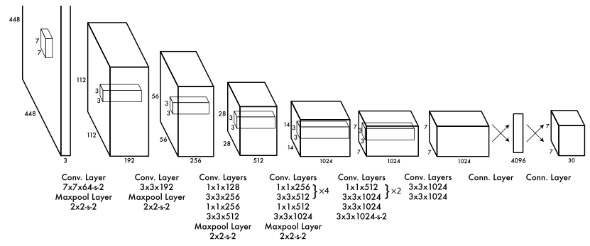
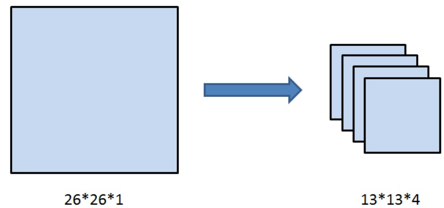
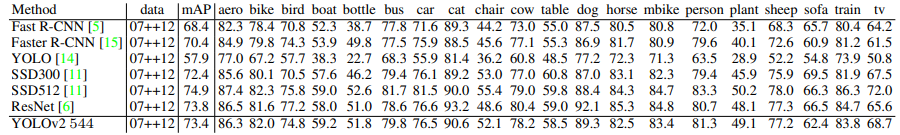
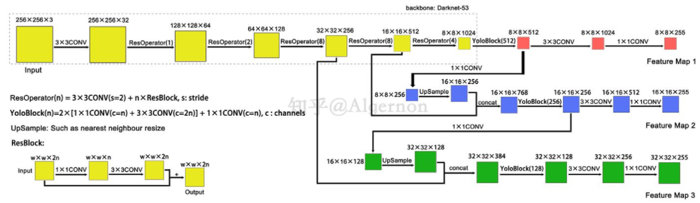
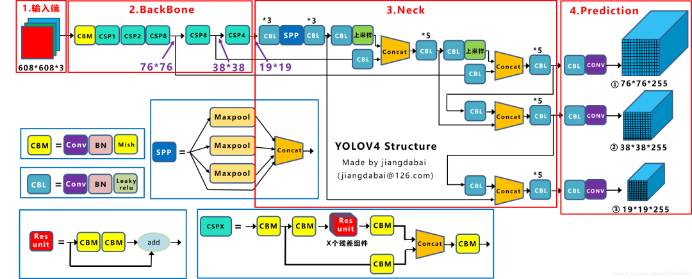
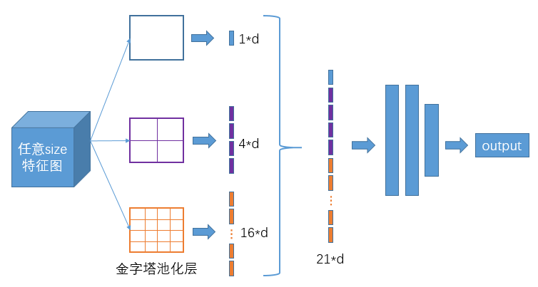
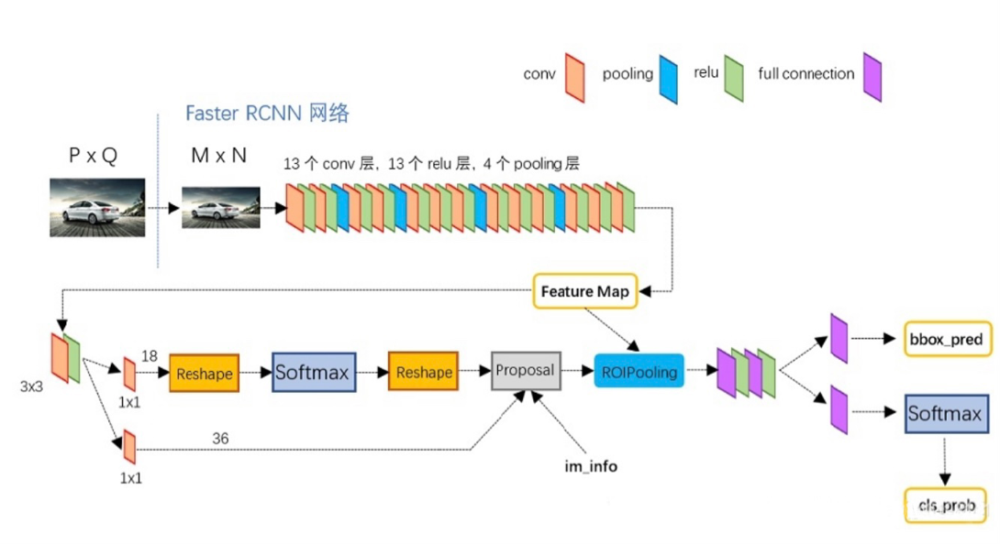
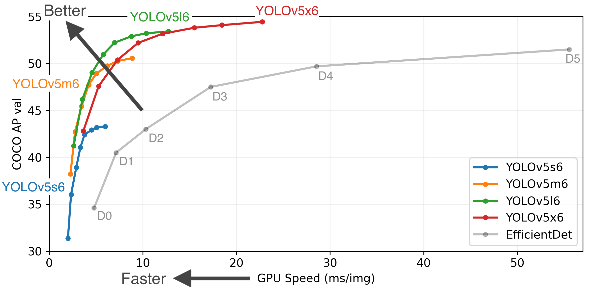

# Homework4

## 1.解决样本不均衡问题的方法

当前基于深度学习的目标检测主要包括：基于two-stage的目标检测和基于one-stage的目标检测。two-stage的目标检测框架一般检测精度相对较高，但检测速度慢；而one-stage的目标检测速度相对较快，但是检测精度相对较低。one-stage的精度不如two-stage的精度，一个主要的原因是训练过程中样本极度不均衡造成的。样本不均衡问题：指在训练的时候各个类别的样本数量不均衡，由于检测算法各不相同，以及数据集之间的差异，可能会存在**正负样本、难易样本、类别间样本**这3种不均衡问题。一般在目标检测任务框架中，保持正负样本的比例为1:3（经验值）。
目标检测任务中，样本包括以下类别:

1.正样本：标签区域内的图像区域，即目标图像块。

2.负样本：标签区域以外的图像区域，即图像背景区域。

3.易分正样本：容易正确分类的正样本，在实际训练过程中，该类占总体样本的比重非常高，单个样本的损失函数较小，但是累计的损失函数会主导损失函数。

4.易分负样本：容易正确分类的负样本，在实际训练过程中，该类占的比重非常高，单个样本的损失函数较小，但是累计的损失函数会主导损失函数。

5.难分正样本：错分成负样本的正样本，这部分样本在训练过程中单个样本的损失函数较高，但是该类占总体样本的比例较小。

6.难分负样本：错分成正样本的负样本，这部分样本在训练过程中单个样本的损失函数教高，但是该类占总体样本的比例较小。如下图所示：

对于不同类型的样本，会出现不同情况的样本不均衡，需要用不同的方法进行解决。主要有以下情况：

**1.正负样本不均衡**

以Faster RCNN为例，在RPN部分会生成20000个左右的Anchor，由于一张图中通常有10个左右的物体，导致可能只有100个左右的Anchor会是正样本，正负样本比例约为1∶200，存在严重的不均衡。

对于目标检测算法，主要需要关注的是对应着真实物体的正样本，在训练时会根据其loss来调整网络参数。相比之下，负样本对应着图像的背景，如果有大量的负样本参与训练，则会淹没正样本的损失，从而降低网络收敛的效率与检测精度。

**2.难易样本不均衡**

难样本指的是分类不太明确的边框，处在前景与背景的过渡区域上，在网络训练中难样本损失会较大，也是我们希望模型去学习优化的样本，利用这部分训练可以提升检测的准确率。然而，大量的样本并非处在前景与背景的过渡区，而是与真实物体没有重叠区域的负样本，或者与真实物体重叠程度很高的正样本，这部分被称为简单样本，单个损失会较小，对参数收敛的作用有限。

虽然简单样本单个损失小，但由于数量众多，因此如果全都计算损失的话，其损失也会比难样本大很多，这种难易样本的不均衡也会影响模型的收敛与精度。值得注意的是，由于负样本中大量的是简单样本，导致难易样本与正负样本这两个不均衡问题有一定的重叠，解决方法往往能同时对这两个问题起作用。

**3.类别间样本不均衡**

在有些目标检测的数据集中，还会存在类别间的不均衡问题。举个例子，数据集中有100万个车辆、1000个行人的实例标签，样本比例为1000∶1，属于典型的类别不均衡。这种情况下，如果不做任何处理，使用该数据集进行训练，由于行人这一类别可参考标签太少，会使得模型主要关注车这一类别的检测，网络中的参数主要根据车辆的损失进行优化，导致行人的检测精度大大下降。

目前，解决样本不均衡问题的一些思路：

机器学习中，解决样本不均衡问题主要有2种思路：数据角度和算法角度。从数据角度出发，有扩大数据集、数据类别均衡采样等方法。在算法层面，目标检测方法使用的方法主要有：

1.Faster RCNN、SSD等算法在正负样本的筛选时，根据样本与真实物体的IoU大小，设置了3∶1的正负样本比例，这一点缓解了正负样本的不均衡，同时也对难易样本不均衡起到了作用。

2.Faster RCNN在RPN模块中，通过前景得分排序筛选出了2000个左右的候选框，这也会将大量的负样本与简单样本过滤掉，缓解了前两个不均衡问题。

3.权重惩罚：对于难易样本与类别间的不均衡，可以增大难样本与少类别的损失权重，从而增大模型对这些样本的惩罚，缓解不均衡问题。

4.数据增强：从数据侧入手，可以在当前数据集上使用随机生成和添加扰动的方法，也可以利用网络爬虫数据等增加数据集的丰富性，从而缓解难易样本和类别间样本等不均衡问题，可以参考SSD的数据增强方法。

## 2.Yolo系列介绍及对比

Yolo系列发表日期全部在Faster R-CNN之后，Faster R-CNN算法的精度是state-of-the-art级别的，Yolo算法的精度没有超越Faster-RCNN，而是在速度与精度之间进行权衡。在RCNN算法日益成熟之后，Yolo算法却能横空出世，离不开其高性能和使用回归思想做物体检测的两个特点。

### 2.1 Yolov1

Yolo的精髓在于将目标检测重新定义为一个单一的回归问题，直接从图像像素到边界框坐标和类概率，也就是所谓的只看一次（You Only Look Once）。所以能够保证较客观的检测速度，其基本网络以每秒45帧的速度运行，在泰坦X图形处理器上没有批处理，快速版本的运行速度超过150帧/秒。这意味着可以实时处理流式视频，延迟不到25毫秒。此外，Yolo的平均精度是其他实时系统的两倍多。

算法将输入图像分成一个S  ×  S网格。如果对象的中心落入网格单元，则该网格单元负责检测该对象。每个网格单元预测B边界框和这些框的置信度得分。这些置信度得分反映了模型对盒子包含一个对象的自信程度，以及它认为盒子预测的准确性。如果该单元格中不存在任何对象，则置信度得分应该为零。否则，我们希望置信度得分等于预测框和地面事实之间的交集。

每个边界框由5个预测组成:x、y、w、h和置信度。(x，y)坐标表示相对于网格单元边界的方框中心。宽度和高度是相对于整个图像预测的。最后，置信度预测表示预测框和任何地面真实框之间的IOU。每个网格单元还预测条件类概率。这些概率取决于包含对象的网格单元。在测试时，我们将条件类概率和单个box置信度预测相乘。

上图为Yolov1的网络结构图，输入图像大小为448$*$448，经过若干个卷积层与池化层，变为7*7*1024张量（图一中倒数第三个立方体），最后经过两层全连接层，输出张量维度为7$*$7$*$30，这就是Yolo v1的整个神经网络结构，和一般的卷积物体分类网络没有太多区别，最大的不同就是：分类网络最后的全连接层，一般连接于一个一维向量，向量的不同位代表不同类别，而这里的输出向量是一个三维的张量（7$*$7$*$30）。上图中Yolo的backbone网络结构，受启发于GoogLeNet。本质上来说没有什么特别，没有使用BN层，用了一层Dropout。除了最后一层的输出使用了线性激活函数，其他层全部使用Leaky Relu激活函数。

输出向量的维度为7$*$7$*$30。7$*$7是指图片被分成了7$*$7个格子，当格子数为7*7时，该网络最多预测49个物体。如图所示：

30是由（4+1）*2+20得到的。其中4+1是矩形框的中心点坐标 ![[公式]](https://www.zhihu.com/equation?tex=x%2C+y) ，长宽 ![[公式]](https://www.zhihu.com/equation?tex=w%2C+h) 以及是否属于被检测物体的置信度 ![[公式]](https://www.zhihu.com/equation?tex=c+) ；2是一个格子共回归两个矩形框，每个矩形框分别产生5个预测值（ ![[公式]](https://www.zhihu.com/equation?tex=x%2Cy%2Cw%2Ch%2Cc) )；20代表预测20个类别。

Yolo的损失函数为：

Yolov1的局限在于其对边界框预测施加了很强的空间限制，因为每个网格单元只能预测两个框，并且只能有一个类。这种空间限制限制了模型可以预测的附近物体的数量。模型与成群出现的小物体作斗争，比如一群鸟。由于我们的模型学会了从数据中预测边界框，它很难推广到具有新的或不寻常的纵横比或配置的对象。我们的模型还使用相对粗糙的特征来预测边界框，因为我们的架构具有来自输入图像的多个下采样层。最后，当我们训练近似检测性能的损失函数时，我们的损失函数在小边界框和大边界框中处理错误是一样的。大盒子里的小错误一般是良性的，但小盒子里的小错误对借条的影响要大得多。我们的主要错误来源是不正确的定位。

### 2.2Yolov2

 建立在Yolov1的基础上，经过Joseph Redmon等的改进，Yolov2和Yolo9000算法在2017年CVPR上被提出，重点解决Yolov1召回率和定位精度方面的误差。在提出时，Yolov2在多种监测数据集中都要快过其他检测系统，并可以在速度与精确度上进行权衡。

改进之处有以下几点：

1.Batch Normalization（批归一化）：

检测系列的网络结构中，BN逐渐变成了标配。在Yolo的每个卷积层中加入BN之后，mAP提升了2%，并且去除了Dropout。

2.High Resolution Classifier（分类网络高分辨率预训练）：

在Yolov1中，网络的backbone部分会在ImageNet数据集上进行预训练，训练时网络输入图像的分辨率为224$*$224。在v2中，将分类网络在输入图片分辨率为448*448的ImageNet数据集上训练10个epoch，再使用检测数据集（例如coco）进行微调。高分辨率预训练使mAP提高了大约4%。

3.Convolutional With Anchor Boxes（Anchor Box替换全连接层）

Yolov1时提到，每个格点预测两个矩形框，在计算loss时，只让与ground truth最接近的框产生loss数值，而另一个框不做修正。这样规定之后，作者发现两个框在物体的大小、长宽比、类别上逐渐有了分工。在v2中，神经网络不对预测矩形框的宽高的绝对值进行预测，而是预测与Anchor框的偏差（offset），每个格点指定n个Anchor框。在训练时，最接近ground truth的框产生loss，其余框不产生loss。在引入Anchor Box操作后，mAP由69.5下降至69.2，原因在于，每个格点预测的物体变多之后，召回率大幅上升，准确率有所下降，总体mAP略有下降。

v2中移除了v1最后的两层全连接层，全连接层计算量大，耗时久。

4.Dimension Clusters（Anchor Box的宽高由聚类产生）

Faster R-CNN中的九个Anchor Box的宽高是事先设定好的比例大小，一共设定三个面积大小的矩形框，每个矩形框有三个宽高比：1:1，2:1，1:2，总共九个框。而在v2中，Anchor Box的宽高不经过人为获得，而是将训练数据集中的矩形框全部拿出来，用kmeans聚类得到先验框的宽和高。例如使用5个Anchor Box，那么kmeans聚类的类别中心个数设置为5。加入了聚类操作之后，引入Anchor Box之后，mAP上升。

5.Direct location prediction（绝对位置预测）

Yolo中的位置预测方法很清晰，就是相对于左上角的格点坐标预测偏移量。这里的Direct具体含义，应该是和其他算法框架对比后得到的。
$$
x=(t_x*w_a)+x_a
\\y=(t_y*h_a)+y_a
$$
神经网络预测$t_X,t_y$，而$t_X,t_y$又需要与先验框的宽高相乘才能得到相较于 $x_a,y_a$的位置偏移值，在Yolov2中，位置预测公式如下：
$$
b_x=\sigma(t_x)+c_x\\
b_y=\sigma(t_y)+c_y\\
b_w=p_we^{t_w}\\
b_h=p_he^{t_b}
$$
6.Fine-Grained Features（细粒度特征）

在26*26的特征图，经过卷积层等，变为13*13的特征图后，作者认为损失了很多细粒度的特征，导致小尺寸物体的识别效果不佳，所以在此加入了passthrough层。

如上图所示，passthrough层就是将26*26*1的特征图，变成13*13*4的特征图，在这一次操作中不损失细粒度特征。

在上述改进后，Yolov2的性能较前作v1有较明显的提升：

### 2.3 Yolov3

Yolov3采用了Darknet-53作为网络架构，处理速度每秒78张图，比Darknet-19慢不少，但是比同精度的ResNet快很多。Yolov3依然保持了高性能。在网络结构上，Yolov2 取消了 Yolov1所有的全连接层，而 Yolov3 比 Yolov2 更进一 步，将卷积神经网络里面最常见的池化层全部取消掉了，而原先池化层用来缩小特征尺寸的功能改由通过增加原卷积核的步长来实现。这一改进可以算是卷积神经网络中最能提升速度的做法，不仅使得 Yolov3 的运算速度更快，还可以将节省的运算性能应用到更多实用的操作上。比如将网络深度增加到了 53 层；还比如 Yolov3 另一个重要的改进 是可以同时输出 3 个不同尺寸的特征图，分别为 13 ×13，26×26 和 52×52。这样就使 得 Yolov3 相对于前面几个版本，更能对小目标进行检测，但是也弱化了其对大物体的检测能力。 最后 Yolov3 不再使用 Softmax 对每个框进行分类，而改用多个独立的 logistic 分类器代替，而 logistic 只对获取到的锚框中拥有目标可能性得分最高的那一个进行操作。

1. Yolov3中，只有卷积层，通过**调节卷积步长控制输出特征图的尺寸**。所以对于输入图片尺寸没有特别限制。流程图中，输入图片以256*256作为样例。
2. Yolov3借鉴了**金字塔特征图**思想，**小尺寸特征图用于检测大尺寸物体**，而**大尺寸特征图检测小尺寸物体**。特征图的输出维度为 ![[公式]](https://www.zhihu.com/equation?tex=N%5Ctimes+N+%5Ctimes+%5B3+%5Ctimes+%284+%2B+1+%2B+80%29%5D) ， ![[公式]](https://www.zhihu.com/equation?tex=N%5Ctimes+N) 为输出特征图格点数，一共3个Anchor框，每个框有4维预测框数值  ，1维预测框置信度，80维物体类别数。所以第一层特征图的输出维度为 ![[公式]](https://www.zhihu.com/equation?tex=8+%5Ctimes+8+%5Ctimes+255) 。
3. Yolov3总共输出3个特征图，第一个特征图下采样32倍，第二个特征图下采样16倍，第三个下采样8倍。输入图像经过Darknet-53（无全连接层），再经过Yoloblock生成的特征图被当作两用，第一用为经过3*3卷积层、1*1卷积之后生成特征图一，第二用为经过1*1卷积层加上采样层，与Darnet-53网络的中间层输出结果进行拼接，产生特征图二。同样的循环之后产生特征图三。
4. concat操作与加和操作的区别：加和操作来源于ResNet思想，将输入的特征图，与输出特征图对应维度进行相加，即 ![[公式]](https://www.zhihu.com/equation?tex=y+%3D+f%28x%29%2Bx) ；而concat操作源于DenseNet网络的设计思路，将特征图按照通道维度直接进行拼接，例如8*8*16的特征图与8*8*16的特征图拼接后生成8*8*32的特征图。
5. 上采样层(upsample)：作用是将小尺寸特征图通过插值等方法，生成大尺寸图像。例如使用最近邻插值算法，将8$*$8的图像变换为16*16。上采样层不改变特征图的通道数。

### 2.3Yolov4

YOLOV4其实是一个结合了大量前人研究技术，加以组合并进行适当创新的算法，实现了速度和精度的完美平衡。可以说有许多技巧可以提高卷积神经网络(CNN)的准确性，但是某些技巧仅适合在某些模型上运行，或者仅在某些问题上运行，或者仅在小型数据集上运行；调优手段包括：加权残差连接(WRC),跨阶段部分连接(CSP),跨小批量标准化(CmBN),自对抗训练(SAT),Mish激活,马赛克数据增强,CmBN,DropBlock正则化,CIoU Loss等等。经过一系列的堆料，终于实现了目前最优的实验结果：43.5％的AP(在Tesla V100上，MS COCO数据集的实时速度约为65FPS)。

Yolov3使用的网络为Darknet53，，而在YOLOv4中，对Darknet53做了一点改进，借鉴了CSPNet，CSPNet全称是Cross Stage Partial Networks，也就是跨阶段局部网络。CSPNet解决了其他大型卷积神经网络框架Backbone中网络优化的梯度信息重复问题，将梯度的变化从头到尾地集成到特征图中，因此减少了模型的参数量和FLOPS数值，既保证了推理速度和准确率，又减小了模型尺寸。
为了增大感受野，作者还使用了SPP-block，使用PANet代替FPN进行参数聚合以适用于不同level的目标检测。SPP-Net全称Spatial Pyramid Pooling Networks，当时主要是用来解决不同尺寸的特征图如何进入全连接层的，直接看下图，下图中对任意尺寸的特征图直接进行固定尺寸的池化，来得到固定数量的特征。

如上图，以3个尺寸的池化为例，对特征图进行一个最大值池化，即一张特征图得取其最大值，得到1$*$d(d是特征图的维度)个特征；对特征图进行网格划分为2x2的网格，然后对每个网格进行最大值池化，那么得到4$*$d个特征；同样，对特征图进行网格划分为4x4个网格，对每个网格进行最大值池化，得到16*d个特征。 接着将每个池化得到的特征合起来即得到固定长度的特征个数（特征图的维度是固定的），接着就可以输入到全连接层中进行训练网络了。用到这里是为了增加感受野。

### 2.5Yolov5

Yolov5同Yolov4类似，网络框架和检测头都没有进行较大改动，但是做了很多能提升检测效果的tricks。具体的特点如下：

（1）增加了正样本：方法是邻琙的正样本 anchor匹配策略。
（2）通过灵活的配置参数，可以得到不同复杂度的模型
（3）通过一些内置的超参优化策略，提升整体性能
（4）和 yolo4一样，都用了 mosaId增强，提升小物体检测性能

## 3.Faster R-CNN算法介绍

Faster-RCNN对Fast-RCNN网络进行优化，在实时性方面和精度方面有了很大的提升。用ＲＰＮ 代替了原有的选择性搜索方法，可以生成高质量的候选区域框。并且实现了区域建议网络与特征提取网络的卷积层共享，大大提高了网络的效率，降低了区域建议功能的时间成本。

Faster-RCNN主要分为三部分：

特征提取网络。Faster-RCNN采用一组特征提取模块，即卷积层、激活函数、池化层来提取图片的特征图。小组采用VGG16卷积神经网络提取输入图像的卷积特征，该网络由5层卷积层、3层全连接层、softmax输出层构成，所有层的激活单元均采用ReLU函数。并且VGG16采取使用多个较小卷积核的卷积层来代替一个卷积核较大的卷积层，除此之外，VGG16每一部分卷积层网络的通道数 都在翻倍，由第一层的64通道增加到最后的512通道

区域建议网络RPN，这是Faster-RCNN的巨大优势。RPN包含一个卷积层和两个全连接层，卷积层添加于卷积特征图之后，两个全连接层采用并行的方式与卷积层连接，其中一个全连接层采用1*1的卷积核和18通道，另一个全连接层采用的1*1卷积核和36通道。RPN将特征提取网络所提取的卷积特征图作为输入，然后在共享卷积特征图上添加一个小的滑动窗口进行滑动，该滑动窗口经过中间层将卷积特征图中的空间窗口映射到一个低维向量上，最后这个低维向量被输入到两个并行的全连接层——边框分类层和边框回归层，用于输出滑动窗口中的区域特征是目标还是图像背景，以及输出该区域位置的位置坐标。

感兴趣区域池化层。Faster-RCNN采用了RoIpooling层，具体工作流程为：

（1）根据输入图像，将感兴趣区域映射到特征图的对应位置；

（2）将映射后的区域划分为大小相同的模块；

（3）对每个模块进行最大池化操作。

最后将结果向量分别输入两个全连接层，其中一个利用 Softmax计算分类得分，输出预测的类别概率；另一个利用边框回归获得位置偏移量，输出更加准确的目标检测框。

4.Yolov5介绍

Yolo之父JosephRedmon在2020年年初宣布退出计算机视觉的研究的时候，很多人都以为目标检测神器Yolo系列就此终结。然而在4月23日，继任者Yolov4却悄无声息地来了。Yolov4是Yolo系列一个重大的更新，其在COCO数据集上的平均精度(AP)和帧率精度(FPS)分别提高了10%和12%，被认为是当前最强的实时对象检测模型之一。

正当计算机视觉的从业者们正在努力研究Yolov4的时候，万万没想到，6月25日，Ultralytics发布了Yolov5的第一个正式版本，其性能与Yolov4不相伯仲。

Yolov5结构分为输入端、Backbone、Neck、Prediction四个部分。对于Yolov5的四种模型，无论是V5s，V5m，V5l还是V5x其结构部分都一致。唯一的区别在与模型的深度和宽度设置。Yolov5s网络最小，速度最少，AP精度也最低。

Yolov5的输入端采用了和Yolov4一样的Mosaic数据增强的方式；在Yolo算法中，针对不同的数据集，都会有初始设定长宽的锚框；在网络训练中，网络在初始锚框的基础上输出预测框，进而和真实框groundtruth进行比对，计算两者差距，再反向更新，迭代网络参数。在Yolov3、Yolov4中，训练不同的数据集时，计算初始锚框的值是通过单独的程序运行的，但Yolov5中将此功能嵌入到代码中，每次训练时，自适应的计算不同训练集中的最佳锚框值。在常用的目标检测算法中，不同的图片长宽都不相同，因此常用的方式是将原始图片统一缩放到一个标准尺寸，再送入检测网络中。但Yolov5代码中对此进行了改进，也是Yolov5推理速度能够很快的一个不错的trick。作者认为，在项目实际使用时，很多图片的长宽比不同，因此缩放填充后，两端的黑边大小都不同，而如果填充的比较多，则存在信息冗余，影响推理速度。因此在Yolov5的代码中datasets.py的letterbox函数中进行了修改，对原始图像自适应的添加最少的黑边。图像高度上两端的黑边变少了，在推理时，计算量也会减少，即目标检测速度会得到提升。通过这种简单的改进，推理速度得到了37%的提升，可以说效果很明显。

Backbone

（1）Focus结构在Yolov3和Yolov4中并没有这个结构，其中比较关键是切片操作。以Yolov5s的结构为例，原始608*608*3的图像输入Focus结构，采用切片操作，先变成304*304*12的特征图，再经过一次32个卷积核的卷积操作，最终变成304*304*32的特征图。需要注意的是：Yolov5s的Focus结构最后使用了32个卷积核，而其他三种结构，使用的数量有所增加。

（2） CSP  结构

Yolov4 网络结构中，借鉴了 CSPNet 的设计思路，在主干网络中设计了 CSP 结构。Yolov5 与 Yolov4 不同点在于，Yolov4  中只有主干网络使用了 CSP 结构， 而 Yolov5 中设计了两种 CSP 结构，CSP1_X 结构应用于 Backbone 主干网络，另 一种 CSP2_X  结构则应用于 Neck 中。

Neck

Yolov5现在的Neck和Yolov4中一样，都采用FPN+PAN的结构，但在Yolov5刚出来时，只使用了FPN结构，后面才增加了PAN结构，此外网络中其他部分也进行了调整。但如上面CSPNet结构中讲到，Yolov5和Yolov4的不同点在于，Yolov4的Neck结构中，采用的都是普通的卷积操作。而Yolov5的Neck结构中，采用借鉴CSPnet设计的CSP2结构，加强网络特征融合的能力。

输出端

（1 ） Bounding box 损失函数

Yolov5 中采用其中的 GIOU_Loss 做 Bounding box 的损失函数，而 Yolov4 中采用 CIOU_Loss 作为目标  Bounding box 的损失。

（2 ） nms  非极大值抑制

在目标检测的后处理过程中，针对很多目标框的筛选，通常需要 nms 操作。 因为 CIOU_Loss 中包含影响因子 v，涉及 groudtruth  的信息，而测试推理时，是没有 groundtruth 的，所以 Yolov4 在 DIOU_Loss 的基础上采用 DIOU_nms 的方式，而 Yolov5  中采用加权 nms 的方式。

# 引用

[1]YOLOv1：You Only Look Once: Unified, Real-Time Object Detection[[1506.02640\] You Only Look Once: Unified, Real-Time Object Detection (arxiv.org)](https://arxiv.org/abs/1506.02640)

[2]YOLOv2：YOLO9000: Better, Faster, Stronger[[1612.08242\] YOLO9000: Better, Faster, Stronger (arxiv.org)](https://arxiv.org/abs/1612.08242)

[3]YOLOv3：YOLOv3: An Incremental Improvement[[1804.02767\] YOLOv3: An Incremental Improvement (arxiv.org)](https://arxiv.org/abs/1804.02767)

[4]林健巍.YOLO图像检测技术综述[J].福建电脑,2019,35(09):80-83.

[5]YOLOv4: Optimal Speed and Accuracy of Object Detection[2004.10934.pdf (arxiv.org)](https://arxiv.org/pdf/2004.10934.pdf)

[6]YOLOv5：[ultralytics/yolov5: YOLOv5 🚀 in PyTorch > ONNX > CoreML > TFLite (github.com)](https://github.com/ultralytics/yolov5)
