## 深度学习发展历史

- **1943年**

由神经科学家**麦卡洛克(W.S.McCilloch)** 和**数学家皮兹（W.Pitts）**在《数学生物物理学公告》上发表论文《神经活动中内在思想的逻辑演算》（A Logical Calculus of the Ideas Immanent in Nervous Activity）。建立了神经网络和数学模型，称为MCP模型。所谓**MCP**模型，其实是按照生物神经元的结构和工作原理构造出来的一个抽象和简化了的模型，也就诞生了所谓的“模拟大脑”，人工神经网络的大门由此开启。

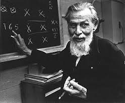

**麦卡洛克(W.S.McCilloch)**

**皮兹（W.Pitts）**

MCP当时是希望能够用计算机来模拟人的神经元反应的过程，该模型将神经元简化为了三个过程：输入信号线性加权，求和，非线性激活（阈值法）。如下图所示

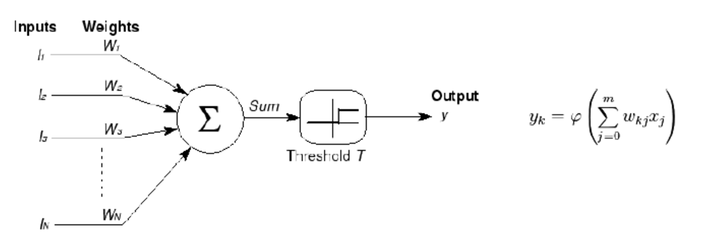

- **1958年**

计算机科学家**罗森布拉特（ Rosenblatt）**提出了两层神经元组成的神经网络，称之为**“感知器”(Perceptrons)**。第一次将MCP用于**机器学习（machine learning）分类(classification)**。“感知器”算法算法使用MCP模型对输入的多维数据进行二分类，且能够使用梯度下降法从训练样本中自动学习更新权值。1962年,该方法被证明为能够收敛，理论与实践效果引起第一次神经网络的浪潮。

- **1969年**

纵观科学发展史，无疑都是充满曲折的，深度学习也毫不例外。 1969年，美国数学家及人工智能先驱 **Marvin Minsky** 在其著作中证明了感知器本质上是一种**线性模型（linear model）**，只能处理线性分类问题，就连最简单的XOR（亦或）问题都无法正确分类。这等于直接宣判了感知器的死刑，神经网络的研究也陷入了将近20年的停滞。

- **1986年**

由神经网络之父 **Geoffrey Hinton** 在1986年发明了适用于多层感知器（MLP）的**BP（Backpropagation）**算法，并采用**Sigmoid**进行非线性映射，有效解决了非线性分类和学习的问题。该方法引起了神经网络的第二次热潮。

注：**Sigmoid** 函数是一个在生物学中常见的S型的函数，也称为S型生长曲线。在信息科学中，由于其单增以及反函数单增等性质，Sigmoid函数常被用作神经网络的阈值函数，将变量映射到0,1之间。

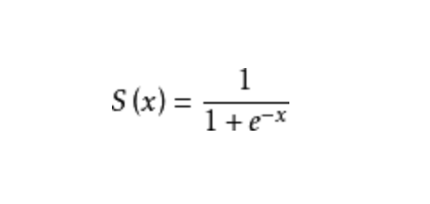

- **90年代时期**

1991年BP算法被指出存在梯度消失问题，也就是说在误差梯度后项传递的过程中，后层梯度以乘性方式叠加到前层，由于Sigmoid函数的饱和特性，后层梯度本来就小，误差梯度传到前层时几乎为0，因此无法对前层进行有效的学习，该问题直接阻碍了深度学习的进一步发展。

此外90年代中期，支持向量机算法诞生（SVM算法）等各种浅层机器学习模型被提出，SVM也是一种有监督的学习模型，应用于模式识别，分类以及回归分析等。支持向量机以统计学为基础，和神经网络有明显的差异，支持向量机等算法的提出再次阻碍了深度学习的发展。

- **发展期 2006年 - 2012年**

2006年，加拿大多伦多大学教授、机器学习领域泰斗、神经网络之父—— Geoffrey Hinton 和他的学生 Ruslan Salakhutdinov 在顶尖学术刊物《科学》上发表了一篇文章，该文章提出了深层网络训练中梯度消失问题的解决方案：**无监督预训练对权值进行初始化+有监督训练微调**。斯坦福大学、纽约大学、加拿大蒙特利尔大学等成为研究深度学习的重镇，至此开启了深度学习在学术界和工业界的浪潮。

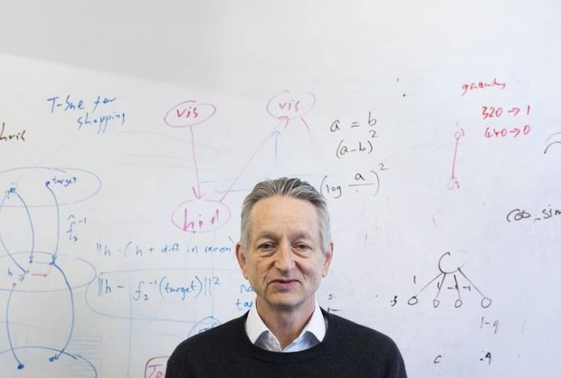

Geoffrey Hinton

2011年，ReLU激活函数被提出，该激活函数能够有效的抑制梯度消失问题。2011年以来，微软首次将DL应用在语音识别上，取得了重大突破。微软研究院和Google的语音识别研究人员先后采用DNN技术降低语音识别错误率20％~30％，是语音识别领域十多年来最大的突破性进展。2012年，DNN技术在图像识别领域取得惊人的效果，在ImageNet评测上将错误率从26％降低到15％。在这一年，DNN还被应用于制药公司的DrugeActivity预测问题，并获得世界最好成绩。

- **爆发期 2012 - 2017**

2012年，Hinton课题组为了证明深度学习的潜力，首次参加ImageNet图像识别比赛，其通过构建的CNN网络AlexNet一举夺得冠军，且碾压第二名（SVM方法）的分类性能。也正是由于该比赛，CNN吸引到了众多研究者的注意。

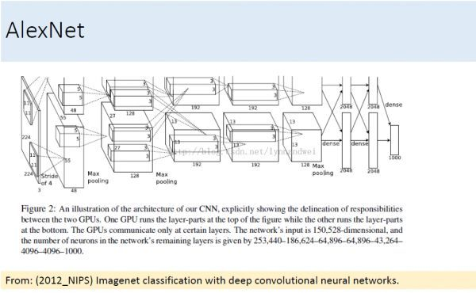

**AlexNet**的创新点在于:

**(1)首次采用ReLU激活函数，极大增大收敛速度且从根本上解决了梯度消失问题。**

**(2)由于ReLU方法可以很好抑制梯度消失问题，AlexNet抛弃了“预训练+微调”的方法，完全采用有监督训练。也正因为如此，DL的主流学习方法也因此变为了纯粹的有监督学习。**

**(3)扩展了LeNet5结构，添加Dropout层减小过拟合，LRN层增强泛化能力/减小过拟合。**

**(4)第一次使用GPU加速模型计算。**

2013、2014、2015、2016年，通过ImageNet图像识别比赛，DL的网络结构，训练方法，GPU硬件的不断进步，促使其在其他领域也在不断的征服战场。

2016年3月，由谷歌（Google）旗下DeepMind公司开发的AlphaGo(基于深度学习)与围棋世界冠军、职业九段棋手李世石进行围棋人机大战，以4比1的总比分获胜；2016年末2017年初，该程序在中国棋类网站上以“大师”（Master）为注册帐号与中日韩数十位围棋高手进行快棋对决，连续60局无一败绩；2017年5月，在中国乌镇围棋峰会上，它与排名世界第一的世界围棋冠军柯洁对战，以3比0的总比分获胜。围棋界公认阿尔法围棋的棋力已经超过人类职业围棋顶尖水平。

**总结**

深度学习目前还处于发展阶段，不管是理论方面还是实践方面都还有许多问题待解决，不过由于我们处在了一个“大数据”时代，以及计算资源的大大提升，新模型、新理论的验证周期会大大缩短。

## 人工智能、机器学习和深度学习之间的区别与联系

　　　

　　如上图，**人工智能是最早出现的**，也是最大、最外侧的同心圆；**其次是机器学习**，稍晚一点；**最内侧，是深度学习**，当今人工智能大爆炸的核心驱动。

　　五十年代，人工智能曾一度被极为看好。之后，人工智能的一些较小的子集发展了起来。先是机器学习，然后是深度学习。深度学习又是机器学习的子集。深度学习造成了前所未有的巨大的影响。

**从概念的提出到走向繁荣**

　　1956年，几个计算机科学家相聚在达特茅斯会议（Dartmouth Conferences），提出了“人工智能”的概念。其后，人工智能就一直萦绕于人们的脑海之中，并在科研实验室中慢慢孵化。之后的几十年，人工智能一直在两极反转，或被称作人类文明耀眼未来的预言；或者被当成技术疯子的狂想扔到垃圾堆里。坦白说，直到2012年之前，这两种声音还在同时存在。

　　过去几年，**尤其是2015年以来，人工智能开始大爆发。很大一部分是由于GPU的广泛应用，使得并行计算变得更快、更便宜、更有效**。当然，无限拓展的存储能力和骤然爆发的数据洪流（大数据）的组合拳，也使得图像数据、文本数据、交易数据、映射数据全面海量爆发。

　　让我们慢慢梳理一下计算机科学家们是如何将人工智能从最早的一点点苗头，发展到能够支撑那些每天被数亿用户使用的应用的。

**人工智能（Artificial Intelligence）——为机器赋予人的智能**

　　　　　　　　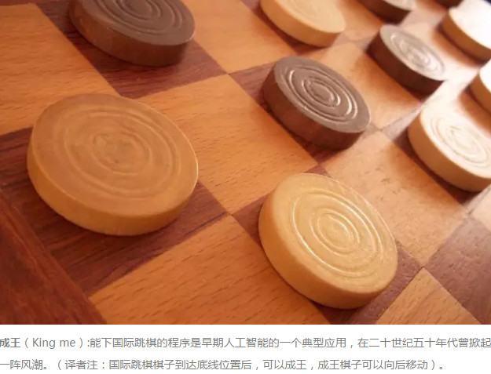

 

　　早在1956年夏天那次会议，人工智能的先驱们就梦想着用当时刚刚出现的计算机来构造复杂的、拥有与人类智慧同样本质特性的机器。这就是我们现在所说的“**强人工智能**”（General AI）。这个无所不能的机器，它有着我们所有的感知（甚至比人更多），我们所有的理性，可以像我们一样思考。

　　人们在电影里也总是看到这样的机器：友好的，像星球大战中的C-3PO；邪恶的，如终结者。强人工智能现在还只存在于电影和科幻小说中，原因不难理解，我们还没法实现它们，至少目前还不行。

　　我们目前能实现的，一般被称为“**弱人工智能**”（Narrow AI）。**弱人工智能是能够与人一样，甚至比人更好地执行特定任务的技术。**例如，Pinterest上的图像分类；或者Facebook的人脸识别。

　　这些是弱人工智能在实践中的例子。这些技术实现的是人类智能的一些具体的局部。但它们是如何实现的？这种智能是从何而来？这就带我们来到同心圆的里面一层，机器学习。

 **机器学习—— 一种实现人工智能的方法**

　　　　　　　　

 

　　**机器学习最基本的做法，是使用算法来解析数据、从中学习，然后对真实世界中的事件做出决策和预测。**与传统的为解决特定任务、硬编码的软件程序不同，机器学习是用大量的数据来“训练”，通过各种算法从数据中学习如何完成任务。

　　**机器学习直接来源于早期的人工智能领域**。传统算法包括**决策树**学习、**推导逻辑规划**、**聚类**、**分类、回归、强化学习和贝叶斯网络**等等（当然还有很多）。**众所周知，我们还没有实现强人工智能。早期机器学习方法甚至都无法实现弱人工智能。**

　　**机器学习最成功的应用领域是计算机视觉**，虽然也还是需要大量的手工编码来完成工作。人们需要手工编写分类器、边缘检测滤波器，以便让程序能识别物体从哪里开始，到哪里结束；写形状检测程序来判断检测对象是不是有八条边；写分类器来识别字母“ST-O-P”。使用以上这些手工编写的分类器，人们总算可以开发算法来感知图像，判断图像是不是一个停止标志牌。

　　这个结果还算不错，但并不是那种能让人为之一振的成功。特别是遇到云雾天，标志牌变得不是那么清晰可见，又或者被树遮挡一部分，算法就难以成功了。这就是为什么前一段时间，计算机视觉的性能一直无法接近到人的能力。它太僵化，太容易受环境条件的干扰。

　　随着时间的推进，学习算法的发展改变了一切。

 **深度学习——一种实现机器学习的技术**

　　　　　　　　　　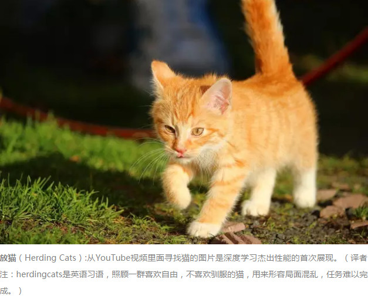

　　**人工神经网络（Artificial Neural Networks）是早期机器学习中的一个重要的算法**，历经数十年风风雨雨。**神经网络的原理是受我们大脑的生理结构——互相交叉相连的神经元启发**。但与大脑中一个神经元可以连接一定距离内的任意神经元不同，**人工神经网络具有离散的层、连接和数据传播的方向**。

　　例如，**我们可以把一幅图像切分成图像块，输入到神经网络的第一层。在第一层的每一个神经元都把数据传递到第二层。第二层的神经元也是完成类似的工作，把数据传递到第三层，以此类推，直到最后一层，然后生成结果**。

　　**每一个神经元都为它的输入分配权重，这个权重的正确与否与其执行的任务直接相关。最终的输出由这些权重加总来决定。**

　　我们仍以停止（Stop）标志牌为例。将一个停止标志牌图像的所有元素都打碎，然后用神经元进行“检查”：八边形的外形、救火车般的红颜色、鲜明突出的字母、交通标志的典型尺寸和静止不动运动特性等等。神经网络的任务就是给出结论，它到底是不是一个停止标志牌。神经网络会根据所有权重，给出一个经过深思熟虑的猜测——“概率向量”。

　　这个例子里，系统可能会给出这样的结果：86%可能是一个停止标志牌；7%的可能是一个限速标志牌；5%的可能是一个风筝挂在树上等等。然后网络结构告知神经网络，它的结论是否正确。

　　即使是这个例子，也算是比较超前了。直到前不久，神经网络也还是为人工智能圈所淡忘。其实在人工智能出现的早期，神经网络就已经存在了，但神经网络对于“智能”的贡献微乎其微。主要问题是，即使是最基本的神经网络，也需要大量的运算。神经网络算法的运算需求难以得到满足。

　　不过，还是有一些虔诚的研究团队，以多伦多大学的Geoffrey Hinton为代表，坚持研究，实现了以超算为目标的并行算法的运行与概念证明。但也直到GPU得到广泛应用，这些努力才见到成效。

　　我们回过头来看这个停止标志识别的例子。**神经网络**是调制、训练出来的，时不时还是很容易出错的。它**最需要的，就是训练**。需要成百上千甚至几百万张图像来训练，直到神经元的输入的权值都被调制得十分精确，无论是否有雾，晴天还是雨天，每次都能得到正确的结果。

　　只有这个时候，我们才可以说神经网络成功地自学习到一个停止标志的样子；或者在Facebook的应用里，神经网络自学习了你妈妈的脸；又或者是2012年吴恩达（Andrew Ng）教授在Google实现了神经网络学习到猫的样子等等。

　　吴教授的突破在于，把这些神经网络从基础上显著地增大了。层数非常多，神经元也非常多，然后给系统输入海量的数据，来训练网络。在吴教授这里，数据是一千万YouTube视频中的图像。吴教授为深度学习（deep learning）加入了“深度”（deep）。这里的**“深度”就是说神经网络中众多的层**。

　　现在，经过深度学习训练的图像识别，在一些场景中甚至可以比人做得更好：从识别猫，到辨别血液中癌症的早期成分，到识别核磁共振成像中的肿瘤。Google的AlphaGo先是学会了如何下围棋，然后与它自己下棋训练。它训练自己神经网络的方法，就是不断地与自己下棋，反复地下，永不停歇。

 **深度学习，给人工智能以璀璨的未来**

　　**深度学习使得机器学习能够实现众多的应用，并拓展了人工智能的领域范围。**深度学习摧枯拉朽般地实现了各种任务，使得似乎所有的机器辅助功能都变为可能。无人驾驶汽车，预防性医疗保健，甚至是更好的电影推荐，都近在眼前，或者即将实现。

　　人工智能就在现在，就在明天。有了深度学习，人工智能甚至可以达到我们畅想的科幻小说一般。你的C-3PO我拿走了，你有你的终结者就好了。

## 神经元 单层感知机 多层感知机

#### 神经元

有人说现在的神经网络实际上和神经元没有什么关系，其实不然，在现有的神经网络算法中，神经元的作用确实体现的较小，但是在硬件（材料、结构）上的实现时，神经元的深入研究可以更好的推进对材料功能实现的机理理解。那么首先来介绍一下神经元。

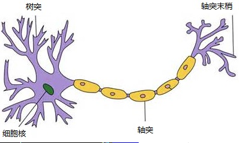

一个神经元通常具有多个树突，主要用来接受传入信息；而轴突只有一条，轴突尾端有许多轴突末梢可以给其他多个神经元传递信息。轴突末梢跟其他神经元的树突产生连接，从而传递信号。这个连接的位置在生物学上叫做“突触”。突触之间的交流通过神经递质实现。
#####数学模型：

下面对上面的这个模型进行抽象处理。首先考虑到神经元结构有多个树突，一个轴突可将其抽象为下图的黑箱结构：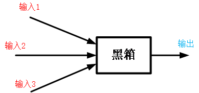

但是黑箱结构有诸多不便，首先是不知道黑箱中的函数结构就不能为我们所用，其次是输入输出与黑箱的关系也无法量化。因此考虑将上述结构简化，首先把树突到细胞核的阶段简化为线性加权的过程（当然了，该过程也有可能是非线性的，但是我们可以把其非线性过程施加到后面的非线性函数以及多层网络结构中），其次把突触之间的信号传递简化为对求和结果的非线性变换，那么上述模型就变得清晰了：

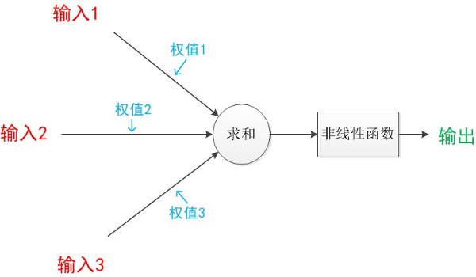

#### 单层感知机

上面我们介绍的神经元的基本模型实际就是一个感知机的模型，该词最早出现于 1958 年，计算科学家 Rosenblatt 提出的由两层神经元组成的神经网络。

对前面的模型进一步符号化，如下图所示：

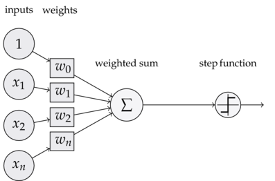

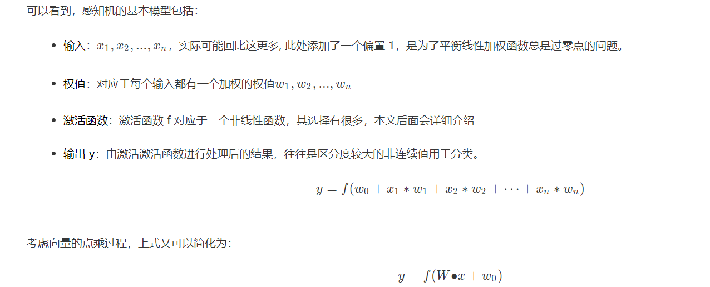

#### 多层感知机：MLP

多层感知机的一个重要特点就是多层，我们将第一层称之为输入层，最后一层称之有输出层，中间的层称之为隐层。MLP 并没有规定隐层的数量，因此可以根据各自的需求选择合适的隐层层数。且对于输出层神经元的个数也没有限制。
MLP 神经网络结构模型如下, 本文中只涉及了一个隐层，输入只有三个变量[x1,x2,x3][x1,x2,x3]和一个偏置量bb，输出层有三个神经元。相比于感知机算法中的神经元模型对其进行了集成。

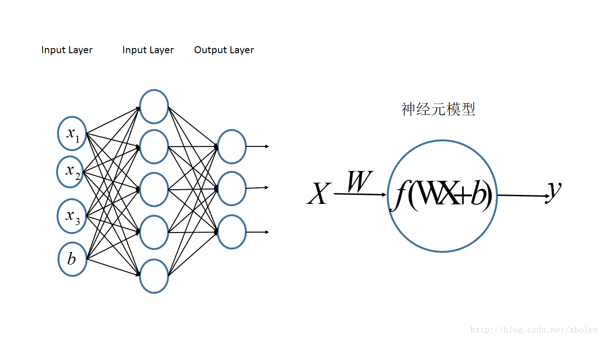

## **前向传播算法**

所谓的前向传播算法就是：**将上一层的输出作为下一层的输入，并计算下一层的输出，一直到运算到输出层为止。**

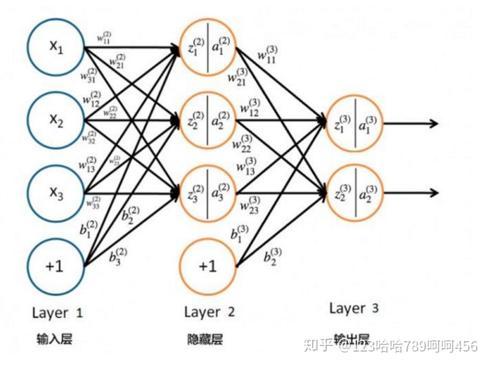

对于Layer 2的输出 ![[公式]](https://www.zhihu.com/equation?tex=a_%7B1%7D%5E%7B%282%29%7D) ，![[公式]](https://www.zhihu.com/equation?tex=a_%7B2%7D%5E%7B%282%29%7D)，![[公式]](https://www.zhihu.com/equation?tex=a_%7B3%7D%5E%7B%282%29%7D)，

![[公式]](https://www.zhihu.com/equation?tex=a_%7B1%7D%5E%7B%282%29%7D%3D%5Csigma%28z_%7B1%7D%5E%7B%282%29%7D%29%3D%5Csigma%28w_%7B11%7D%5E%7B%282%29%7Dx_%7B1%7D%2Bw_%7B12%7D%5E%7B%282%29%7Dx_%7B2%7D%2Bw_%7B13%7D%5E%7B%282%29%7Dx_%7B3%7D%2Bb_%7B1%7D%5E%7B%282%29%7D%29)

![[公式]](https://www.zhihu.com/equation?tex=a_%7B2%7D%5E%7B%282%29%7D%3D%5Csigma%28z_%7B2%7D%5E%7B%282%29%7D%29%3D%5Csigma%28w_%7B21%7D%5E%7B%282%29%7Dx_%7B1%7D%2Bw_%7B22%7D%5E%7B%282%29%7Dx_%7B2%7D%2Bw_%7B23%7D%5E%7B%282%29%7Dx_%7B3%7D%2Bb_%7B2%7D%5E%7B%282%29%7D%29)

![[公式]](https://www.zhihu.com/equation?tex=a_%7B3%7D%5E%7B%282%29%7D%3D%5Csigma%28z_%7B3%7D%5E%7B%282%29%7D%29%3D%5Csigma%28w_%7B31%7D%5E%7B%282%29%7Dx_%7B1%7D%2Bw_%7B32%7D%5E%7B%282%29%7Dx_%7B2%7D%2Bw_%7B33%7D%5E%7B%282%29%7Dx_%7B3%7D%2Bb_%7B3%7D%5E%7B%282%29%7D%29)

对于Layer 3的输出![[公式]](https://www.zhihu.com/equation?tex=a_%7B1%7D%5E%7B%283%29%7D)，

![[公式]](https://www.zhihu.com/equation?tex=a_%7B1%7D%5E%7B%283%29%7D%3D%5Csigma%28z_%7B1%7D%5E%7B%283%29%7D%29%3D%5Csigma%28w_%7B11%7D%5E%7B%283%29%7Da_%7B1%7D%5E%7B%282%29%7D%2Bw_%7B12%7D%5E%7B%283%29%7Da_%7B2%7D%5E%7B%282%29%7D%2Bw_%7B13%7D%5E%7B%283%29%7Da_%7B3%7D%5E%7B%282%29%7D%2Bb_%7B1%7D%5E%7B%283%29%7D%29)

![[公式]](https://www.zhihu.com/equation?tex=a_%7B2%7D%5E%7B%283%29%7D%3D%5Csigma%28z_%7B2%7D%5E%7B%283%29%7D%29%3D%5Csigma%28w_%7B21%7D%5E%7B%283%29%7Da_%7B1%7D%5E%7B%282%29%7D%2Bw_%7B22%7D%5E%7B%283%29%7Da_%7B2%7D%5E%7B%282%29%7D%2Bw_%7B23%7D%5E%7B%283%29%7Da_%7B3%7D%5E%7B%282%29%7D%2Bb_%7B2%7D%5E%7B%283%29%7D%29)

从上面可以看出，使用代数法一个个的表示输出比较复杂，而如果使用矩阵法则比较的简洁。将上面的例子一般化，并写成矩阵乘法的形式，

![[公式]](https://www.zhihu.com/equation?tex=z%5E%7B%28l%29%7D%3DW%5E%7B%28l%29%7Da%5E%7B%28l-1%29%7D%2Bb%5E%7B%28l%29%7D)

![[公式]](https://www.zhihu.com/equation?tex=a%5E%7B%28l%29%7D%3D%5Csigma%28z%5E%7B%28l%29%7D%29)

其中 ![[公式]](https://www.zhihu.com/equation?tex=%5Csigma) 为 sigmoid 函数。

这个表示方法就很简洁、很漂亮，后面我们的讨论都会基于上面的这个矩阵法表示来。**所以，应该牢牢记住我们符号的含义，否则在后面推导反向传播公式时会比较懵。**

------

## 反向传播算法（BP算法）

**反向传播**（back propagation, **BP**）算法是 "误差反向传播" 的简称，也称为**backprop**，允许来自代价函数的信息通过网络向后流动，以便计算梯度。

反向传播是一种与最优化方法（如梯度下降法）结合使用的，用来训练人工神经网络的常见方法。该方法对网络中所有权重计算损失函数的梯度。这个梯度会反馈给最优化方法，用来更新权值以最小化损失函数。

反向传播这个术语经常被误解为用于多层神经网络的整个学习算法。实际上，**反向传播仅指用于计算梯度的方法。**而另一种算法，例如随机梯度下降法，才是使用该梯度来进行学习。另外，反向传播还经常被误解为仅适用于多层神经网络，但是**原则上它可以计算任何函数的到导数**（对于一些函数，正确的响应是报告函数的导数是未定义的）。

------

**简单介绍一下链式法则：**

**微积分中的链式法则**（为了不与概率中的链式法则相混淆）用于计复合函数的导数。反向传播是一种计算链式法则的算法，使用高效的特定运输顺序。

设 ![[公式]](https://www.zhihu.com/equation?tex=x) 是实数， ![[公式]](https://www.zhihu.com/equation?tex=f) 和 ![[公式]](https://www.zhihu.com/equation?tex=g) 是从实数映射到实数的函数。假设 ![[公式]](https://www.zhihu.com/equation?tex=y%3Dg%28x%29) 并且 ![[公式]](https://www.zhihu.com/equation?tex=z%3Df%28g%28x%29%29%3Df%28y%29) 。那么链式法则就是： ![[公式]](https://www.zhihu.com/equation?tex=%5Cfrac%7Bdz%7D%7Bdx%7D%3D%5Cfrac%7Bdz%7D%7Bdy%7D%5Cfrac%7Bdy%7D%7Bdx%7D) 。