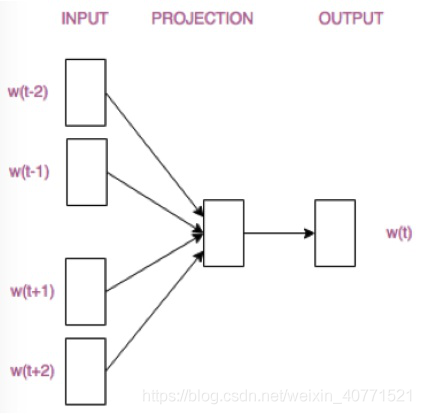
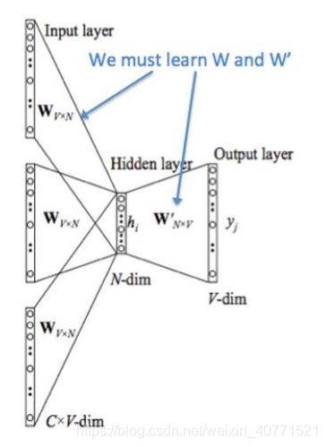
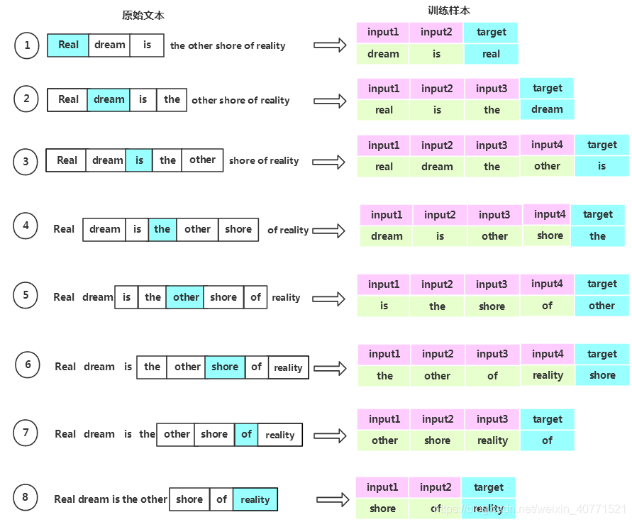

# 基于CBOW的词向量训练

### 背景介绍

##### 1.词嵌入

自然语言是一套用来表达含义的复杂系统。在这套系统中，词是表义的基本单元。顾名思义，词向量是用来表示词的向量，也可被认为是词的特征向量或表征。把词映射为实数域向量的技术也叫词嵌入（word embedding）。近年来，词嵌入已逐渐成为自然语言处理的基础知识

##### 2.为何不采用one-hot向量

- 【如何使用one-hot】

  - 假设词典中不同词的数量（词典大小）为$N$ ，每个词可以和从0到$N-1$−的连续整数一一对应。这些与词对应的整数叫作词的索引。
  - 假设一个词的索引为$i$，为了得到该词的one-hot向量表示，我们创建一个全0的长为$N$的向量，并将其第$i$位设成1。这样一来，每个词就表示成了一个长度为$N$的向量，可以直接被神经网络使用。
  - 简单来说：就是有多少个不同的词，我就会创建多少维的向量，如上：一个词典中有$N$个不同词，那么就会开创$N $维的向量，其中单词出现的位置为以1，该位置设为$i$ ，那么对应的向量就生成了。举个例子：[我，喜，欢，学，习]，其中的“我”就可以编码为：[1,0,0,0,0]，后面的“喜”就可以编码为：[0,1,0,0,0]，依次类推。

- 【存在的问题】

  - 无法使用该方法进行单词之间的相似度计算。

  - 原因就是每个单词在空间中都是正交的向量，彼此之间没有任何联系。

  - 比如我们通过余弦相似度进行度量。
    $$
    \frac{\boldsymbol{x}^\top \boldsymbol{y}}{\|\boldsymbol{x}\| \|\boldsymbol{y}\|} \in [-1, 1].
    $$
    

  -  对于向量$\boldsymbol{x}, \boldsymbol{y} \in \mathbb{R}^d$，它们的余弦相似度是它们之间夹角的余弦值。

- 【解决策略】
  - 既然one-hot的方式没有办法解决，那么我们就需要通过词嵌入的方式来解决。也就是我们后面重点要讲解的word2vec的方法。该方法目前有两种实现模型。
  - 跳字模型（skip-gram）：通过中心词来推断上下文一定窗口内的单词。
  - 连续词袋模型（continuous bag of words，CBOW）：通过上下文来推断中心词。

### CBOW理论介绍

##### 模型理解

CBOW模型根据某个中心词前后A个连续的词，来计算该中心词出现的概率，即用上下文预测目标词。模型结构简易示意图如下：



模型有三层，输入层，隐藏层（又叫投影层），输出层。上图模型的window=2，即在中心词前后各选两个连续的词作为其上下文。输入层的w(t-2),w(t-1),w(t+1),w(t+2)是中心词w(t)的上下文。

**接下来根据下图，走一遍CBOW的流程，推导一下各层矩阵维度的变化**



原始语料词库（corpus）中有V个单词。滑动窗口window选为A，那总共选取的上下文词个数C=2A.

1. 在输入层，输入的是多个上下文单词的one-hot。
   (维度：因为corpus中有V个单词，所以每个单词的one-hot的维度1*V，那么在输入层输入的就是C个1*V的向量，所以在输入层，数据维度为C*V)*
2. 设定最终获得的词向量的维度为N，初始化输入层与隐藏层之间的权重矩阵w，w维度为V*N。上下文单词的one-hot(C*V)与网络的输入权重矩阵w(V*N)相乘，得到C个1*N的向量。把它们求和再平均，得到隐藏层向量h，维度为1*N.
   $h = \frac{1}{C}({x_1} + {x_2} + ... + {x_c}) \cdot w$*
3. 初始化隐藏层与输出层之间的权重矩阵$w$ , 维度为$N*V$。
4. 隐藏层向量$h(1*N)$与$ {w\prime}(N*V)$相乘，得到$1*V$的向量u, $u = h ⋅ w ′ $。为了方便概率表示,将向量u经过`softmax`，此时向量`softmax(u)`的每一维代表语料中的一个单词。向量`softmax(u)`概率最大的位置所代表的单词为模型预测出的中间词。
5. 上一步输出的$1*V$向量与`groud truth`中的`one-hot`比较。训练的目的是最大化实际中心词出现的概率，基于此定义损失函数，通过最小化损失函数，采用梯度下降算法更新W和W’。当网络收敛则训练完成，此时矩阵W就是我们想要的词向量。如果我们想要知道语料中某个词的向量表示，就用这个词的one-hot乘以权重矩阵w，得到$1*N$的向量，这个向量就是我们要找的这个词的向量表示。

因为词的one-hot表示中只有一个位置是1，其余都是0，那么与w相乘后，得到的是w中的某一列向量。由于每个词语的 one-hot里面 1 的位置是不同的，所以不同词的one-hot与w相乘，得到的词向量是w中的不同的列向量。所以可见，权重矩阵中的每一列向量都能对应的、唯一的表示corpus中的每一个词。所以要的词向量就是神经网络输入层与隐藏层之间的权重矩阵。

##### CBOW举例

下面用一个例子来说明CBOW的训练过程，其实主要是想明确一下实际操作时训练样本怎么生成怎么应用，所以具体计算只算了前向传播，计算梯度反向传播嫌麻烦都没算。
假如语料为一句话：Real dream is the other shore of reality.我们设定一个滑动窗口window=2，即中心词左右分别选两个词作为其上下文词。

1. 在训练前，首先要将原始文本生成训练样本数据。下图展示了根据原始语料生成训练数据的过程。



2. 图中蓝色阴影所覆盖的单词为中心词，生成的训练所用的数据。每一个训练样本由多个输入特征和一个输出组成。其中input是feature，output是label。可见，这句文本最后整理成了8个训练样本，下面以第6个样本为例，说明词向量的生成过程

### CBOW的paddle实现

```
class CBOW_2(nn.Layer):
    def __init__(self,vocab_size,embed_size,window_size=5):
        super(CBOW_2,self).__init__()
        self.positive_num=2*window_size
        self.embed=nn.Embedding(vocab_size,embed_size)
        self.l1=nn.Linear(2*window_size*embed_size,128)
        self.l2=nn.Linear(128,vocab_size)

    def forward(self,x_sample):
        inputs=self.embed(x_sample)
        inputs=paddle.flatten(inputs)
        out=self.l1(inputs)
        out=F.relu(out)
        out=self.l2(out)
        out=F.log_softmax(out,axis=-1)
        return out

```

### 参考文献

> https://blog.csdn.net/weixin_40771521/article/details/103893982