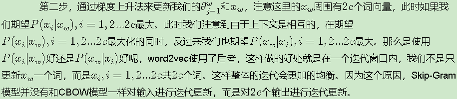

# 如何基于层次softmax训练词向量

## 1. 基于Hierarchical Softmax的模型概述

　　　　我们先回顾下传统的神经网络词向量语言模型，里面一般有三层，输入层（词向量），隐藏层和输出层（softmax层）。里面最大的问题在于从隐藏层到输出的softmax层的计算量很大，因为要计算所有词的softmax概率，再去找概率最大的值。这个模型如下图所示。其中V是词汇表的大小，

　　　　word2vec对这个模型做了改进，首先，对于从输入层到隐藏层的映射，没有采取神经网络的线性变换加激活函数的方法，而是采用简单的对所有输入词向量求和并取平均的方法。比如输入的是三个4维词向量：(1,2,3,4),(9,6,11,8),(5,10,7,12)那么我们word2vec映射后的词向量就是(5,6,7,8)。由于这里是从多个词向量变成了一个词向量。

　　　　第二个改进就是从隐藏层到输出的softmax层这里的计算量改进。为了避免要计算所有词的softmax概率，word2vec采样了霍夫曼树来代替从隐藏层到输出softmax层的映射。我们在上一节已经介绍了霍夫曼树的原理。如何映射呢？这里就是理解word2vec的关键所在了。　　

　　　　由于我们把之前所有都要计算的从输出softmax层的概率计算变成了一颗二叉霍夫曼树，那么我们的softmax概率计算只需要沿着树形结构进行就可以了。如下图所示，我们可以沿着霍夫曼树从根节点一直走到我们的叶子节点的词w2。

　　　　和之前的神经网络语言模型相比，我们的霍夫曼树的所有内部节点就类似之前神经网络隐藏层的神经元,其中，根节点的词向量对应我们的投影后的词向量，而所有叶子节点就类似于之前神经网络softmax输出层的神经元，叶子节点的个数就是词汇表的大小。在霍夫曼树中，隐藏层到输出层的softmax映射不是一下子完成的，而是沿着霍夫曼树一步步完成的，因此这种softmax取名为"Hierarchical Softmax"。

　　　　如何“沿着霍夫曼树一步步完成”呢？在word2vec中，我们采用了二元逻辑回归的方法，即规定沿着左子树走，那么就是负类(霍夫曼树编码1)，沿着右子树走，那么就是正类(霍夫曼树编码0)。判别正类和负类的方法是使用sigmoid函数，即：

　　　　

其中x_w是当前内部节点的词向量，而θ则是我们需要从训练样本求出的逻辑回归的模型参数。

　　　　使用霍夫曼树有什么好处呢？首先，由于是二叉树，之前计算量为V,现在变成了log2V。第二，由于使用霍夫曼树是高频的词靠近树根，这样高频词需要更少的时间会被找到，这符合我们的贪心优化思想。

　　　　容易理解，被划分为左子树而成为负类的概率为P(−)=1−P(+)。在某一个内部节点，要判断是沿左子树还是右子树走的标准就是看P(−),P(+)谁的概率值大。而控制P(−),P(+)谁的概率值大的因素一个是当前节点的词向量，另一个是当前节点的模型参数θ。

　　　　对于上图中的w2，如果它是一个训练样本的输出，那么我们期望对于里面的隐藏节点n(w2,1)的P(−)概率大，n(w2,2)的P(−)概率大，n(w2,3)的P(+)概率大。

　　　　回到基于Hierarchical Softmax的word2vec本身，我们的目标就是找到合适的所有节点的词向量和所有内部节点θ, 使训练样本达到最大似然。那么如何达到最大似然呢？

## 2. 基于Hierarchical Softmax的模型梯度计算

　　　我们使用最大似然法来寻找所有节点的词向量和所有内部节点θ。先拿上面的w2例子来看，我们期望最大化下面的似然函数：

 

 　对于所有的训练样本，我们期望最大化所有样本的似然函数乘积。

## 3. 基于Hierarchical Softmax的CBOW模型　

　　由于word2vec有两种模型：CBOW和Skip-Gram,我们先看看基于CBOW模型时， Hierarchical Softmax如何使用。

　　首先我们要定义词向量的维度大小M，以及CBOW的上下文大小2c2c,这样我们对于训练样本中的每一个词，其前面的c个词和后面的c个词作为了CBOW模型的输入,该词本身作为样本的输出，期望softmax概率最大。

　　在做CBOW模型前，我们需要先将词汇表建立成一颗霍夫曼树。

　　对于从输入层到隐藏层（投影层），这一步比较简单，就是对w周围的2c个词向量求和取平均即可，即：

　　　　

这里总结下基于Hierarchical Softmax的CBOW模型算法流程，梯度迭代使用了随机梯度上升法：

　　　　输入：基于CBOW的语料训练样本，词向量的维度大小M，CBOW的上下文大小2c,步长η

　　　　输出：霍夫曼树的内部节点模型参数θ，所有的词向量w

　　　　1. 基于语料训练样本建立霍夫曼树。

　　　　2. 随机初始化所有的模型参数θ，所有的词向量w

　　　　3. 进行梯度上升迭代过程，对于训练集中的每一个样本(context(w),w)做如下处理：

​       

## 4. 基于Hierarchical Softmax的Skip-Gram模型

现在我们先看看基于Skip-Gram模型时， Hierarchical Softmax如何使用。此时输入的只有一个词w,输出的为2c个词向量context(w)。

　　　　我们对于训练样本中的每一个词，该词本身作为样本的输入， 其前面的c个词和后面的c个词作为了Skip-Gram模型的输出,，期望这些词的softmax概率比其他的词大。

　　　　Skip-Gram模型和CBOW模型其实是反过来的，在上一篇已经讲过。

　　　　在做CBOW模型前，我们需要先将词汇表建立成一颗霍夫曼树。

　　　　对于从输入层到隐藏层（投影层），这一步比CBOW简单，由于只有一个词，所以，即x_w就是词w对应的词向量。

​       

这里总结下基于Hierarchical Softmax的Skip-Gram模型算法流程，梯度迭代使用了随机梯度上升法：

　　　　**输入：**基于Skip-Gram的语料训练样本，词向量的维度大小M，Skip-Gram的上下文大小2c,步长η

　　　　**输出：**霍夫曼树的内部节点模型参数θ，所有的词向量w

　　　　1. 基于语料训练样本建立霍夫曼树。

　　　　2. 随机初始化所有的模型参数θ，所有的词向量w,

　　　　3. 进行梯度上升迭代过程，对于训练集中的每一个样本(w,context(w))做如下处理：

​        

 Mikolov 关于超参数的建议如下：

- **模型架构：**Skip-gram 更慢一些，但是对低频词效果更好；对应的 CBOW 则速度更快一些。
- **训练算法：**层次 softmax 对低频词效果更好；对应的 negative sampling 对 高频词效果更好，向量维度较低时效果更好。
- **高频词亚采样：**对大数据集合可以同时提高精度和速度，sample 的取值 在 1e-3 到 1e-5 之间效果最佳。
- **词向量的维度：**一般维度越高越好，但并不总是这样。
- **窗口大小：**Skip-gram 一般 10 左右，CBOW 一般 5 左右。
