# 用LSTM实现NLP任务

## 序列到类别：文本分类

### 什么是文本分类

​        文本分类在文本处理中是很重要的一个模块，它的应用也非常广泛，比如：垃圾过滤，新闻分类，等等。传统的文本分类方法的流程基本是：

1. 预处理：首先进行分词，然后是除去停用词；
2. 将文本表示成向量，常用的就是文本表示向量空间模型；
3. 进行特征选择，这里的特征就是词语，去掉一些对于分类帮助不大的特征。常用的特征选择的方法是词频过滤，互信息，信息增益，卡方检验等；
4. 接下来就是构造分类器，在文本分类中常用的分类器一般是SVM，朴素贝叶斯等；
5. 训练分类器，后面只要来一个文本，进行文本表示和特征选择后，就可以得到文本的类别。

### 深度学习进行文本分类

​        回归的目的是预测数值型的目标值。最直接的办法是依据输入写出一个目标值的计算公式。假如你想预测小姐姐男友汽车的功率，可能会这么计算：前面介绍了传统的文本分类做法，传统做法主要问题的文本表示是高纬度高稀疏的，特征表达能力很弱，而且神经网络很不擅长对此类数据的处理；此外需要人工进行特征工程，成本很高。应用深度学习解决大规模文本分类问题最重要的是解决文本表示，再利用CNN/RNN等网络结构自动获取特征表达能力，去掉繁杂的人工特征工程，端到端的解决问题。利用深度学习做文本分类，首先还是要进行分词，这是做中文语料必不可少的一步，这里的分词使用的jieba分词。         深度学习处理文本分类问题中，词语的表示不用one-hot编码，而是使用词向量(word embedding)，词向量是词语的一种分布式表示，Hinton最早再1986年就提出了。分布式表示可以这么理解，举个例子，假设有三个词语‘水’，‘冰’，‘冰水’，如果使用one-hot编码，那就编码成：水[1,0,0],冰[0,1,0],冰水[0,0,1]。这就代表了向量空间的第一个维度表示的是‘水’，第二个维度表示的是‘冰’，第三个维度表示的是‘冰水’，每个维度表示的含义不同，而且每个词语的向量之间的夹角都是90度，即使在语义上相似的词语，也无法体现出来。假如我们使用分布式表示，用二维向量表示这个词语，我们指定第一维的含义是‘水’，第二维的含义是‘冰’，那么第一个词语‘水’表示为[1,0]，第二个词语’冰‘表示为[0,1]，那么‘冰水’既有水也有冰，可以表示为[0.5,0.5]，这样的分布式表示，既降低了维度，也体现了语义信息。现在最常用的词向量的分布式表示就是word2vec，是由Tomas Mikolov在2013年提出的，是一种无监督，训练出的词向量具备稠密，包含语义信息的特点。         使用深度学习进行文本分类，不需要进行特征选择这一步，因为深度学习具有自动学习特征的能力。

### 使用LSTM进行文本分类

​         前面已经说了词语的表示了，那么在LSTM中，一句话应该如何建模表示呢？“作者 在 少年 时 即 喜 阅读 ，能 看出 他 精读 了 无数 经典，因而 他 有 一个 庞大 的 内心 世界。”这是段分好词的话，将每个词语的词向量按顺序送进LSTM里面，最后LSTM的输出就是这段话的表示，而且能够包含句子的时序信息。

### 结构图

​        现在我们来搭建一个基于LSTM的文本分类的模型，其结构图如下：

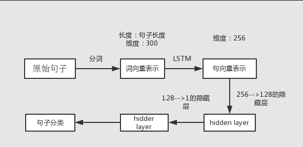

## 同步的序列到序列：机器翻译

### 机器翻译

早期的机器翻译使用的都是基于规则的方法。后来在上世纪90年代开始，机器翻译的方法通常使用基于统计的方法，核心思想就是在平行语料库上学习一个概率模型。在后来深度学习开始盛行后，机器翻译任务又可以用深度学习中的模型来解决。

### 基于统计的机器翻译系统

基于统计的机器翻译一般使用贝叶斯定理来求得最大化的后验概率：

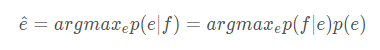

这里的 f 代表源语言法语， e 代表目标语言英语（当然这两个也可以是别的语言）。

公式中的 p(f|e) 是一个翻译模型， p(e) 是之前提到过的语言模型。

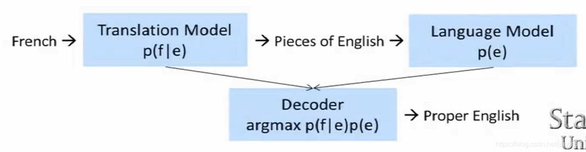

翻译过程如上图所示，将源语言通过翻译模型生成一些对应的目标语言的片段，然后通过语言模型来找出更合理通顺的表达，最后用一个decoder来生成最终的翻译结果。

### 翻译模型

上图所示的翻译系统由三个模块构成，所以要实现一个翻译系统，首先要建立一个翻译模型。

#### 1. 找到两种语言的词和短语之间的映射关系（alignment）

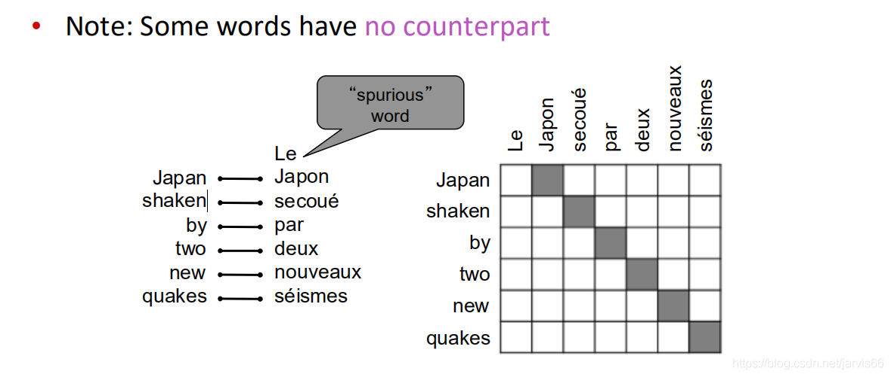

要找出这样的映射关系并不简单，因为两种语言不可能所有的词之间都是一一对应的关系，可能有些语言中的词在另一个语言中找不到对应的词，也有可能一个词会在另一个语言中对应多个词，甚至可能存在多对多的关系（短语对短语）。

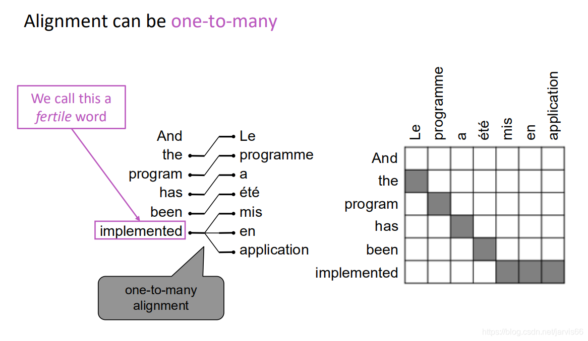

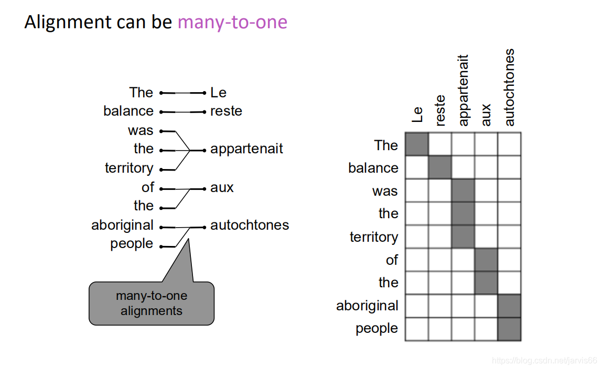

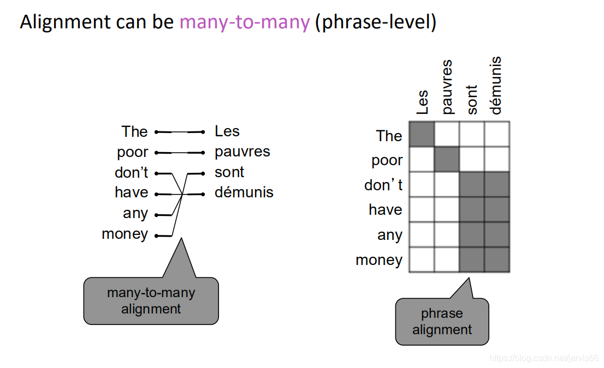

#### 2. 分析语序

分析这种映射关系除了要找到对应的词或者短语外，还需要考虑映射后的词在句子中的位置，因为不同的语言可能存在不同的语序，不可能只根据词在源语言的位置就推断出映射后的词在目标语言的位置。很多翻译过程很可能是下图所示的这样。

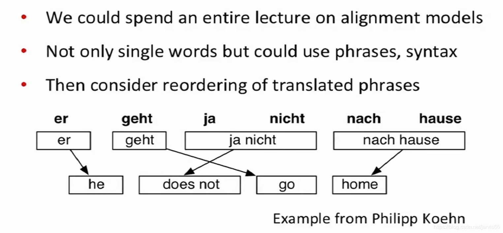

#### 3. 搜索合适的翻译组合

在一个翻译系统中，源语言中的每个词可能都对应着目标语言中的多个词，而不同词之间又会产生非常多的组合，导致组合爆炸。所以这个问题实际上是一个复杂的搜索问题，这个搜索过程需要一个好的语言模型，目标是搜索出一个最合理最符合语言习惯的翻译结果。

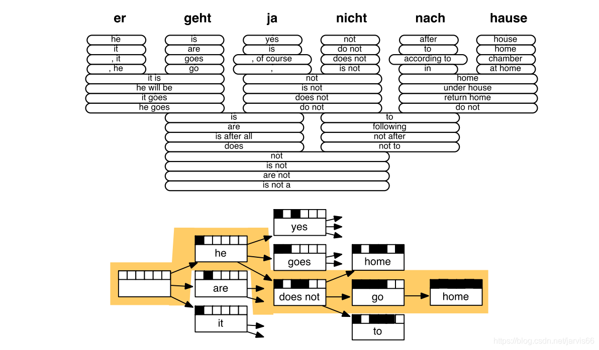

传统的机器翻译系统是一个十分复杂的系统，往往都由很多独立训练的子模块构成，并且在训练前要进行大量的特征工程，所以构建一个机器翻译系统需要大量的人力和时间。

### 基于深度学习的机器翻译

与传统的由多模块构成的机器翻译系统不同，深度学习中最重要的一个性质是它的端到端的学习方式，在深度学习中我们可以仅构造一个模型，只关心最后的目标函数，所有的内容都可以用一个模型来学习。

LSTM
相比于GRU，LSTM的结构更加复杂一些。具体来讲就是将GRU的门从两个增加到了三个：Forget gate、Input gate、Output gate。实际上每个门的计算过程和GRU中的两个门一样，而后面的计算中引入了cell的概念，在cell中控制遗忘和输入保留。具体计算过程如下图所示：

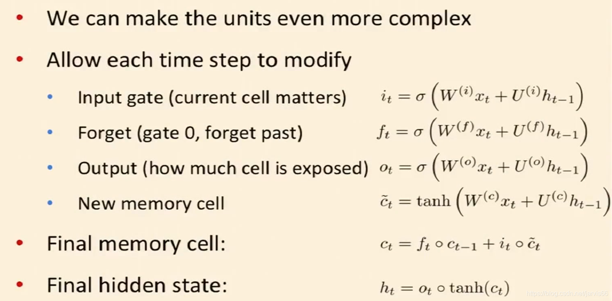

LSTM中每个门的作用如下：

我们可以结合图来理解LSTM的结构：

单个时刻的单元可以表示成这样：

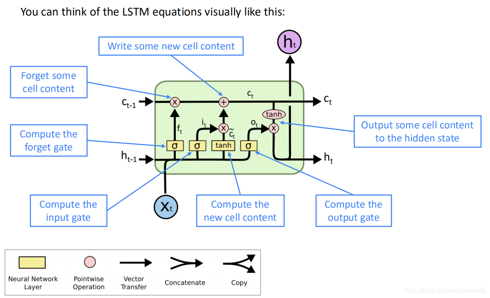

整体的网络结构：

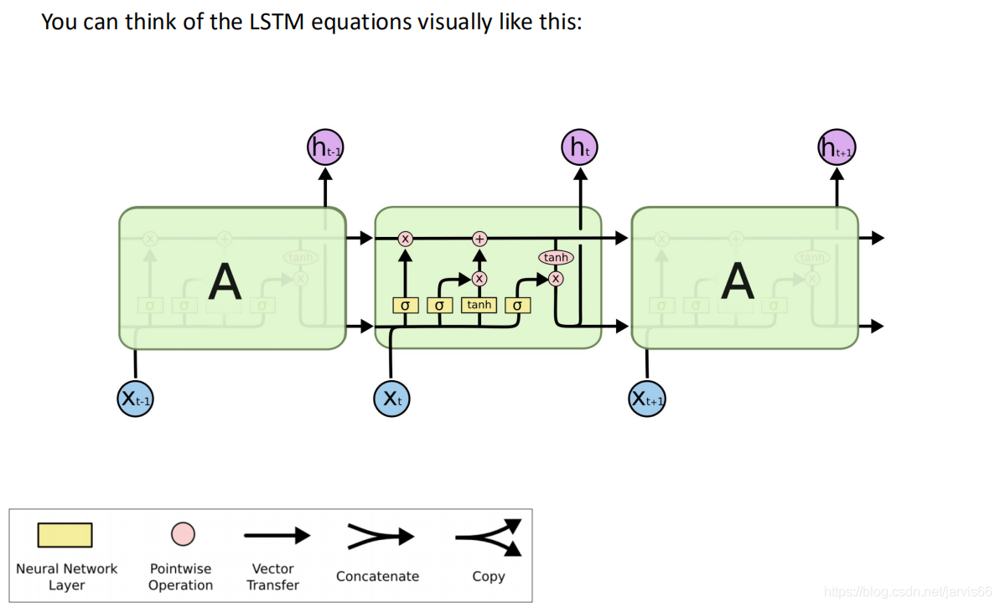

***LSTM如何改善梯度消失的问题？***

## 异步的序列到序列：古诗生成

### 数据预处理

本文藏头诗自动生成采用的是全唐诗，一共包含34646首唐诗。数据格式为诗歌名加上诗歌内容，如图。所有诗歌存放在一个txt文档中，每一行存储一首诗。

数据预处理的过程，实际上是文本处理的过程，先对诗歌进行拆分，提取诗歌内容。步骤包括数据清洗、统计词频、生成字库、根据字库把每一首诗转化为一个向量。

#### 1.进行原始数据清洗（这里只进行去除诗歌题目）

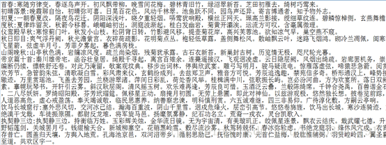

#### 2.统计词频。（诗歌中就是统计字频，下面只是小样本测试）

#### 3.根据词频排序,生成字库

#### 4.根据字库把每一首诗转化为一个向量。（这个向量以字库中的汉字数作为维度，每个维度中通过0和1来表示这个汉字在这首诗中是否出现。）

该程序是使用词库法进行的数据处理。

**One-hot编码：**

本实验在转化为词向量的过程中采用的one-hot编码，在数据处理和特征工程中，经常会遇到类型数据，如性别分为[男，女]，手机运营商分为[移动，联通，电信]等，我们通常将其转为数值带入模型，如[0,1], [-1,0,1]等，但模型往往默认为连续型数值进行处理，这样其实是违背我们最初设计的，也会影响模型效果。

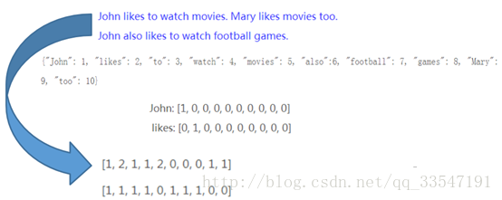

把唐诗转化为向量形式，接下里就可以输入LSTM网络进行训练了。

### 训练与模型生成

首先我们要训练好模型。这里采用的是2层的LSTM框架，每层有128个隐藏层节点，batch_size设为64。训练数据来源于全唐诗。训练参数：rnn_size=128,num_layers=2，batch_size = 64（每次取64首诗进行训练），Learning_rate=0.01。

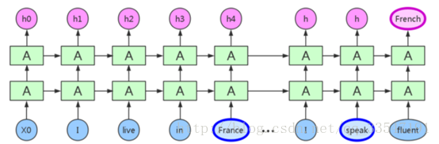
