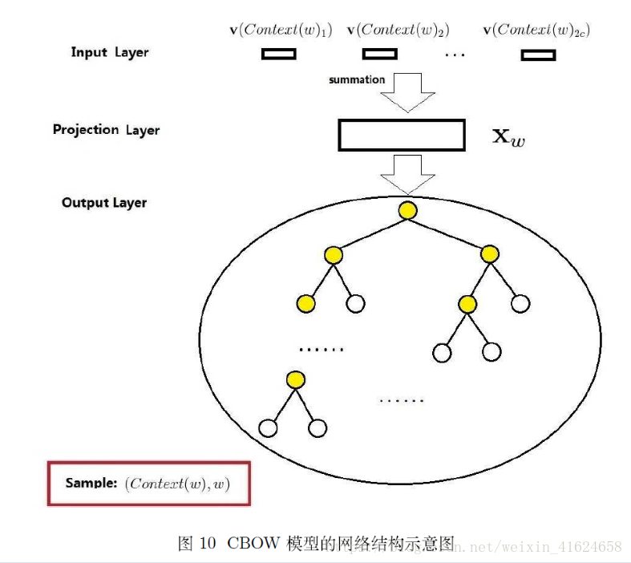
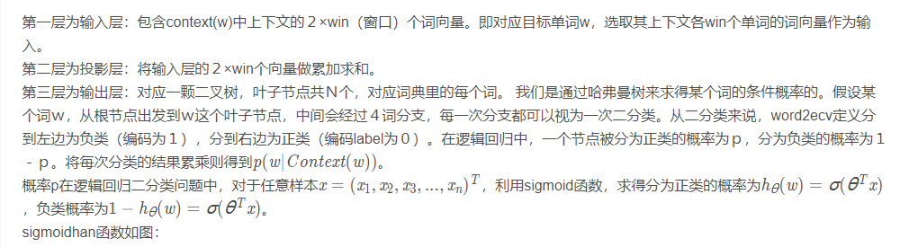
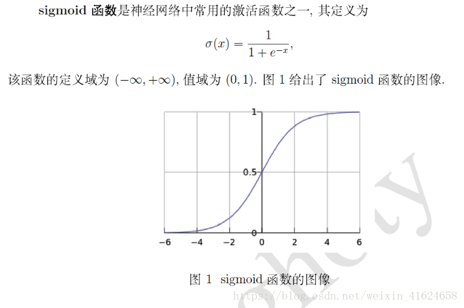
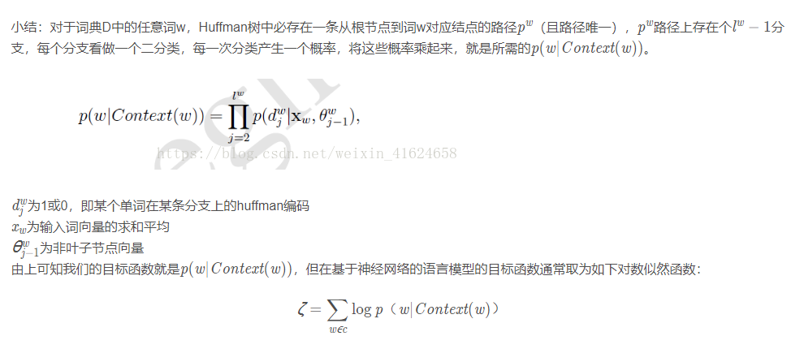

# 使用CBOW方法训练词向量原理

## 一、word2vec简介

word2vec是一种用于训练词向量的模型工具，作用是将所有词语投影到K维的向量空间，每个词语都可以用一个K维向量表示。
为什么要将词用向量来表示呢？这样可以给词语一个数学上的表示，使之可以适用于某些算法或数学模型。

## 二、CBOW介绍

Word2vec根据上下文之间的出现关系去训练词向量，有两种训练模式，Skip Gram和CBOW（constinuous bags of words），其中Skip Gram根据目标单词预测上下文，CBOW根据上下文预测目标单词，最后使用模型的部分参数作为词向量。本文中只介绍基于Hierarchical Softmax的CBOW训练模型，CBOW结构图如下。

训练过程就是要将目标函数最大化，word2vec采用随机梯度上升的方法。
