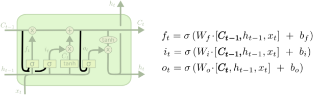

# 1. CNN-DSSM

针对 DSSM 词袋模型丢失上下文信息的缺点，CLSM（convolutional latent semantic model）应运而生，又叫 CNN-DSSM。CNN-DSSM 与 DSSM 的区别主要在于输入层和表示层。

## 1.1 输入层

（1）英文

英文的处理方式，除了上文提到的 letter-trigram，CNN-DSSM 还在输入层增加了word-trigram

如上图所示，word-trigram其实就是一个包含了上下文信息的滑动窗口。举个例子：把<`s`> online auto body ... <`s`>这句话提取出前三个词<`s`> online auto，之后再分别对这三个词进行letter-trigram映射到一个 3 万维的向量空间里，然后把三个向量 concat 起来，最终映射到一个 9 万维的向量空间里。

（2）中文

英文的处理方式（word-trigram letter-trigram）在中文中并不可取，因为英文中虽然用了 word-ngram 把样本空间拉成了百万级，但是经过 letter-trigram 又把向量空间降到可控级别，只有 3`*`30K（9 万）。而中文如果用 word-trigram，那向量空间就是百万级的了，显然还是字向量（1.5 万维）比较可控。

## 1.2 表示层

CNN-DSSM 的表示层由一个卷积神经网络组成，如下图所示：

（1）卷积层——Convolutional layer

卷积层的作用是提取滑动窗口下的上下文特征。以下图为例，假设输入层是一个 302`*`90000（302 行，9 万列）的矩阵，代表 302 个字向量（query 的和 Doc 的长度一般小于 300，这里少了就补全，多了就截断），每个字向量有 9 万维。而卷积核是一个 3`*`90000 的权值矩阵，卷积核以步长为 1 向下移动，得到的 feature map 是一个 300`*`1 的矩阵，feature map 的计算公式是(输入层维数 302-卷积核大小 3 步长 1)/步长 1=300。而这样的卷积核有 300 个，所以形成了 300 个 300`*`1 的 feature map 矩阵。

（2）池化层——Max pooling layer

池化层的作用是为句子找到全局的上下文特征。池化层以 Max-over-time pooling 的方式，每个 feature map 都取最大值，得到一个 300 维的向量。Max-over-pooling 可以解决可变长度的句子输入问题（因为不管 Feature Map 中有多少个值，只需要提取其中的最大值）。不过我们在上一步已经做了句子的定长处理（固定句子长度为 302），所以就没有可变长度句子的问题。最终池化层的输出为各个 Feature Map 的最大值，即一个 300`*`1 的向量。这里多提一句，之所以 Max pooling 层要保持固定的输出维度，是因为下一层全链接层要求有固定的输入层数，才能进行训练。

（3）全连接层——Semantic layer

最后通过全连接层把一个 300 维的向量转化为一个 128 维的低维语义向量。全连接层采用 tanh 函数：

## 1.3 匹配层

CNN-DSSM 的匹配层和 DSSM 的一样，这里省略。

## 1.4 优缺点

优点：CNN-DSSM 通过卷积层提取了滑动窗口下的上下文信息，又通过池化层提取了全局的上下文信息，上下文信息得到较为有效的保留。

缺点：对于间隔较远的上下文信息，难以有效保留。举个例子，I grew up in France... I speak fluent French，显然 France 和 French 是具有上下文依赖关系的，但是由于 CNN-DSSM 滑动窗口（卷积核）大小的限制，导致无法捕获该上下文信息。

# 2. LSTM-DSSM

针对 CNN-DSSM 无法捕获较远距离上下文特征的缺点，有人提出了用LSTM-DSSM（Long-Short-Term Memory）来解决该问题。不过说 LSTM 之前，要先介绍它的"爸爸""RNN。

## 2.1 RNN

RNN（Recurrent Neural Networks）可以被看做是同一神经网络的多次复制，每个神经网络模块会把消息传递给下一个。如果我们将这个循环展开：

假设输入 xi 为一个 query 中几个连续的词，hi 为输出。那么上一个神经元的输出 h(t-1) 与当前细胞的输入 Xt 拼接后经过 tanh 函数会输出 ht，同时把 ht 传递给下一个细胞。

不幸的是，在这个间隔不断增大时，RNN 会逐渐丧失学习到远距离信息的能力。因为 RNN 随着距离的加长，会导致梯度消失。简单来说，由于求导的链式法则，直接导致梯度被表示为连乘的形式，以至梯度消失（几个小于 1 的数相乘会逐渐趋向于 0）。

## 2.2 LSTM

LSTM(（Long-Short-Term Memory）是一种 RNN 特殊的类型，可以学习长期依赖信息。我们分别来介绍它最重要的几个模块：

（0）细胞状态

细胞状态这条线可以理解成是一条信息的传送带，只有一些少量的线性交互。在上面流动可以保持信息的不变性。

（1）遗忘门

遗忘门由 Gers 提出，它用来控制细胞状态 cell 有哪些信息可以通过，继续往下传递。如下图所示，上一层的输出 h(t-1) concat 上本层的输入 xt，经过一个 sigmoid 网络（遗忘门）产生一个从 0 到 1 的数值 ft，然后与细胞状态 C(t-1) 相乘，最终决定有多少细胞状态可以继续往后传递。

（2）输入门

输入门决定要新增什么信息到细胞状态，这里包含两部分：一个 sigmoid 输入门和一个 tanh 函数。sigmoid 决定输入的信号控制，tanh 决定输入什么内容。如下图所示，上一层的输出 h(t-1) concat 上本层的输入 xt，经过一个 sigmoid 网络（输入门）产生一个从 0 到 1 的数值 it，同样的信息经过 tanh 网络做非线性变换得到结果 Ct，sigmoid 的结果和 tanh 的结果相乘，最终决定有哪些信息可以输入到细胞状态里。

（3）输出门

输出门决定从细胞状态要输出什么信息，这里也包含两部分：一个 sigmoid 输出门和一个 tanh 函数。sigmoid 决定输出的信号控制，tanh 决定输出什么内容。如下图所示，上一层的输出 h(t-1) concat 上本层的输入 xt，经过一个 sigmoid 网络（输出门）产生一个从 0 到 1 的数值 Ot，细胞状态 Ct 经过 tanh 网络做非线性变换，得到结果再与 sigmoid 的结果 Ot 相乘，最终决定有哪些信息可以输出，输出的结果 ht 会作为这个细胞的输出，也会作为传递个下一个细胞。

## 2.2 LSTM-DSSM

LSTM-DSSM 其实用的是 LSTM 的一个变种——加入了peephole的 LSTM。如下图所示：

看起来有点复杂，我们换一个图，读者可以看的更清晰：

这里三条黑线就是所谓的 peephole，传统的 LSTM 中遗忘门、输入门和输出门只用了 h(t-1) 和 xt 来控制门缝的大小，peephole 的意思是说不但要考虑 h(t-1) 和 xt，也要考虑 Ct-1 和 Ct，其中遗忘门和输入门考虑了 Ct-1，而输出门考虑了 Ct。总体来说需要考虑的信息更丰富了。

好了，来看一个 LSTM-DSSM 整体的网络结构：

红色的部分可以清晰的看到残差传递的方向。

# 3. MMoE

MMoE模型的结构(下图c)**基于广泛使用的Shared-Bottom结构(下图a)和MoE结构**，其中图(b)是图(c)的一种特殊情况，下面依次介绍。

- **Shared-Bottom Multi-task Model**

如上图a所示，shared-bottom网络（表示为函数f）位于底部，多个任务共用这一层。往上，K个子任务分别对应一个tower network（表示为![[公式]](https://www.zhihu.com/equation?tex=h%5Ek) ），每个子任务的输出 ![[公式]](https://www.zhihu.com/equation?tex=y_k%3Dh%5Ek%28f%28x%29%29) 。

- **Mixture-of-Experts**

MoE模型可以形式化表示为 ![[公式]](https://www.zhihu.com/equation?tex=y%3D%5Csum_%7Bi%3D1%7D%5E%7Bn%7D%7Bg%28x%29_if_i%28x%29%7D) ，其中 ![[公式]](https://www.zhihu.com/equation?tex=%5Csum_%7Bi%3D1%7D%5E%7Bn%7D%7Bg%28x%29_i%7D%3D1) 。其中 ![[公式]](https://www.zhihu.com/equation?tex=f_i%2Ci%3D1%2C%5Ccdots%2Cn) 是n个expert network（expert network可认为是一个神经网络）。g是组合experts结果的gating network，具体来说g产生n个experts上的概率分布，最终的输出是**所有experts的带权加和**。显然，MoE可看做基于多个独立模型的集成方法。这里注意MoE并不对应上图中的b部分。

后面有些文章将MoE作为一个基本的组成单元，将多个MoE结构堆叠在一个大网络中。比如一个MoE层可以接受上一层MoE层的输出作为输入，其输出作为下一层的输入使用。

- **所提模型Multi-gate Mixture-of-Experts**

文章提出的模型（简称MMoE）目的就是**相对于shared-bottom结构不明显增加模型参数的要求下捕捉任务的不同**。其核心思想是将**shared-bottom网络中的函数f替换成MoE层**，如上图c所示，形式化表达为：

![[公式]](https://www.zhihu.com/equation?tex=y_k%3Dh%5Ek%28f%5Ek%28x%29%29%2Cf%5Ek%28x%29%3D%5Csum_%7Bi%3D1%7D%5E%7Bn%7D%7Bg%5Ek%28x%29_if_i%28x%29%7D)

其中 ![[公式]](https://www.zhihu.com/equation?tex=g%5Ek%28x%29%3Dsoftmax%28W_%7Bgk%7Dx%29) ，输入就是input feature，输出是所有experts上的权重。

一方面，因为gating networks通常是轻量级的，而且expert networks是所有任务共用，所以相对于论文中提到的一些baseline方法在计算量和参数量上具有优势。

另一方面，相对于所有任务公共一个门控网络(One-gate MoE model，如上图b)，这里MMoE(上图c)中每个任务使用单独的gating networks。每个任务的gating networks通过最终输出权重不同实现对experts的选择性利用。不同任务的gating networks可以学习到不同的组合experts的模式，因此模型考虑到了捕捉到任务的相关性和区别。

整体来看，这篇文章是对多任务学习的一个扩展，**通过门控网络的机制来平衡多任务**的做法在真实业务场景中具有借鉴意义。下面补充介绍文中的一个数据集设置的做法和实验结果中对不同模型的相互对比分析。

- **人工构造数据集**

在真实数据集中我们无法改变任务之间的相关性，所以不太方便进行研究任务相关性对多任务模型的影响。轮文中人工构建了两个回归任务的数据集，然后通过两个任务的标签的Pearson相关系数来作为任务相关性的度量。在工业界中**通过人工构造的数据集来验证自己的假设**是个有意思的做法。

- **模型的可训练性**

模型的**可训练性，就是模型对于超参数和初始化是否足够鲁棒**。作者在人工合成数据集上进行了实验，观察不同随机种子和模型初始化方法对loss的影响。这里简单介绍下两个现象：第一，Shared-Bottom models的效果方差要明显大于基于MoE的方法，说明Shared-Bottom模型有很多偏差的局部最小点；第二，如果任务相关度非常高，则OMoE和MMoE的效果近似，但是如果任务相关度很低，则OMoE的效果相对于MMoE明显下降，说明**MMoE中的multi-gate的结构对于任务差异带来的冲突有一定的缓解**作用。

# **4. Shared-bottom**

在推荐业务中经常有“既要、也要、还要”的场景，比如做视频推荐业务的时候既要提升用户对于视频的点击率，也希望同时提升用户观看视频的时长。面对这样的诉求，通常需要在推荐系统中使用多目标建模算法。

多目标建模目前业内有两种模式，一种叫Shared-Bottom模式，另一种叫MOE，MOE又包含MMOE和OMOE两种。MMOE也是Google提出的一套多目标学习算法结果，被应用到了Google的内部推荐系统中。如下图所示：

Shared-Bottom的思路就是多个目标底层共用一套共享layer，在这之上基于不同的目标构建不同的Tower。这样的好处就是底层的layer复用，减少计算量，同时也可以防止过拟合的情况出现。

Shared-Bottom 优点：降低overfit风险，利用任务之间的关联性使模型学习效果更强

Shared-Bottom 缺点：任务之间的相关性将严重影响模型效果。假如任务之间相关性较低，模型的效果相对会较差。

# 5. YouTube深度学习视频推荐系统

## 5.1 推荐系统的应用场景

作为全球最大的视频分享网站，YouTube 平台中几乎所有的视频都来自 UGC（User Generated Content，用户原创内容），这样的内容产生模式有两个特点：

一是其商业模式不同于 Netflix，以及国内的腾讯视频、爱奇艺这样的流媒体，这些流媒体的大部分内容都是采购或自制的电影、剧集等头部内容，而 YouTube 的内容都是用户上传的自制视频，种类风格繁多，头部效应没那么明显；
二是由于 YouTube 的视频基数巨大，用户难以发现喜欢的内容。

## 5.2 YouTube 推荐系统架构

为了对海量的视频进行快速、准确的排序，YouTube 也采用了经典的召回层 + 排序层的推荐系统架构。

**其推荐过程可以分成二级。第一级是用候选集生成模型（Candidate Generation Model）完成候选视频的快速筛选，在这一步，候选视频集合由百万降低到几百量级，这就相当于经典推荐系统架构中的召回层。第二级是用排序模型（Ranking Model）完成几百个候选视频的精排，这相当于经典推荐系统架构中的排序层。**

无论是候选集生成模型还是排序模型，YouTube 都采用了深度学习的解决方案。

## 5.3 候选集生成模型

用于视频召回的候选集生成模型，架构如下图所示。

最底层是它的输入层，输入的特征包括用户历史观看视频的 Embedding 向量，以及搜索词的 Embedding 向量。对于这些 Embedding 特征，YouTube 是利用用户的观看序列和搜索序列，采用了类似 Item2vec 的预训练方式生成的。

除了视频和搜索词 Embedding 向量，特征向量中还包括用户的地理位置 Embedding、年龄、性别等特征。这里我们需要注意的是，对于样本年龄这个特征，YouTube 不仅使用了原始特征值，还把经过平方处理的特征值也作为一个新的特征输入模型。
这个操作其实是为了挖掘特征非线性的特性。

确定好了特征，这些特征会在 concat 层中连接起来，输入到上层的 ReLU 神经网络进行训练。

三层 ReLU 神经网络过后，YouTube 又使用了 softmax 函数作为输出层。值得一提的是，这里的输出层不是要预测用户会不会点击这个视频，而是要预测用户会点击哪个视频，这就跟一般深度推荐模型不一样。

总的来讲，YouTube 推荐系统的候选集生成模型，是一个标准的利用了 Embedding 预训练特征的深度推荐模型，它遵循Embedding MLP 模型的架构，只是在最后的输出层有所区别。

## 5.4 候选集生成模型独特的线上服务方法

## 5.5 排序模型

输入层，相比于候选集生成模型需要对几百万候选集进行粗筛，排序模型只需对几百个候选视频进行排序，因此可以引入更多特征进行精排。具体来说，YouTube 的输入层从左至右引入的特征依次是：

- impression video ID embedding：当前候选视频的 Embedding；
- watched video IDs average embedding：用户观看过的最后 N 个视频 Embedding 的平均值；
- language embedding：用户语言的 Embedding 和当前候选视频语言的 Embedding；
- time since last watch：表示用户上次观看同频道视频距今的时间；
- #previous impressions：该视频已经被曝光给该用户的次数；

这 5 类特征连接起来之后，需要再经过三层 ReLU 网络进行充分的特征交叉，然后就到了输出层。这里重点注意，排序模型的输出层与候选集生成模型又有所不同。不同主要有两点：**一是候选集生成模型选择了 softmax 作为其输出层，而排序模型选择了 weighted logistic regression（加权逻辑回归）作为模型输出层；二是候选集生成模型预测的是用户会点击“哪个视频”，排序模型预测的是用户“要不要点击当前视频”。**

其实，排序模型采用不同输出层的根本原因就在于，YouTube 想要更精确地预测**用户的观看时长，因为观看时长才是 YouTube 最看中的商业指标**，而使用 Weighted LR 作为输出层，就可以实现这样的目标。

在 Weighted LR 的训练中，我们需要为每个样本设置一个权重，权重的大小，代表了这个样本的重要程度。为了能够预估观看时长，YouTube 将正样本的权重设置为用户观看这个视频的时长，然后再用 Weighted LR 进行训练，就可以让模型学到用户观看时长的信息。

对于排序模型，必须使用 TensorFlow Serving 等模型服务平台，来进行模型的线上推断。

## 5.6 训练和测试样本的处理

为了能够提高模型的训练效率和预测准确率，Youtube采取了诸多处理训练样本的工程措施，主要有3点：

- 候选集生成模型把推荐模型转换成**多分类**问题，在预测下一次观看的场景中，每一个备选视频都会是一个分类，而如果采用softmax对其训练是很低效的。

  Youtube采用word2vec中常用的**负采样训练方法减少每次预测的分类数量，从而加快整个模型的收敛速度**。

- 在对训练集的预处理过程中，Youtube没有采用原始的用户日志，而是**对每个用户提取等数量的训练样本**。

  YouTube这样做的目的是减少高度活跃用户对模型损失的过度影响，使模型过于偏向活跃用户的行为模式，忽略数量更广大的长尾用户体验。

- 在处理测试集时，Youtube没有采用经典的随机留一法，而是一定要以用户最近一次观看的行为作为测试集。

  **只留最后一次观看行为做测试集主要是为了避免引入未来信息(future information)，产生于事实不符的数据穿越问题**。

## 5.7 处理用户对新视频的爱好

## 5.8 总结

YouTube 推荐系统的架构是一个典型的召回层加排序层的架构，其中候选集生成模型负责从百万候选集中召回几百个候选视频，排序模型负责几百个候选视频的精排，最终选出几十个推荐给用户。

候选集生成模型是一个典型的 Embedding MLP 的架构，要注意的是它的输出层一个多分类的输出层，预测的是用户点击了“哪个”视频。在候选集生成模型的 serving 过程中，需要从输出层提取出视频 Embedding，从最后一层 ReLU 层得到用户 Embedding，然后利用 **最近邻搜索** 快速得到候选集。

排序模型同样是一个 Embedding MLP 的架构，不同的是，它的输入层包含了更多的用户和视频的特征，输出层采用了 Weighted LR 作为输出层，并且使用观看时长作为正样本权重，让模型能够预测出观看时长，这更接近 YouTube 要达成的商业目标。

