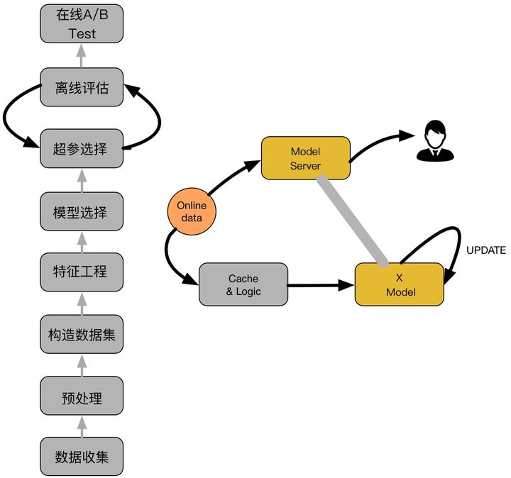
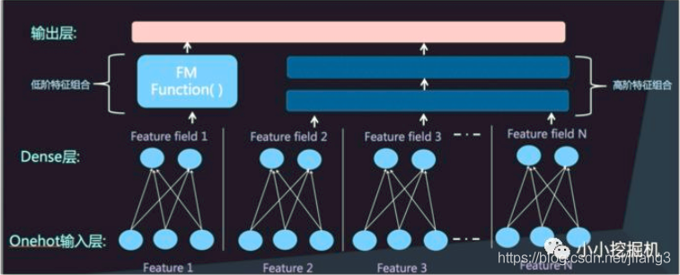
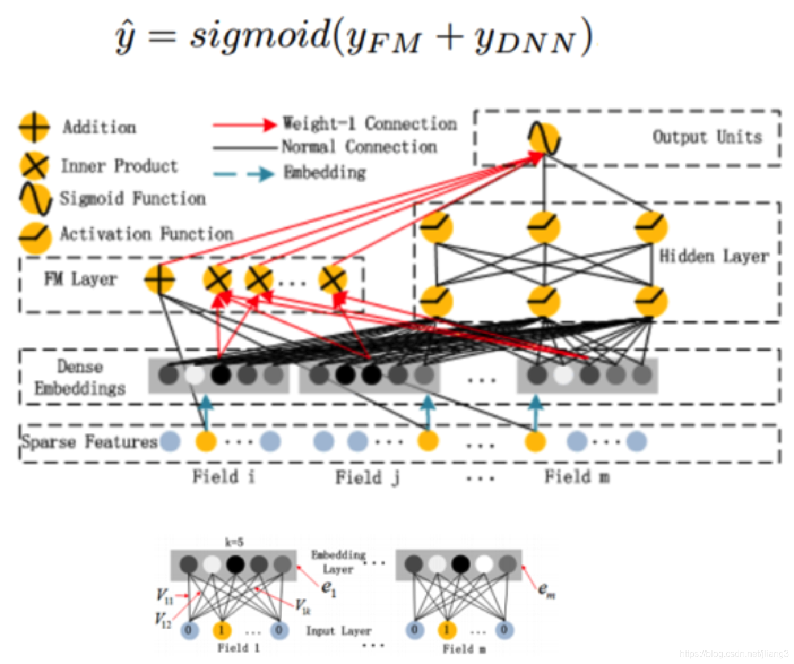
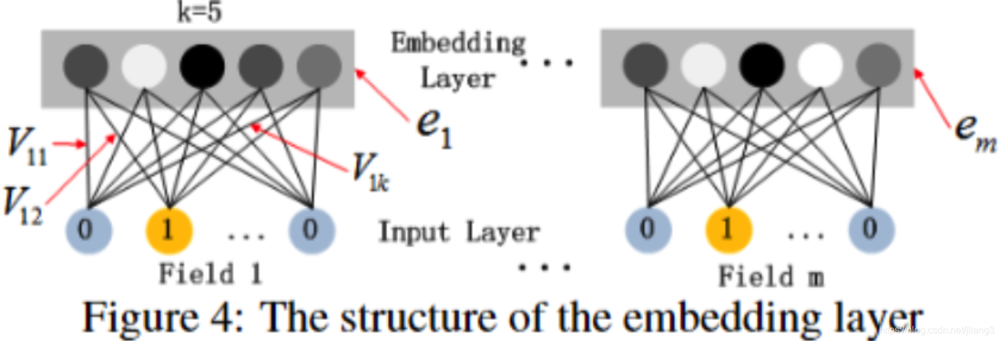
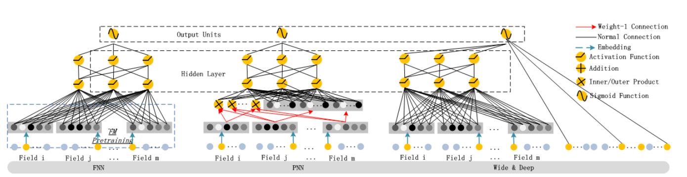
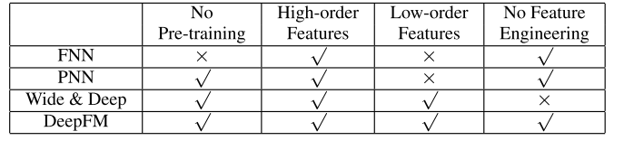
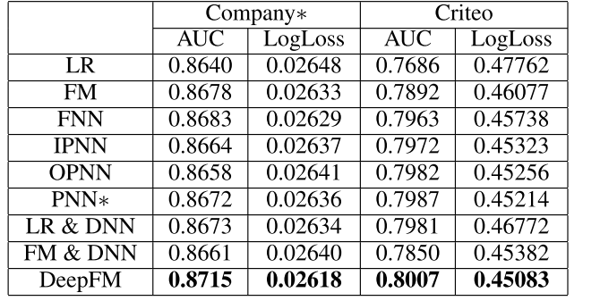

# 点击率预估
一个典型的CTR流程如下图所示：

如上图，主要包括两大部分：离线部分、在线部分，其中离线部分目标主要是训练出可用模型，而在线部分则考虑模型上线后，性能可能随时间而出现下降，弱出现这种情况，可选择使用Online-Learning来在线更新模型：：

- · 离线部分：

- - 数据收集：主要收集和业务相关的数据，通常会有专门的同事在app位置进行埋点，拿到业务数据；
  - 预处理：对埋点拿到的业务数据进行去脏去重；
  - 构造数据集：经过预处理的业务数据，构造数据集，在切分训练、测试、验证集时应该合理根据业务逻辑来进行切分；
  - 特征工程：对原始数据进行基本的特征处理，包括去除相关性大的特征，离散变量one-hot，连续特征离散化等等;
  - 模型选择：选择合理的机器学习模型来完成相应工作，原则是先从简入深，先找到baseline，然后逐步优化；
  - 超参选择：利用gridsearch、randomsearch或者hyperopt来进行超参选择，选择在离线数据集中性能最好的超参组合；
  - 在线A/B Test：选择优化过后的模型和原先模型（如baseline）进行A/B Test，若性能有提升则替换原先模型；

- 在线部分

- - Cache & Logic：设定简单过滤规则，过滤异常数据；
  - 模型更新：当Cache & Logic 收集到合适大小数据时，对模型进行pretrain+finetuning，若在测试集上比原始模型性能高，则更新model server的模型参数；

- Model Server：接受数据请求，返回预测结果；

## CTR预估的典型应用场景

现阶段, 工业级的推荐系统常因为候选集数据量、系统响应时效等因素的影响, 需要分多个阶段完成整个推荐的流程, 具体地, 常将其分为**召回**与**排序**两大阶段. 对于具有一定规模的互联网业务而言, 其所面对的待推荐物料库(商品、视频、音乐等)通常能达到百万量级, 更大规模的业务甚至能达到千万及亿量级. 若针对某一特定的用户我们都需要对全体物料进行打分排序以给出最终推荐结果的话, 在有限的计算资源和响应时间下显然是不现实的事情. 所以, 在工业实践中, 我们通常先采用多路召回策略(协同过滤、热点、用户画像标签等)从待推荐物料库中先召回一批数据, 使数据量下降到千量级. 由于召回阶段的数据量较大, 所以要求该阶段所使用的策略和模型要足够的简单. 通过召回阶段, 我们顺利地将待排序数据量降至千量级, 此时, 我们便可以通过用户画像、物料画像、用户行为记录等数据来进行排序, 从而得到用户对每个物料的CTR预估值.

## DeepFM
近年来深度学习模型在解决NLP、CV等领域的问题上取得了不错的效果，于是有学者将深度神经网络模型与FM模型结合，提出了DeepFM模型。

FM通过对于每一位特征的隐变量内积来提取特征组合，有着以下优点：
1. FM模型的参数支持非常稀疏的特征，而SVM等模型不行
1. FM的时间复杂度为 o(N)，并且可以直接优化原问题的参数，而不需要依靠支持向量或者是转化成对偶问题解决
1. FM是通用的模型，可以适用于任何实数特征的场景，其他的模型不行

但FM通常使用二维特征的交叉，因为当特征数量>2时，没有很好的优化方法，同时三重特征的交叉往往没有意义，且会过于稀疏，由此可见FM适用于低维特征交叉。对于高维特征组合来说，我们很自然想到深度神经网络DNN。而将这二者结合，便是DeepFM模型。

### 模型概览

### 数学原理

对于给定特征i， wi用于表示一阶特征的重要性，这部分只直接输入到FM
特征i的隐向量vi用于衡量和其他特征的相互影响
在FM部分，vi用于表示二阶特征
在神经网络部分vi用于构建高阶特征
对于当前模型，和wide&deep一样，所有的参数共同参与训练
不需要预训练，可以直接将稀疏数据输入模型

### embedding layer（上图中的dense embeddings）

原始输入的数据是很多歌字段的高维稀疏数据，因此引入embedding layer将输入向量压缩到低维稠密向量
输入数据的每个字段（field）的特征（每个字段onehot后都是包含多个特征）经过embedding之后都变成k维，所以embedding后的特征数=count(field)*k
FM得到的隐变量V作为潜入层网络的权重，FM模型作为整个模型的一部分与其他深度学习模型一起参与整体的学习
FM部分与深度学习部分共享embedding的好处
从原始数据中同时学习了低维与高维特征
不再需要特征工程

### Field和Feature

每个Field是一个原始特征，Field经过onehot编码后产生多个特征，输出的每个特征就是feature
同一个Field中所有Feature中只有一个为1，其它为0
不同的Field经过onehot后的Feature数不一样，但经过embedding后都是一样长

### DeepFM优势

相对Wide&Deep不需要手工构建wide部门特征
相对于FNN把FM的隐向量参数直接作为网络的参数学习，不需要预训练
DeepFM将embedding层结果输入到FM和MLP，两者输出叠加，达到捕捉低阶和高阶特征交叉的目的

## **DeepFM模型对比**
目前在推荐领域中比较流行的深度模型有FNN、PNN、Wide&Deep。

* FNN模型是用FM模型来对Embedding层进行初始化的全连接神经网络。
* PNN模型则是在Embedding层和全连接层之间引入了内积/外积层，来学习特征之间的交互关系。
* Wide&Deep模型由谷歌提出，将LR和DNN联合训练，在Google Play取得了线上效果的提升。Wide&Deep模型，很大程度上满足了模型同时学习低阶特征和高阶特征的需求，让模型同时具备较好的“memorization”和“generalization”。但是需要人工特征工程来为Wide模型选取输入特征。具体而言，对哪些稀疏的特征进行embedding，是由人工指定的。

有学者将DeepFM与当前流行的应用于CTR的神经网络做了对比：

从预训练，特征维度以及特征工程的角度进行对比，发现：

从实验效果来看，DeepFM的效果较好：

**DeepFM的三大优势：**

1. 相对于Wide&Deep不再需要手工构建wide部分；
1. 相对于FNN把FM的隐向量参数直接作为网络参数学习；
1. DeepFM将embedding层结果输入给FM和MLP，两者输出叠加，达到捕捉了低阶和高阶特征交叉的目的。
