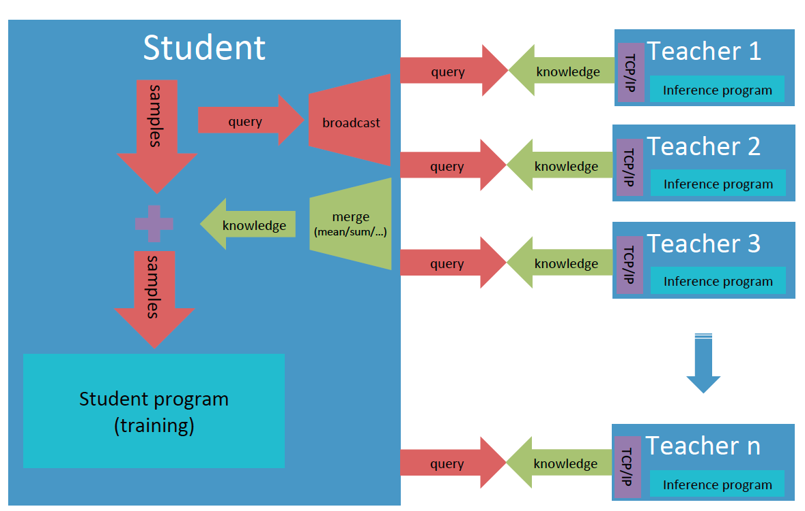

# Pantheon: Paddle large-scale scalable knowledge distillation framework

Pantheon is a universal solution for knowledge distillation in Paddle Fluid. Its design takes account of many possible behaviors of teacher models. Every teacher and student model in Pantheon works in different processes and they communicate with each other via local files or TCP/IP ports. The knowledge can be easily transferred to the student model from a single teacher model or the ensemble of multiple teacher models, in which each teacher model can work in online or offline mode independently. And Pantheon also provides a highly optimized interface for the large-scale prediction of teacher models. Beneficial from the low coupling of teachers and the student, users can allocate computation resources for different roles dependent on their computation complexity, and build a large-scale and practical knowledge distillation learning system on Pantheon.  

The illustration below shows an application of Pantheon, where the sudent model is trained with knowledge from multiple online teachers. These teachers may work on the same node but different devices, or different nodes with the student model, as long as they can communicate with each other via the Internet. The student model can send queries to teachers, and the latter take these queries as input and generate streaming knowledge data for the former. Or in a simpler way, the student model can read the training data in the **same order** with the teachers, avoiding the procedure of sending queryies.  


<div align="center">
   <br>
  The architecture for one online knowledge distillation system based on Pantheon
</div>

## Prerequisites

- Python 2.7.x or 3.x
- PaddlePaddle >= 1.7.0
- System: MacOS/Linux

## APIs

Pantheon defines two classes **Teacher** and **Student** for the communication and knowledge transfer between teacher and student.

- **Teacher**: used by the teacher model. Can receive queries from student and write out the knowledge from teacher model via TCP/IP port (online mode) or into a local file (offline mode).
- **Student**: used by the student model. Can receive and merge the knowledge from teachers, and feed the student model along with local data for training.

Usually, the public methods of these two classes work in the pairwise way. Their mapping relations and suitable working modes are listed in the following table.

<table>
  <tr>
    <th rowspan="2">Teacher</th>
    <th rowspan="2">Student</th>
    <th colspan="2">Supported Graph</th>
    <th colspan="2">Mode</th>
    <th rowspan="2">remarks</th>
  </tr>
  <tr>
   <td>static</td>
   <td>dynamic</td>
   <td>online</td>
   <td>offline</td>
  </tr>
    <tr>
    <td><strong>__init__</strong>(<br>&nbsp;&nbsp;&nbsp;&nbsp;out_path=None,          <br>&nbsp;&nbsp;&nbsp;&nbsp;out_port=None)</td>
    <td><strong>__init__</strong>(<br>&nbsp;&nbsp;&nbsp;&nbsp;merge_strategy=None)</td>
    <td><center>✅</center></td>
    <td><center>✅</center></td>
    <td><center>✅</center></td>
    <td><center>✅</center></td>
    <td>[1]</td>
  </tr>
  <tr>
    <td></td>
    <td><strong>register_teacher</strong>(
            <br>&nbsp;&nbsp;&nbsp;&nbsp;in_path=None,
            <br>&nbsp;&nbsp;&nbsp;&nbsp;in_address=None)
    </td>
    <td><center>✅</center></td>
    <td><center>✅</center></td>
    <td><center>✅</center></td>
    <td><center>✅</center></td>
    <td>[2]</td>
  </tr>
  <tr>
    <td><strong>start()</strong></td>
    <td><strong>start()</strong></td>
    <td><center>✅</center></td>
    <td><center>✅</center></td>
    <td><center>✅</center></td>
    <td><center>✅</center></td>
    <td>[3]</td>
  </tr>
  <tr>
    <td><strong>send</strong>(data)</td>
    <td><strong>recv</strong>(teacher_id)</td>
    <td><center>✅</center></td>
    <td><center>✅</center></td>
    <td><center>✅</center></td>
    <td><center></center></td>
    <td>[4]</td>
  </tr>
   <tr>
    <td><strong>recv()</strong></td>
    <td><strong>send</strong>(data, <br>&nbsp;&nbsp;&nbsp;
        &nbsp;teacher_ids=None)
    </td>
    <td><center>✅</center></td>
    <td><center>✅</center></td>
    <td><center>✅</center></td>
    <td><center></center></td>
    <td>[5]</td>
  </tr>
   <tr>
    <td><strong>dump</strong>(knowledge)</td>
    <td></td>
    <td><center>✅</center></td>
    <td><center>✅</center></td>
    <td><center></center></td>
    <td><center>✅</center></td>
    <td>[6]</td>
  </tr>
  <tr>
    <td rowspan="3"><strong>start_knowledge_service</strong>(
    <br>&nbsp;&nbsp;&nbsp;&nbsp;feed_list,
    <br>&nbsp;&nbsp;&nbsp;&nbsp;schema,
    <br>&nbsp;&nbsp;&nbsp;&nbsp;program,
    <br>&nbsp;&nbsp;&nbsp;&nbsp;reader_config,
    <br>&nbsp;&nbsp;&nbsp;&nbsp;exe,
    <br>&nbsp;&nbsp;&nbsp;&nbsp;buf_size=10,
    <br>&nbsp;&nbsp;&nbsp;&nbsp;use_fp16=False,
    <br>&nbsp;&nbsp;&nbsp;&nbsp;times=1)</td>
    <td><strong>get_knowledge_desc</strong>()</td>
    <td><center>✅</center></td>
    <td><center></center></td>
    <td><center>✅</center></td>
    <td><center>✅</center></td>
    <td rowspan="3">[7]</td>
  </tr>
  <tr>
    <td><strong>get_knowledge_qsize</strong>()</td>
    <td><center>✅</center></td>
    <td><center></center></td>
    <td><center>✅</center></td>
    <td><center>✅</center></td>
  </tr>
   <tr>
    <td><strong>get_knowledge_generator</strong>(<br>&nbsp;&nbsp;&nbsp;&nbsp;batch_size,
        <br>&nbsp;&nbsp;&nbsp;&nbsp;drop_last=False)</td>
    <td><center>✅</center></td>
    <td><center></center></td>
    <td><center>✅</center></td>
    <td><center>✅</center></td>
  </tr>
</table>

**Remarks:**

  - [1] Decalre the teacher object for teacher model with **out\_path** or **out\_port**, and the student for student model with **merge\_strategy** for knowledge from different teachers.
  - [2] Register a teacher, and allocate an id for it which starts from zero in the order of registration. **register\_teacher()** can be called many times for multiple-teacher mode.
  - [3] Estabish TCP/IP link between teachers and the student, and synchronize all of them.
  - [4] Send one data from teacher to student.
  - [5] Send one data from student to teacher.
  - [6] Dump one batch knowledge data into the output file.
  - [7] Highly optimized high-level interfaces to build service for knowledge transfer:
     -  **start\_knowledge\_service()** can perform large-scale prediction of teacher model on multiple devices;
     - Support auto merging of knowledge from different teachers;
     - Support auto reconnection of student and teachers.

### About the data format

- **Knowledge**: A dictionary with the keys specified by users and the values that are numpy ndarray tensors predicted by teacher models. The first dimension of tensors should be batch size and LoDTensor is not supported yet. One can call **get\_knowledge\_desc()** to get the description of knowledge, which is also a dictionary, including the shape, data type and LoD level about knowledge data.
- **Offline knowledge file**: The first line is knowledge description, and the following lines are knowledge data, one line for one batch samples, all dumped by cPickle.


### Usage

If separately runnable teacher models and the student model
have been ready, basically one can build the trainable system with knowledge
distillation by following two simple steps.

1) Instantiate a **Teacher** object for the teacher model, and launch knowledge serving

```python

from paddleslim.pantheon import Teacher
...

teacher = Teacher(out_path=args.out_path, out_port=args.out_port)
teacher.start()

teacher.start_knowledge_service(
    feed_list=[inp_x.name],
    schema={"x": inp_x,
            "y": y},
    program=program,
    reader_config={"batch_generator": batch_generator},
    exe=exe,
    buf_size=100,
    times=1)
```

2) Instantiate a **Student** object, specify the way to merge knowledge, register teachers,
   and get knowledge description and data generator for the student model

```python
from paddleslim.pantheon import Student
...

student = Student(merge_strategy={"result": "sum"})

student.register_teacher(
        in_address=args.in_address0, in_path=args.in_path0)
student.register_teacher(
        in_address=args.in_address1, in_path=args.in_path1)
student.start()

knowledge_desc = student.get_knowledge_desc()
data_generator = student.get_knowledge_generator(
    batch_size=32, drop_last=False)
```

## Examples

### Toy Example

A toy example is provied to show how the knowledge data is transferred from teachers to the student model and merged, including offline, online modes and their hybrid. See [demo/pantheon/toy](../../demo/pantheon/toy).
