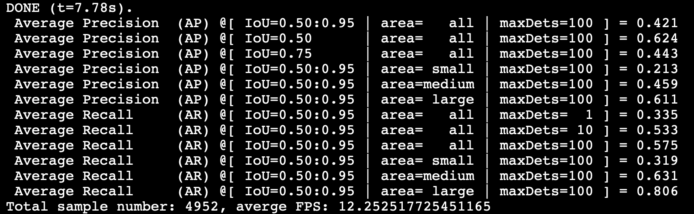
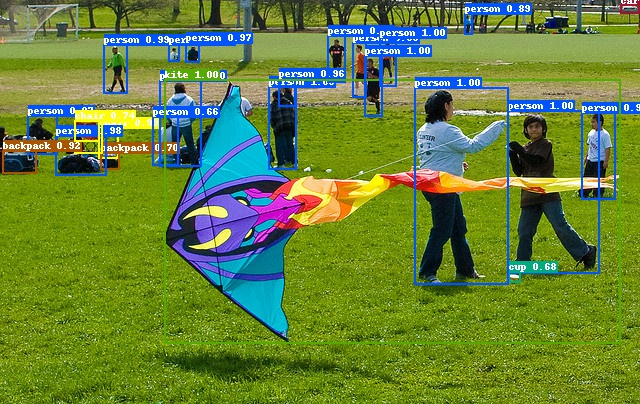

# 环境要求

- PaddlePaddle 2.1
- OS 64位操作系统
- Python 3(3.5.1+/3.6/3.7/3.8/3.9)，64位版本
- pip/pip3(9.0.1+)，64位版本
- CUDA >= 10.1
- cuDNN >= 7.6

#### 安装PaddlePaddle

```bash
# CUDA10.1
python -m pip install paddlepaddle-gpu==2.1.0.post101 -f https://paddlepaddle.org.cn/whl/mkl/stable.html

# CPU
python -m pip install paddlepaddle -i https://mirror.baidu.com/pypi/simple
```

- 更多CUDA版本或环境快速安装，请参考[PaddlePaddle快速安装文档](https://www.paddlepaddle.org.cn/install/quick)
- 更多安装方式例如conda或源码编译安装方法，请参考[PaddlePaddle安装文档](https://www.paddlepaddle.org.cn/documentation/docs/zh/install/index_cn.html)

请确保您的PaddlePaddle安装成功并且版本不低于需求版本。使用以下命令进行验证。

```bash
# 在您的Python解释器中确认PaddlePaddle安装成功
>>> import paddle
>>> paddle.utils.run_check()

# 确认PaddlePaddle版本
python -c "import paddle; print(paddle.__version__)"
```

#  # 目录结构

	｜-- data：数据处理
		|-- dataset.py：COCO格式数据解析
		|-- operators.py：包含各种预处理方法
	｜-- models：模型
		|-- backbone.py：backbone模型
	  |-- positional_encoding.py：位置编码器	
		|-- transformer.py：transormer模型
		|-- hungarian_matcher.py：双边匹配方法
		|-- loss.py：计算损失函数
		|-- detr_head.py：DETR的head模型
		|-- post_process.py：DETR结果后处理
		|-- detr.py：DETR的整体结构
	  |-- layers.py、ops.py：定义网络层
	  |-- initializer.py：初始化方法
	  |-- callbacks.py：callbacks方法，LogPrinter等
	  |-- optimizer.py：优化器、学习率衰减等方法
	  |-- save_model.py：保存模型
	｜-- utils：
		|-- bbox_utils.py：框bbox的处理
		|-- load_model.py：加载预训练模型
		|-- util.py：定义GIoULoss等函数
	｜-- imgs：README图片
	｜-- test_imgs：测试图片
	｜-- output：测试结果图片
	｜-- main.py：主函数
	｜-- train_model.py：训练代码
	｜-- eval_model.py：验证代码
	｜-- test_model.py：测试代码

# 准备数据集

下载[COCO数据集](https://aistudio.baidu.com/aistudio/datasetdetail/105593)，并解压到dataset文件夹下

```bash
mkdir dataset
unzip -q -o train2017.zip -d dataset
unzip -q -o val2017.zip -d dataset
unzip -q -o annotations_trainval2017.zip -d dataset
```

解压之后，完整COCO数据存储结构：
```bash
	｜-- annotations：标注文件
		|-- person_keypoints_train2017.json：关键点检测
		|-- person_keypoints_val2017.json
		|-- captions_train2017.json：看图说话
		|-- captions_val2017.json
		|-- instances_train2017.json：目标实例
		|-- instances_val2017.json
	｜-- images：图片
		|-- train2017
		|-- val2017
```

# 训练

```python
python main.py --mode='train' --dataset_dir='dataset/' --image_dir='train2017' --anno_path='annotations/instances_train2017.json'
```

* mode：设置不同的模型，'train'表示训练
* dataset_dir：COCO数据集路径
* image_dir：训练图片路径
* anno_path：训练标注文件路径

# 验证

```python
python main.py --mode='eval' --dataset_dir='dataset/' --image_dir='val2017' --anno_path='annotations/instances_val2017.json' --pretrained_model='pretrained_model/detr'
```

* pretrained_model：预训练模型

[下载DETR预训练模型](https://aistudio.baidu.com/aistudio/datasetdetail/105570)，放在pretrained_model/目录下，使用预训练模型在COCO验证集上进行验证，结果如下：



# 测试

```python
python main.py --mode='test' --infer_img='test_imgs/000000014439.jpg'  --anno_path='dataset/annotations/instances_val2017.json' --pretrained_model='pretrained_model/detr'
```

* Infer_img：待测试图片
* anno_path：用于获取标签类别

**效果展示**：



