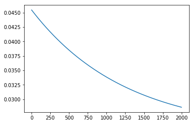
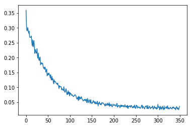

# 一、深度学习基础知识

**1、深度学习发展历史**
<br></br>
<center>
</center>  
<br></br>
  
  我们将深度学习分为三个历史阶段：
 
  
    起源阶段：
    1943年，心里学家麦卡洛克和数学逻辑学家皮兹发表论文《神经活动中内在思想的逻辑演算》，提出了MP模型。MP模型是模仿神经元的结构和工作原理，构成出的一个基于神经网络的数学模型，本质上是一种“模拟人类大脑”的神经元模型。MP模型作为人工神经网络的起源，开创了人工神经网络的新时代，也奠定了神经网络模型的基础。
    
    1949年，加拿大著名心理学家唐纳德·赫布在《行为的组织》中提出了一种基于无监督学习的规则——海布学习规则(Hebb Rule)。为以后的神经网络学习算法奠定了基础，具有重大的历史意义。
    
    20世纪50年代末，在MP模型和海布学习规则的研究基础上，美国科学家罗森布拉特发现了一种类似于人类学习过程的学习算法——感知机学习。并于1958年，正式提出了由两层神经元组成的神经网络，称之为“感知器”。感知器本质上是一种线性模型，可以对输入的训练集数据进行二分类，且能够在训练集中自动更新权值。
 
但由于异或问题这类线性不可分问题的无法解决，人工智能迎来第一个寒冬。
	  
    发展阶段：
    1982年，著名物理学家约翰·霍普菲尔德发明了Hopfield神经网络。Hopfield神经网络是一种结合存储系统和二元系统的循环神经网络。Hopfield网络也可以模拟人类的记忆，根据激活函数的选取不同，有连续型和离散型两种类型，分别用于优化计算和联想记忆。但由于容易陷入局部最小值的缺陷，该算法并未在当时引起很大的轰动。

    1986年，深度学习之父杰弗里·辛顿提出了一种适用于多层感知器的反向传播算法——BP算法。BP算法在传统神经网络正向传播的基础上，增加了误差的反向传播过程。反向传播过程不断地调整神经元之间的权值和阈值，直到输出的误差达到减小到允许的范围之内，或达到预先设定的训练次数为止。BP算法完美的解决了非线性分类问题，让人工神经网络再次的引起了人们广泛的关注。
    
但随后因为算力的限制和“梯度消失”等问题的出现，以及SVM等浅层学习的算法出现，神经网络的研究再次进入瓶颈期。

	  爆发阶段：
     2006年，杰弗里·辛顿以及他的学生鲁斯兰·萨拉赫丁诺夫正式提出了深度学习的概念。他们在世界顶级学术期刊《科学》发表的一篇文章中详细的给出了“梯度消失”问题的解决方案——通过无监督的学习方法逐层训练算法，再使用有监督的反向传播算法进行调优。该深度学习方法的提出，立即在学术圈引起了巨大的反响，以斯坦福大学、多伦多大学为代表的众多世界知名高校纷纷投入巨大的人力、财力进行深度学习领域的相关研究。而后又在迅速蔓延到工业界中.

 	  2012年，在著名的ImageNet图像识别大赛中，杰弗里·辛顿领导的小组采用深度学习模型AlexNet一举夺冠。AlexNet采用ReLU激活函数，从根本上解决了梯度消失问题，并采用GPU极大的提高了模型的运算速度。同年，由斯坦福大学著名的吴恩达教授和世界顶尖计算机专家Jeff Dean共同主导的深度神经网络——DNN技术在图像识别领域取得了惊人的成绩，在ImageNet评测中成功的把错误率从26％降低到了15％。深度学习算法在世界大赛的脱颖而出，也再一次吸引了学术界和工业界对于深度学习领域的关注。

	  2014年，Facebook基于深度学习技术的DeepFace项目，在人脸识别方面的准确率已经能达到97%以上，跟人类识别的准确率几乎没有差别。这样的结果也再一次证明了深度学习算法在图像识别方面的一骑绝尘。

	  2016年，随着谷歌公司基于深度学习开发的AlphaGo以4:1的比分战胜了国际顶尖围棋高手李世石，深度学习的热度一时无两。后来，AlphaGo又接连和众多世界级围棋高手过招，均取得了完胜。这也证明了在围棋界，基于深度学习技术的机器人已经超越了人类。
-------
参考https://zhuanlan.zhihu.com/p/34472753

**2、人工智能、机器学习、深度学习有什么区别和联系?**

三者依次为包含关系：人工智能包含机器学习，机器学习是人工智能的一个分支，也是人工智能的核心；深度学习是机器学习的一个新兴的领域，在算力和数据库的发展支持下得到了快速的发展。概括来说，人工智能、机器学习和深度学习覆盖的技术范畴是逐层递减的。人工智能是最宽泛的概念。机器学习是当前比较有效的一种实现人工智能的方式。深度学习是机器学习算法中最热门的一个分支，近些年取得了显著的进展，并替代了大多数传统机器学习算法。
<br></br>
<center>  
</center>  
<br></br>


**3、神经元、单层感知机多层感知机**

**神经元**：神经网络中最基本的成分是神经元(neuron)模型，即上述所说的“简单单元”。在生物神经网络中，每个神经元与其他神经元相连，当它“兴奋”时，就会向相连的神经元发送化学物质，从而改变这些神经元内的电位；如果某神经元的电位超过了一个“阈值”，那么它就会被激活，即“兴奋”起来，向其他神经元发送化学物质。将其抽象为数学模型如下图所示：
<br></br>
<center>  
</center>  
<br></br>

即通过对n个输入信号，通过带权重的连接（connection）进行传递，将总的输入求和通过“激活函数”处理产生输出。

**单层感知机**：感知机是基础的线性二分类模型（即输出为两个状态），由两层神经元组成。感知机只有输出层神经元进行激活函数处理，即只拥有一层功能神经元。且激活函数为总的输入与阈值进行比较，从而产生两种输出，用作二分类。

**多层感知机**： 多层感知机（MLP，Multilayer Perceptron）也叫人工神经网络（ANN，Artificial Neural Network），除了输入输出层，它中间可以有多个隐层，最简单的MLP只含一个隐层，即三层的结构，如下图：
<br></br>
<center>    
</center>  
<br></br>

MLP并没有规定隐层的数量，因此可以根据各自的需求选择合适的隐层层数。且对于输出层神经元的个数也没有限制。

**4、什么是前向传播(包含图文示例)？**
<br></br>
<center>     
</center>  
<br></br>

如图所示，这里讲得已经很清楚了，前向传播的思想比较简单。
举个例子，假设上一层结点i,j,k,…等一些结点与本层的结点w有连接，那么结点w的值怎么算呢？就是通过上一层的i,j,k等结点以及对应的连接权值进行加权和运算，最终结果再加上一个偏置项（图中为了简单省略了），最后在通过一个非线性函数（即激活函数），如ReLu，sigmoid等函数，最后得到的结果就是本层结点w的输出。
最终不断的通过这种方法一层层的运算，得到输出层结果。

对于前向传播来说，不管维度多高，其过程都可以用如下公式表示：$a^2=σ(z^2)=σ(a^1*W^2+b^2)$

其中，上标代表层数，星号表示卷积，b表示偏置项bias，σ表示激活函数。


**5、什么是反向传播(包含图文示例)？**

BP算法(即误差反向传播算法)适合于多层神经元网络的一种学习算法，它建立在梯度下降法的基础上。

BP算法的学习过程由正向传播过程和反向传播过程组成。在正向传播过程中，输入信息通过输入层经隐含层，逐层处理并传向输出层。如果在输出层得不到期望的输出值，则取输出与期望的误差的平方和作为目标函数，转入反向传播，逐层求出目标函数对各神经元权值的偏导数，构成目标函数对权值向量的梯量，作为修改权值的依据，网络的学习在权值修改过程中完成。误差达到所期望值时，网络学习结束。

具体过程如下：

假设有一个网络：
<br></br>
<center>     
</center>  
<br></br>

其中，每个神经元有两个单元，第一个单元是对其输入信号和对应的权重的乘积求和，第二单元就是激活函数，它的输出就是整个神经元的输出。
<br></br>
<center>     
</center>  

开始输入
<center>     
</center> 
<center>     
</center> 
<center>     
</center> 

然后信号传播到输出层，信号加权求和然后通过激活函数计算，输出最终结果。

以上就是前向传播的过程，接下来是计算误差的向前传播时，每个神经元所贡献的误差，反向传播的名字也由此而来。

神经网络模型的预测结果是y，而真实值是z，那么最终的误差为 δ = z − y。
在之前，几乎不可能直接计算中间层的神经元的误差，因为它们的输出值是未知的，而反向传播算法解决了这个问题，从最终结果的误差，一步步反推中间神经元的误差。

<center>     
</center> 
<center>     
</center>
<center>     
</center>

当每个神经元的误差都被计算出来后，神经元之间连接的权重就可以被更新了。这里的 η 表示学习速率，是人为设置的一个参数。这里可以理解为，新的权重，在之前的基础上，在神经元的梯度方向上前进一小步。
<center>     
</center>
<center>     
</center>
<center>     
</center>
<center>     
</center>
<br></br>


# 房价预测任务

## 线性回归模型

假设房价和影响因素之间能够用线性关系来描述：

$$y = {\sum_{j=1}^Mx_j w_j} + b$$

模型的求解即是通过数据拟合出每个$w_j$和$b$。其中，$w_j$和$b$分别表示该线性模型的权重和偏置。一维情况下，$w_j$ 和 $b$ 是直线的斜率和截距。

线性回归模型使用均方误差作为损失函数（Loss），用以衡量预测房价和真实房价的差异，公式如下：

$$MSE = \frac{1}{n} \sum_{i=1}^n(\hat{Y_i} - {Y_i})^{2}$$


```
import numpy as np
import matplotlib.pyplot as plt
```

## 数据处理

数据处理包含五个部分：数据导入、数据形状变换、数据集划分、数据归一化处理和封装`load data`函数。数据预处理后，才能被模型调用。

------
**说明：**

* 本教程中的代码都可以在AI Studio上直接运行，Print结果都是基于程序真实运行的结果。
* 由于是真实案例，代码之间存在依赖关系，因此需要读者逐条、全部运行，否则会导致命令执行报错。

------

### 读入数据

通过如下代码读入数据，了解下波士顿房价的数据集结构，数据存放在本地目录下housing.data文件中。


```
import zipfile

# zip_src: 需要解压的文件路径
# dst_dir: 解压后文件存放路径
def unzip_file(zip_src, dst_dir):
	r = zipfile.is_zipfile(zip_src)
	if r:
		fz = zipfile.ZipFile(zip_src, 'r')
		for file in fz.namelist():
			fz.extract(file, dst_dir)
	else:
		print('This is not a zip file !!!')


unzip_file('./data/data269/房价预测.zip', './data/data')
```


```
fname = 'data/data/房价预测/data/data.txt'
data = np.loadtxt(fname, delimiter=',',dtype='float64')
data
```


    array([[ 98.87, 599.  ],
           [ 68.74, 450.  ],
           [ 89.24, 440.  ],
           ...,
           [ 89.  , 735.  ],
           [ 59.53, 360.  ],
           [ 97.  , 600.  ]])


### 数据集划分

将数据集划分成训练集和测试集，其中训练集用于确定模型的参数，测试集用于评判模型的效果。为什么要对数据集进行拆分，而不能直接应用于模型训练呢？这与学生时代的授课和考试关系比较类似，如 **图4** 所示。

<center></center>
<center><br>图4：训练集和测试集拆分的意义</br></center>
<br></br>

上学时总有一些自作聪明的同学，平时不认真学习，考试前临阵抱佛脚，将习题死记硬背下来，但是成绩往往并不好。因为学校期望学生掌握的是知识，而不仅仅是习题本身。另出新的考题，才能鼓励学生努力去掌握习题背后的原理。同样我们期望模型学习的是任务的本质规律，而不是训练数据本身，模型训练未使用的数据，才能更真实的评估模型的效果。

在本案例中，我们将80%的数据用作训练集，20%用作测试集，实现代码如下。通过打印训练集的形状，可以发现共有870个样本，每个样本含有1个特征和1个预测值。


```
ratio = 0.8
offset = int(data.shape[0] * ratio)
training_data = data[:offset]
test_data = data[offset:]
training_data.shape
```


    (696, 2)


```
def load_data():
    # 从文件导入数据
    fname = 'data/data/房价预测/data/data.txt'
    data = np.loadtxt(fname, delimiter=',',dtype='float64')
    
   
    # 将原数据集拆分成训练集和测试集
    # 这里使用80%的数据做训练，20%的数据做测试
    # 测试集和训练集必须是没有交集的
    ratio = 0.8
    offset = int(data.shape[0] * ratio)
    training_data = data[:offset]

    # 计算训练集的最大值，最小值，平均值
    maximums, minimums, avgs = training_data.max(axis=0), training_data.min(axis=0), \
                                 training_data.sum(axis=0) / training_data.shape[0]
    feature_num = 2
    # 对数据进行归一化处理
    for i in range(feature_num):
        #print(maximums[i], minimums[i], avgs[i])
        data[:, i] = (data[:, i] - minimums[i]) / (maximums[i] - minimums[i])
    
     # 因为数据为一个特征所以我们需要加一个偏置作为一个恒定输入
    a = data[:,0]
    b = np.ones(870)/5
    c = np.c_[a,b]
    d = data[:,1]
    data = np.c_[c,d]

    # 训练集和测试集的划分比例
    training_data = data[:offset]
    test_data = data[offset:]
    return training_data, test_data
```


```
# 获取数据
training_data, test_data = load_data()
b = np.ones(870)
x = training_data[:, :-1]
y = training_data[:, -1:]
x[0]
```


    array([0.36767373, 0.2       ])


## 模型设计

模型设计是深度学习模型关键要素之一，也称为网络结构设计，相当于模型的假设空间，即实现模型“前向计算”（从输入到输出）的过程。

如果将输入特征和输出预测值均以向量表示，输入特征$x$有2个分量，$y$有1个分量，那么参数权重的形状（shape）是$2\times1$。假设我们以如下任意数字赋值参数做初始化：
$$w=[0.1, 0.2]$$


```
class Network(object):
    def __init__(self, num_of_weights):
        # 随机产生w的初始值
        # 为了保持程序每次运行结果的一致性，此处设置固定的随机数种子
        np.random.seed(0)
        self.w = np.random.randn(num_of_weights, 1)
        
    def forward(self, x):
        self.w[0]=0
        z = np.dot(x, self.w)
        return z
    
    def loss(self, z, y):
        error = z - y
        num_samples = error.shape[0]
        cost = error * error
        cost = np.sum(cost) / num_samples
        return cost
    
    def gradient(self, x, y):
        z = self.forward(x)
        N = x.shape[0]
        gradient_w = 1. / N * np.sum((z-y) * x, axis=0)
        gradient_w = gradient_w[:, np.newaxis]
        return gradient_w
    
    def update(self, gradient_w,eta = 0.01):
        self.w = self.w - eta * gradient_w

        
    def train(self, x, y, iterations=1000, eta=0.01):
        points = []
        losses = []
        for i in range(iterations):
            points.append(self.w)
            z = self.forward(x)
            L = self.loss(z, y)
            gradient_w = self.gradient(x, y)
            self.update(gradient_w, eta)
            losses.append(L)
            if i % 50 == 0:
                print(f'iter:{i}, point:{self.w[:,0]}, loss:{L}')
        return points, losses

# 获取数据
train_data, test_data = load_data()
x = train_data[:, :-1]
y = train_data[:, -1:]
# 创建网络
net = Network(2)
num_iterations=2000
# 启动训练
points, losses = net.train(x, y, iterations=num_iterations, eta=0.01)

# 画出损失函数的变化趋势
plot_x = np.arange(num_iterations)
plot_y = np.array(losses)
plt.plot(plot_x, plot_y)
plt.show()
```

    iter:0, point:[0.00075471 0.4004477 ], loss:0.045452453517784853
    iter:50, point:[0.00074502 0.41482487], loss:0.044625116870524534
    iter:100, point:[0.00073552 0.4289173 ], loss:0.043830226918054466
    iter:150, point:[0.00072621 0.44273063], loss:0.04306651115781323
    iter:200, point:[0.00071708 0.45627038], loss:0.042332746992561905
    iter:250, point:[0.00070813 0.46954198], loss:0.041627759773184767
    iter:300, point:[0.00069937 0.48255072], loss:0.0409504209182478
    iter:350, point:[0.00069077 0.49530183], loss:0.040299646107304896
    iter:400, point:[0.00068235 0.50780039], loss:0.03967439354505939
    iter:450, point:[0.00067409 0.52005142], loss:0.03907366229360215
    iter:500, point:[0.00066599 0.53205982], loss:0.038496490670056435
    iter:550, point:[0.00065806 0.54383038], loss:0.03794195470706413
    iter:600, point:[0.00065028 0.55536783], loss:0.03740916667364924
    iter:650, point:[0.00064266 0.56667677], loss:0.0368972736540904
    iter:700, point:[0.00063519 0.57776174], loss:0.03640545618252751
    iter:750, point:[0.00062786 0.58862717], loss:0.035932926931116785
    iter:800, point:[0.00062068 0.5992774 ], loss:0.035478929449634024
    iter:850, point:[0.00061365 0.6097167 ], loss:0.035042736954508394
    iter:900, point:[6.06747568e-04 6.19949255e-01], loss:0.034623651165348227
    iter:950, point:[5.99986574e-04 6.29979148e-01], loss:0.03422100118709626
    iter:1000, point:[5.93359484e-04 6.39810396e-01], loss:0.033834142436024825
    iter:1050, point:[5.86863644e-04 6.49446934e-01], loss:0.033462455607851424
    iter:1100, point:[5.80496457e-04 6.58892617e-01], loss:0.033105345686323256
    iter:1150, point:[5.74255373e-04 6.68151227e-01], loss:0.0327622409906832
    iter:1200, point:[5.68137895e-04 6.77226468e-01], loss:0.03243259226049252
    iter:1250, point:[5.62141576e-04 6.86121971e-01], loss:0.03211587177634523
    iter:1300, point:[5.56264015e-04 6.94841297e-01], loss:0.0318115725150665
    iter:1350, point:[5.50502860e-04 7.03387934e-01], loss:0.03151920733804273
    iter:1400, point:[5.44855807e-04 7.11765303e-01], loss:0.03123830821138382
    iter:1450, point:[5.39320595e-04 7.19976756e-01], loss:0.030968425456669436
    iter:1500, point:[5.33895009e-04 7.28025579e-01], loss:0.03070912703107956
    iter:1550, point:[5.28576879e-04 7.35914993e-01], loss:0.03045999783575716
    iter:1600, point:[5.23364075e-04 7.43648156e-01], loss:0.030220639051295607
    iter:1650, point:[5.18254512e-04 7.51228161e-01], loss:0.02999066749928714
    iter:1700, point:[5.13246145e-04 7.58658042e-01], loss:0.029769715028910283
    iter:1750, point:[5.08336970e-04 7.65940773e-01], loss:0.0295574279275742
    iter:1800, point:[5.03525023e-04 7.73079268e-01], loss:0.029353466354676592
    iter:1850, point:[4.98808378e-04 7.80076382e-01], loss:0.02915750379756859
    iter:1900, point:[4.94185146e-04 7.86934917e-01], loss:0.02896922654885573
    iter:1950, point:[4.89653479e-04 7.93657618e-01], loss:0.02878833320419833





```
import numpy as np
class Network(object):
    def __init__(self, num_of_weights):
        # 随机产生w的初始值
        # 为了保持程序每次运行结果的一致性，此处设置固定的随机数种子
        #np.random.seed(0)
        self.w = np.random.randn(num_of_weights, 1)

    # 前向传播过程
    def forward(self, x):
        z = np.dot(x, self.w)
        return z
    
    # 均方差损失函数
    def loss(self, z, y):
        error = z - y
        num_samples = error.shape[0]
        cost = error * error
        cost = np.sum(cost) / num_samples
        return cost
    
    # 梯度下降法
    def gradient(self, x, y):
        z = self.forward(x)
        N = x.shape[0]
        gradient_w = 1. / N * np.sum((z-y) * x, axis=0)
        gradient_w = gradient_w[:, np.newaxis]
       
        return gradient_w
    
    # 参数更新公式
    def update(self, gradient_w, eta = 0.01):
        self.w = self.w - eta * gradient_w
        
            
    # 训练过程            
    def train(self, training_data, num_epoches, batch_size=10, eta=0.01):
        n = len(training_data)
        losses = []
        for epoch_id in range(num_epoches):
            # 在每轮迭代开始之前，将训练数据的顺序随机的打乱，
            # 然后再按每次取batch_size条数据的方式取出
            np.random.shuffle(training_data)
            # 将训练数据进行拆分，每个mini_batch包含batch_size条的数据
            mini_batches = [training_data[k:k+batch_size] for k in range(0, n, batch_size)]
            for iter_id, mini_batch in enumerate(mini_batches):
                #print(self.w.shape)
                #print(self.b)
                x = mini_batch[:, :-1]
                y = mini_batch[:, -1:]
                a = self.forward(x)
                loss = self.loss(a, y)
                gradient_w= self.gradient(x, y)
                self.update(gradient_w, eta)
                losses.append(loss)
                print('Epoch {:3d} / iter {:3d}, loss = {:.4f}'.
                                 format(epoch_id, iter_id, loss))
        
        return losses

# 获取数据
train_data, test_data = load_data()

# 创建网络
net = Network(2)
# 启动训练
losses = net.train(train_data, num_epoches=50, batch_size=100, eta=0.05)

# 画出损失函数的变化趋势
plot_x = np.arange(len(losses))
plot_y = np.array(losses)
plt.plot(plot_x, plot_y)
plt.show()

```

    Epoch   0 / iter   0, loss = 0.3592
    Epoch   0 / iter   1, loss = 0.3061
    Epoch   0 / iter   2, loss = 0.2902
    Epoch   0 / iter   3, loss = 0.2916
    Epoch   0 / iter   4, loss = 0.3011
    Epoch   0 / iter   5, loss = 0.2894
    Epoch   0 / iter   6, loss = 0.2820
    Epoch   1 / iter   0, loss = 0.2887
    Epoch   1 / iter   1, loss = 0.2710
    Epoch   1 / iter   2, loss = 0.2675
    Epoch   1 / iter   3, loss = 0.2687
    Epoch   1 / iter   4, loss = 0.2684
    Epoch   1 / iter   5, loss = 0.2720
    Epoch   1 / iter   6, loss = 0.2540
    Epoch   2 / iter   0, loss = 0.2398
    Epoch   2 / iter   1, loss = 0.2593
    Epoch   2 / iter   2, loss = 0.2365
    Epoch   2 / iter   3, loss = 0.2479
    Epoch   2 / iter   4, loss = 0.2568
    Epoch   2 / iter   5, loss = 0.2344
    Epoch   2 / iter   6, loss = 0.2139
    Epoch   3 / iter   0, loss = 0.2272
    Epoch   3 / iter   1, loss = 0.2221
    Epoch   3 / iter   2, loss = 0.2148
    Epoch   3 / iter   3, loss = 0.2152
    Epoch   3 / iter   4, loss = 0.2301
    Epoch   3 / iter   5, loss = 0.2045
    Epoch   3 / iter   6, loss = 0.1984
    Epoch   4 / iter   0, loss = 0.2151
    Epoch   4 / iter   1, loss = 0.1936
    Epoch   4 / iter   2, loss = 0.1902
    Epoch   4 / iter   3, loss = 0.1991
    Epoch   4 / iter   4, loss = 0.2018
    Epoch   4 / iter   5, loss = 0.1756
    Epoch   4 / iter   6, loss = 0.1822
    Epoch   5 / iter   0, loss = 0.1825
    Epoch   5 / iter   1, loss = 0.1785
    Epoch   5 / iter   2, loss = 0.1818
    Epoch   5 / iter   3, loss = 0.1794
    Epoch   5 / iter   4, loss = 0.1685
    Epoch   5 / iter   5, loss = 0.1642
    Epoch   5 / iter   6, loss = 0.1664
    Epoch   6 / iter   0, loss = 0.1608
    Epoch   6 / iter   1, loss = 0.1686
    Epoch   6 / iter   2, loss = 0.1640
    Epoch   6 / iter   3, loss = 0.1513
    Epoch   6 / iter   4, loss = 0.1567
    Epoch   6 / iter   5, loss = 0.1610
    Epoch   6 / iter   6, loss = 0.1387
    Epoch   7 / iter   0, loss = 0.1433
    Epoch   7 / iter   1, loss = 0.1472
    Epoch   7 / iter   2, loss = 0.1416
    Epoch   7 / iter   3, loss = 0.1484
    Epoch   7 / iter   4, loss = 0.1426
    Epoch   7 / iter   5, loss = 0.1412
    Epoch   7 / iter   6, loss = 0.1320
    Epoch   8 / iter   0, loss = 0.1426
    Epoch   8 / iter   1, loss = 0.1276
    Epoch   8 / iter   2, loss = 0.1244
    Epoch   8 / iter   3, loss = 0.1370
    Epoch   8 / iter   4, loss = 0.1254
    Epoch   8 / iter   5, loss = 0.1291
    Epoch   8 / iter   6, loss = 0.1180
    Epoch   9 / iter   0, loss = 0.1119
    Epoch   9 / iter   1, loss = 0.1256
    Epoch   9 / iter   2, loss = 0.1181
    Epoch   9 / iter   3, loss = 0.1199
    Epoch   9 / iter   4, loss = 0.1189
    Epoch   9 / iter   5, loss = 0.1159
    Epoch   9 / iter   6, loss = 0.1128
    Epoch  10 / iter   0, loss = 0.1130
    Epoch  10 / iter   1, loss = 0.1098
    Epoch  10 / iter   2, loss = 0.1147
    Epoch  10 / iter   3, loss = 0.1074
    Epoch  10 / iter   4, loss = 0.1056
    Epoch  10 / iter   5, loss = 0.0958
    Epoch  10 / iter   6, loss = 0.1056
    Epoch  11 / iter   0, loss = 0.1018
    Epoch  11 / iter   1, loss = 0.1032
    Epoch  11 / iter   2, loss = 0.1018
    Epoch  11 / iter   3, loss = 0.1019
    Epoch  11 / iter   4, loss = 0.0919
    Epoch  11 / iter   5, loss = 0.0960
    Epoch  11 / iter   6, loss = 0.0924
    Epoch  12 / iter   0, loss = 0.0927
    Epoch  12 / iter   1, loss = 0.0888
    Epoch  12 / iter   2, loss = 0.1022
    Epoch  12 / iter   3, loss = 0.0934
    Epoch  12 / iter   4, loss = 0.0842
    Epoch  12 / iter   5, loss = 0.0838
    Epoch  12 / iter   6, loss = 0.0890
    Epoch  13 / iter   0, loss = 0.0956
    Epoch  13 / iter   1, loss = 0.0879
    Epoch  13 / iter   2, loss = 0.0762
    Epoch  13 / iter   3, loss = 0.0824
    Epoch  13 / iter   4, loss = 0.0759
    Epoch  13 / iter   5, loss = 0.0887
    Epoch  13 / iter   6, loss = 0.0788
    Epoch  14 / iter   0, loss = 0.0840
    Epoch  14 / iter   1, loss = 0.0711
    Epoch  14 / iter   2, loss = 0.0823
    Epoch  14 / iter   3, loss = 0.0771
    Epoch  14 / iter   4, loss = 0.0795
    Epoch  14 / iter   5, loss = 0.0756
    Epoch  14 / iter   6, loss = 0.0730
    Epoch  15 / iter   0, loss = 0.0754
    Epoch  15 / iter   1, loss = 0.0718
    Epoch  15 / iter   2, loss = 0.0701
    Epoch  15 / iter   3, loss = 0.0691
    Epoch  15 / iter   4, loss = 0.0717
    Epoch  15 / iter   5, loss = 0.0717
    Epoch  15 / iter   6, loss = 0.0755
    Epoch  16 / iter   0, loss = 0.0746
    Epoch  16 / iter   1, loss = 0.0733
    Epoch  16 / iter   2, loss = 0.0693
    Epoch  16 / iter   3, loss = 0.0636
    Epoch  16 / iter   4, loss = 0.0602
    Epoch  16 / iter   5, loss = 0.0635
    Epoch  16 / iter   6, loss = 0.0677
    Epoch  17 / iter   0, loss = 0.0554
    Epoch  17 / iter   1, loss = 0.0703
    Epoch  17 / iter   2, loss = 0.0585
    Epoch  17 / iter   3, loss = 0.0676
    Epoch  17 / iter   4, loss = 0.0647
    Epoch  17 / iter   5, loss = 0.0608
    Epoch  17 / iter   6, loss = 0.0658
    Epoch  18 / iter   0, loss = 0.0687
    Epoch  18 / iter   1, loss = 0.0618
    Epoch  18 / iter   2, loss = 0.0600
    Epoch  18 / iter   3, loss = 0.0580
    Epoch  18 / iter   4, loss = 0.0543
    Epoch  18 / iter   5, loss = 0.0559
    Epoch  18 / iter   6, loss = 0.0585
    Epoch  19 / iter   0, loss = 0.0567
    Epoch  19 / iter   1, loss = 0.0601
    Epoch  19 / iter   2, loss = 0.0543
    Epoch  19 / iter   3, loss = 0.0577
    Epoch  19 / iter   4, loss = 0.0608
    Epoch  19 / iter   5, loss = 0.0488
    Epoch  19 / iter   6, loss = 0.0562
    Epoch  20 / iter   0, loss = 0.0630
    Epoch  20 / iter   1, loss = 0.0484
    Epoch  20 / iter   2, loss = 0.0513
    Epoch  20 / iter   3, loss = 0.0558
    Epoch  20 / iter   4, loss = 0.0581
    Epoch  20 / iter   5, loss = 0.0508
    Epoch  20 / iter   6, loss = 0.0468
    Epoch  21 / iter   0, loss = 0.0586
    Epoch  21 / iter   1, loss = 0.0523
    Epoch  21 / iter   2, loss = 0.0469
    Epoch  21 / iter   3, loss = 0.0455
    Epoch  21 / iter   4, loss = 0.0496
    Epoch  21 / iter   5, loss = 0.0485
    Epoch  21 / iter   6, loss = 0.0556
    Epoch  22 / iter   0, loss = 0.0515
    Epoch  22 / iter   1, loss = 0.0505
    Epoch  22 / iter   2, loss = 0.0464
    Epoch  22 / iter   3, loss = 0.0526
    Epoch  22 / iter   4, loss = 0.0445
    Epoch  22 / iter   5, loss = 0.0491
    Epoch  22 / iter   6, loss = 0.0464
    Epoch  23 / iter   0, loss = 0.0444
    Epoch  23 / iter   1, loss = 0.0538
    Epoch  23 / iter   2, loss = 0.0471
    Epoch  23 / iter   3, loss = 0.0380
    Epoch  23 / iter   4, loss = 0.0469
    Epoch  23 / iter   5, loss = 0.0461
    Epoch  23 / iter   6, loss = 0.0510
    Epoch  24 / iter   0, loss = 0.0438
    Epoch  24 / iter   1, loss = 0.0421
    Epoch  24 / iter   2, loss = 0.0453
    Epoch  24 / iter   3, loss = 0.0411
    Epoch  24 / iter   4, loss = 0.0485
    Epoch  24 / iter   5, loss = 0.0468
    Epoch  24 / iter   6, loss = 0.0473
    Epoch  25 / iter   0, loss = 0.0485
    Epoch  25 / iter   1, loss = 0.0455
    Epoch  25 / iter   2, loss = 0.0439
    Epoch  25 / iter   3, loss = 0.0441
    Epoch  25 / iter   4, loss = 0.0396
    Epoch  25 / iter   5, loss = 0.0372
    Epoch  25 / iter   6, loss = 0.0452
    Epoch  26 / iter   0, loss = 0.0412
    Epoch  26 / iter   1, loss = 0.0392
    Epoch  26 / iter   2, loss = 0.0430
    Epoch  26 / iter   3, loss = 0.0471
    Epoch  26 / iter   4, loss = 0.0396
    Epoch  26 / iter   5, loss = 0.0436
    Epoch  26 / iter   6, loss = 0.0404
    Epoch  27 / iter   0, loss = 0.0484
    Epoch  27 / iter   1, loss = 0.0361
    Epoch  27 / iter   2, loss = 0.0436
    Epoch  27 / iter   3, loss = 0.0388
    Epoch  27 / iter   4, loss = 0.0386
    Epoch  27 / iter   5, loss = 0.0431
    Epoch  27 / iter   6, loss = 0.0366
    Epoch  28 / iter   0, loss = 0.0345
    Epoch  28 / iter   1, loss = 0.0371
    Epoch  28 / iter   2, loss = 0.0436
    Epoch  28 / iter   3, loss = 0.0401
    Epoch  28 / iter   4, loss = 0.0400
    Epoch  28 / iter   5, loss = 0.0398
    Epoch  28 / iter   6, loss = 0.0426
    Epoch  29 / iter   0, loss = 0.0386
    Epoch  29 / iter   1, loss = 0.0379
    Epoch  29 / iter   2, loss = 0.0368
    Epoch  29 / iter   3, loss = 0.0430
    Epoch  29 / iter   4, loss = 0.0462
    Epoch  29 / iter   5, loss = 0.0335
    Epoch  29 / iter   6, loss = 0.0346
    Epoch  30 / iter   0, loss = 0.0394
    Epoch  30 / iter   1, loss = 0.0380
    Epoch  30 / iter   2, loss = 0.0391
    Epoch  30 / iter   3, loss = 0.0366
    Epoch  30 / iter   4, loss = 0.0317
    Epoch  30 / iter   5, loss = 0.0393
    Epoch  30 / iter   6, loss = 0.0407
    Epoch  31 / iter   0, loss = 0.0351
    Epoch  31 / iter   1, loss = 0.0401
    Epoch  31 / iter   2, loss = 0.0358
    Epoch  31 / iter   3, loss = 0.0388
    Epoch  31 / iter   4, loss = 0.0366
    Epoch  31 / iter   5, loss = 0.0387
    Epoch  31 / iter   6, loss = 0.0338
    Epoch  32 / iter   0, loss = 0.0364
    Epoch  32 / iter   1, loss = 0.0417
    Epoch  32 / iter   2, loss = 0.0371
    Epoch  32 / iter   3, loss = 0.0334
    Epoch  32 / iter   4, loss = 0.0352
    Epoch  32 / iter   5, loss = 0.0379
    Epoch  32 / iter   6, loss = 0.0320
    Epoch  33 / iter   0, loss = 0.0398
    Epoch  33 / iter   1, loss = 0.0286
    Epoch  33 / iter   2, loss = 0.0366
    Epoch  33 / iter   3, loss = 0.0348
    Epoch  33 / iter   4, loss = 0.0359
    Epoch  33 / iter   5, loss = 0.0385
    Epoch  33 / iter   6, loss = 0.0353
    Epoch  34 / iter   0, loss = 0.0332
    Epoch  34 / iter   1, loss = 0.0396
    Epoch  34 / iter   2, loss = 0.0385
    Epoch  34 / iter   3, loss = 0.0338
    Epoch  34 / iter   4, loss = 0.0328
    Epoch  34 / iter   5, loss = 0.0308
    Epoch  34 / iter   6, loss = 0.0367
    Epoch  35 / iter   0, loss = 0.0339
    Epoch  35 / iter   1, loss = 0.0320
    Epoch  35 / iter   2, loss = 0.0408
    Epoch  35 / iter   3, loss = 0.0349
    Epoch  35 / iter   4, loss = 0.0290
    Epoch  35 / iter   5, loss = 0.0311
    Epoch  35 / iter   6, loss = 0.0402
    Epoch  36 / iter   0, loss = 0.0366
    Epoch  36 / iter   1, loss = 0.0372
    Epoch  36 / iter   2, loss = 0.0303
    Epoch  36 / iter   3, loss = 0.0329
    Epoch  36 / iter   4, loss = 0.0344
    Epoch  36 / iter   5, loss = 0.0330
    Epoch  36 / iter   6, loss = 0.0339
    Epoch  37 / iter   0, loss = 0.0295
    Epoch  37 / iter   1, loss = 0.0308
    Epoch  37 / iter   2, loss = 0.0304
    Epoch  37 / iter   3, loss = 0.0347
    Epoch  37 / iter   4, loss = 0.0396
    Epoch  37 / iter   5, loss = 0.0407
    Epoch  37 / iter   6, loss = 0.0294
    Epoch  38 / iter   0, loss = 0.0365
    Epoch  38 / iter   1, loss = 0.0345
    Epoch  38 / iter   2, loss = 0.0327
    Epoch  38 / iter   3, loss = 0.0293
    Epoch  38 / iter   4, loss = 0.0277
    Epoch  38 / iter   5, loss = 0.0352
    Epoch  38 / iter   6, loss = 0.0367
    Epoch  39 / iter   0, loss = 0.0355
    Epoch  39 / iter   1, loss = 0.0383
    Epoch  39 / iter   2, loss = 0.0289
    Epoch  39 / iter   3, loss = 0.0294
    Epoch  39 / iter   4, loss = 0.0395
    Epoch  39 / iter   5, loss = 0.0283
    Epoch  39 / iter   6, loss = 0.0298
    Epoch  40 / iter   0, loss = 0.0334
    Epoch  40 / iter   1, loss = 0.0365
    Epoch  40 / iter   2, loss = 0.0333
    Epoch  40 / iter   3, loss = 0.0280
    Epoch  40 / iter   4, loss = 0.0300
    Epoch  40 / iter   5, loss = 0.0336
    Epoch  40 / iter   6, loss = 0.0325
    Epoch  41 / iter   0, loss = 0.0330
    Epoch  41 / iter   1, loss = 0.0373
    Epoch  41 / iter   2, loss = 0.0280
    Epoch  41 / iter   3, loss = 0.0272
    Epoch  41 / iter   4, loss = 0.0321
    Epoch  41 / iter   5, loss = 0.0368
    Epoch  41 / iter   6, loss = 0.0307
    Epoch  42 / iter   0, loss = 0.0321
    Epoch  42 / iter   1, loss = 0.0292
    Epoch  42 / iter   2, loss = 0.0335
    Epoch  42 / iter   3, loss = 0.0268
    Epoch  42 / iter   4, loss = 0.0297
    Epoch  42 / iter   5, loss = 0.0291
    Epoch  42 / iter   6, loss = 0.0430
    Epoch  43 / iter   0, loss = 0.0329
    Epoch  43 / iter   1, loss = 0.0342
    Epoch  43 / iter   2, loss = 0.0330
    Epoch  43 / iter   3, loss = 0.0246
    Epoch  43 / iter   4, loss = 0.0366
    Epoch  43 / iter   5, loss = 0.0282
    Epoch  43 / iter   6, loss = 0.0316
    Epoch  44 / iter   0, loss = 0.0325
    Epoch  44 / iter   1, loss = 0.0262
    Epoch  44 / iter   2, loss = 0.0365
    Epoch  44 / iter   3, loss = 0.0312
    Epoch  44 / iter   4, loss = 0.0305
    Epoch  44 / iter   5, loss = 0.0248
    Epoch  44 / iter   6, loss = 0.0378
    Epoch  45 / iter   0, loss = 0.0270
    Epoch  45 / iter   1, loss = 0.0295
    Epoch  45 / iter   2, loss = 0.0308
    Epoch  45 / iter   3, loss = 0.0335
    Epoch  45 / iter   4, loss = 0.0349
    Epoch  45 / iter   5, loss = 0.0286
    Epoch  45 / iter   6, loss = 0.0333
    Epoch  46 / iter   0, loss = 0.0382
    Epoch  46 / iter   1, loss = 0.0274
    Epoch  46 / iter   2, loss = 0.0318
    Epoch  46 / iter   3, loss = 0.0286
    Epoch  46 / iter   4, loss = 0.0276
    Epoch  46 / iter   5, loss = 0.0286
    Epoch  46 / iter   6, loss = 0.0338
    Epoch  47 / iter   0, loss = 0.0303
    Epoch  47 / iter   1, loss = 0.0298
    Epoch  47 / iter   2, loss = 0.0298
    Epoch  47 / iter   3, loss = 0.0272
    Epoch  47 / iter   4, loss = 0.0334
    Epoch  47 / iter   5, loss = 0.0335
    Epoch  47 / iter   6, loss = 0.0304
    Epoch  48 / iter   0, loss = 0.0344
    Epoch  48 / iter   1, loss = 0.0303
    Epoch  48 / iter   2, loss = 0.0286
    Epoch  48 / iter   3, loss = 0.0311
    Epoch  48 / iter   4, loss = 0.0247
    Epoch  48 / iter   5, loss = 0.0292
    Epoch  48 / iter   6, loss = 0.0348
    Epoch  49 / iter   0, loss = 0.0347
    Epoch  49 / iter   1, loss = 0.0270
    Epoch  49 / iter   2, loss = 0.0314
    Epoch  49 / iter   3, loss = 0.0296
    Epoch  49 / iter   4, loss = 0.0245
    Epoch  49 / iter   5, loss = 0.0284
    Epoch  49 / iter   6, loss = 0.0360





# paddlepaddle实现房价预测

代码中参数含义如下：

* paddle：飞桨的主库，paddle 根目录下保留了常用API的别名，当前包括：paddle.tensor、paddle.framework目录下的所有API。

* paddle.nn：组网相关的API，例如 Linear 、卷积 Conv2D 、 循环神经网络 LSTM 、损失函数 CrossEntropyLoss 、 激活函数 ReLU 等。

* Linear：神经网络的全连接层函数，即包含所有输入权重相加的基本神经元结构。在房价预测任务中，使用只有一层的神经网络（全连接层）来实现线性回归模型。

* paddle.nn.functional：与paddle.nn一样，包含组网相关的API，例如Linear、激活函数ReLu等。两者下的同名模块功能相同，运行性能也基本一致。 但是，paddle.nn下的模块均是类，每个类下可以自带模块参数；paddle.nn.functional下的模块均是函数，需要手动传入模块计算需要的参数。在实际使用中，卷积、全连接层等层本身具有可学习的参数，建议使用paddle.nn模块，而激活函数、池化等操作没有可学习参数，可以考虑直接使用paddle.nn.functional下的函数代替。
<br></br>
------

**说明：**

飞桨支持两种深度学习建模编写方式，更方便调试的动态图模式和性能更好并便于部署的静态图模式。

* 动态图模式（命令式编程范式，类比Python）：解析式的执行方式。用户无需预先定义完整的网络结构，每写一行网络代码，即可同时获得计算结果。
* 静态图模式（声明式编程范式，类比C++）：先编译后执行的方式。用户需预先定义完整的网络结构，再对网络结构进行编译优化后，才能执行获得计算结果。

飞桨框架2.0及之后的版本，默认使用动态图模式进行编码，同时提供了全面完备的动转静支持。开发者仅需添加一个装饰器（ to_static ），飞桨会自动将动态图的程序，转换为静态图的program，并使用该program训练并可保存静态模型以实现推理部署。

------


```
#加载飞桨、Numpy和相关类库
import paddle
from paddle.nn import Linear
import paddle.nn.functional as F
import numpy as np
import os
import random
import paddle.fluid as fluid

```

## 数据处理


```
def load_data():
    # 从文件导入数据
    fname = 'data/data/房价预测/data/data.txt'
    data = np.loadtxt(fname, delimiter=',',dtype='float32')
    
   
    # 将原数据集拆分成训练集和测试集
    # 这里使用80%的数据做训练，20%的数据做测试
    # 测试集和训练集必须是没有交集的
    ratio = 0.8
    offset = int(data.shape[0] * ratio)
    training_data = data[:offset]

    # 计算训练集的最大值，最小值，平均值
    maximums, minimums, avgs = training_data.max(axis=0), training_data.min(axis=0), \
                                 training_data.sum(axis=0) / training_data.shape[0]
    feature_num = 2
    # 对数据进行归一化处理
    for i in range(feature_num):
        #print(maximums[i], minimums[i], avgs[i])
        data[:, i] = (data[:, i] - minimums[i]) / (maximums[i] - minimums[i])
    
    #  # 因为数据为一个特征所以我们需要加一个偏置作为一个恒定输入
    # a = data[:,0]
    # b = np.ones(870)/5
    # c = np.c_[a,b]
    # d = data[:,1]
    # data = np.c_[c,d]

    # 训练集和测试集的划分比例
    training_data = data[:offset]
    test_data = data[offset:]
    return training_data, test_data
```


模型定义的实质是定义线性回归的网络结构，飞桨建议通过创建Python类的方式完成模型网络的定义，该类需要继承paddle.nn.Layer父类，并且在类中定义``init``函数和``forward``函数。``forward``函数是框架指定实现前向计算逻辑的函数，程序在调用模型实例时会自动执行forward方法。在``forward``函数中使用的网络层需要在``init``函数中声明。

实现过程分如下两步：

1. **定义init函数**：在类的初始化函数中声明每一层网络的实现函数。在房价预测模型中，只需要定义一层全连接层，模型结构和使用Python和Numpy构建神经网络模型》章节模型保持一致。
1. **定义forward函数**：构建神经网络结构，实现前向计算过程，并返回预测结果，在本任务中返回的是房价预测结果。


```
class Regressor(paddle.nn.Layer):

    # self代表类的实例自身
    def __init__(self):
        # 初始化父类中的一些参数
        super(Regressor, self).__init__()
        
        # 定义一层全连接层，输入维度是13，输出维度是1
        
        self.fc1 = Linear(in_features=1, out_features=4)
        
        self.fc2 = Linear(in_features=4, out_features=1)
    
    # 网络的前向计算
    def forward(self, inputs):
        
        middle2 = self.fc1(inputs)
        paddle.to_tensor(middle2)
        m = paddle.nn.ReLU()
        out = m(middle2)
        x = self.fc2(out)
        return x
```

## 训练配置

训练配置过程包含四步，如 **图2** 所示：
<center></center>
<center><br>图2：训练配置流程示意图</br></center>
<br></br>

1. 声明定义好的回归模型Regressor实例，并将模型的状态设置为训练。
1. 使用load_data函数加载训练数据和测试数据。
1. 设置优化算法和学习率，优化算法采用随机梯度下降SGD，学习率设置为0.01。

训练配置代码如下所示：


```
# 声明定义好的线性回归模型
model = Regressor()
# 开启模型训练模式
model.train()
# 加载数据
training_data, test_data = load_data()
# 定义优化算法，使用随机梯度下降SGD
# 学习率设置为0.01
opt = paddle.optimizer.SGD(learning_rate=0.01, parameters=model.parameters())
```

------

**说明：**

模型实例有两种状态：训练状态``.train()``和预测状态``.eval()``。训练时要执行正向计算和反向传播梯度两个过程，而预测时只需要执行正向计算，为模型指定运行状态，有两点原因：

1. 部分高级的算子（例如Dropout和BatchNorm，在计算机视觉的章节会详细介绍）在两个状态执行的逻辑不同；
1. 从性能和存储空间的考虑，预测状态时更节省内存(无需记录反向梯度)，性能更好。

------

在基于Python实现神经网络模型的案例中，我们为实现梯度下降编写了大量代码，而使用飞桨框架只需要定义SGD就可以实现优化器设置，大大简化了这个过程。

## 训练过程

训练过程采用二层循环嵌套方式：

- **内层循环：** 负责整个数据集的一次遍历，采用分批次方式（batch）。假设数据集样本数量为1000，一个批次有10个样本，则遍历一次数据集的批次数量是1000/10=100，即内层循环需要执行100次。

        for iter_id, mini_batch in enumerate(mini_batches):

- **外层循环：** 定义遍历数据集的次数，通过参数EPOCH_NUM设置。

        for epoch_id in range(EPOCH_NUM):

------
**说明**:

batch的取值会影响模型训练效果。batch过大，会增大内存消耗和计算时间，且训练效果并不会明显提升（因为每次参数只向梯度反方向移动一小步，所以方向没必要特别精确）；batch过小，每个batch的样本数据将没有统计意义，计算的梯度方向可能偏差较大。由于房价预测模型的训练数据集较小，我们将batch为设置10。

------

每次内层循环都需要执行如下四个步骤，如 **图3** 所示，计算过程与使用Python编写模型完全一致。
<center></center>
<center><br>图3：内循环计算过程</br></center>
<br></br>

1. 数据准备：将一个批次的数据先转换成np.array格式，再转换成paddle内置tensor格式。
1. 前向计算：将一个批次的样本数据灌入网络中，计算输出结果。
1. 计算损失函数：以前向计算结果和真实房价作为输入，通过损失函数square_error_cost API计算出损失函数值（Loss）。飞桨所有的API接口都有完整的说明和使用案例，在后续教程中我们会详细介绍API的查阅方法。
1. 反向传播：执行梯度反向传播``backward``函数，即从后到前逐层计算每一层的梯度，并根据设置的优化算法更新参数。


```
EPOCH_NUM = 10   # 设置外层循环次数
BATCH_SIZE = 10  # 设置batch大小

# 定义外层循环
for epoch_id in range(EPOCH_NUM):
    # 在每轮迭代开始之前，将训练数据的顺序随机的打乱
    np.random.shuffle(training_data)
    # 将训练数据进行拆分，每个batch包含10条数据
    mini_batches = [training_data[k:k+BATCH_SIZE] for k in range(0, len(training_data), BATCH_SIZE)]
    # 定义内层循环
    for iter_id, mini_batch in enumerate(mini_batches):
        x = np.array(mini_batch[:, :-1]) # 获得当前批次训练数据
        y = np.array(mini_batch[:, -1:]) # 获得当前批次训练标签（真实房价）
        # 将numpy数据转为飞桨动态图tensor形式
        house_features = paddle.to_tensor(x)
        prices = paddle.to_tensor(y)
        
        # 前向计算
        predicts = model(house_features)
        
        # 计算损失
        loss = F.square_error_cost(predicts, label=prices)
        avg_loss = paddle.mean(loss)
        if iter_id%20==0:
            print("epoch: {}, iter: {}, loss is: {}".format(epoch_id, iter_id, avg_loss.numpy()))
        
        # 反向传播
        avg_loss.backward()
        # 最小化loss,更新参数
        opt.step()
        # 清除梯度
        opt.clear_grad()
```

    epoch: 0, iter: 0, loss is: [0.19077912]
    epoch: 0, iter: 20, loss is: [0.26821977]
    epoch: 0, iter: 40, loss is: [0.10774108]
    epoch: 0, iter: 60, loss is: [0.06238294]
    epoch: 1, iter: 0, loss is: [0.02389851]
    epoch: 1, iter: 20, loss is: [0.10332851]
    epoch: 1, iter: 40, loss is: [0.05110644]
    epoch: 1, iter: 60, loss is: [0.07717873]
    epoch: 2, iter: 0, loss is: [0.06780779]
    epoch: 2, iter: 20, loss is: [0.03951957]
    epoch: 2, iter: 40, loss is: [0.05023772]
    epoch: 2, iter: 60, loss is: [0.04566764]
    epoch: 3, iter: 0, loss is: [0.05174584]
    epoch: 3, iter: 20, loss is: [0.13672993]
    epoch: 3, iter: 40, loss is: [0.0810004]
    epoch: 3, iter: 60, loss is: [0.08541711]
    epoch: 4, iter: 0, loss is: [0.05637588]
    epoch: 4, iter: 20, loss is: [0.11330146]
    epoch: 4, iter: 40, loss is: [0.04999761]
    epoch: 4, iter: 60, loss is: [0.0425316]
    epoch: 5, iter: 0, loss is: [0.0291314]
    epoch: 5, iter: 20, loss is: [0.03193913]
    epoch: 5, iter: 40, loss is: [0.02953169]
    epoch: 5, iter: 60, loss is: [0.07679995]
    epoch: 6, iter: 0, loss is: [0.06592248]
    epoch: 6, iter: 20, loss is: [0.02056373]
    epoch: 6, iter: 40, loss is: [0.07544459]
    epoch: 6, iter: 60, loss is: [0.05759854]
    epoch: 7, iter: 0, loss is: [0.03330588]
    epoch: 7, iter: 20, loss is: [0.03034755]
    epoch: 7, iter: 40, loss is: [0.01952718]
    epoch: 7, iter: 60, loss is: [0.07346249]
    epoch: 8, iter: 0, loss is: [0.02260392]
    epoch: 8, iter: 20, loss is: [0.05158296]
    epoch: 8, iter: 40, loss is: [0.03655307]
    epoch: 8, iter: 60, loss is: [0.01882508]
    epoch: 9, iter: 0, loss is: [0.08805832]
    epoch: 9, iter: 20, loss is: [0.0167549]
    epoch: 9, iter: 40, loss is: [0.03234318]
    epoch: 9, iter: 60, loss is: [0.047973]


## 保存并测试模型

### 保存模型

将模型当前的参数数据``model.state_dict()``保存到文件中（通过参数指定保存的文件名 LR_model），以备预测或校验的程序调用，代码如下所示。


```
# 保存模型参数，文件名为LR_model.pdparams
paddle.save(model.state_dict(), 'LR_model.pdparams')
print("模型保存成功，模型参数保存在LR_model.pdparams中")
```

    模型保存成功，模型参数保存在LR_model.pdparams中


理论而言，直接使用模型实例即可完成预测，而本教程中预测的方式为什么是先保存模型，再加载模型呢？这是因为在实际应用中，训练模型和使用模型往往是不同的场景。模型训练通常使用大量的线下服务器（不对外向企业的客户/用户提供在线服务），而模型预测则通常使用线上提供预测服务的服务器，或者将已经完成的预测模型嵌入手机或其他终端设备中使用。因此本教程的讲解方式更贴合真实场景的使用方法。

回顾下基于飞桨实现的房价预测模型，实现效果与之前基于Python实现的模型没有区别，但两者的实现成本有天壤之别。飞桨的愿景是用户只需要了解模型的逻辑概念，不需要关心实现细节，就能搭建强大的模型。

### 测试模型

下面我们选择一条数据样本，测试下模型的预测效果。测试过程和在应用场景中使用模型的过程一致，主要可分成如下三个步骤：

1. 配置模型预测的机器资源。本案例默认使用本机，因此无需写代码指定。
1. 将训练好的模型参数加载到模型实例中。由两个语句完成，第一句是从文件中读取模型参数；第二句是将参数内容加载到模型。加载完毕后，需要将模型的状态调整为``eval()``（校验）。上文中提到，训练状态的模型需要同时支持前向计算和反向传导梯度，模型的实现较为臃肿，而校验和预测状态的模型只需要支持前向计算，模型的实现更加简单，性能更好。
1. 将待预测的样本特征输入到模型中，打印输出的预测结果。

通过``load_one_example``函数实现从数据集中抽一条样本作为测试样本，具体实现代码如下所示。


```
def load_one_example():
    # 从上边已加载的测试集中，随机选择一条作为测试数据
    idx = np.random.randint(0, test_data.shape[0])
    idx = -10
    one_data, label = test_data[idx, :-1], test_data[idx, -1]
    # 修改该条数据shape为[1,13]
    one_data =  one_data.reshape([1,-1])

    return one_data, label

```


```
# 参数为保存模型参数的文件地址
model_dict = paddle.load('LR_model.pdparams')
model.load_dict(model_dict)
model.eval()

# 参数为数据集的文件地址
one_data, label = load_one_example()
# 将数据转为动态图的variable格式 
one_data = paddle.to_tensor(one_data)
predict = model(one_data)

# 对结果做反归一化处理
predict = predict * (max_values[-1] - min_values[-1]) + avg_values[-1]
# 对label数据做反归一化处理
label = label * (max_values[-1] - min_values[-1]) + avg_values[-1]

print("Inference result is {}, the corresponding label is {}".format(predict.numpy(), label))
```


    ---------------------------------------------------------------------------

    NameError                                 Traceback (most recent call last)

    <ipython-input-16-2c02b4d79248> in <module>
         11 
         12 # 对结果做反归一化处理
    ---> 13 predict = predict * (max_values[-1] - min_values[-1]) + avg_values[-1]
         14 # 对label数据做反归一化处理
         15 label = label * (max_values[-1] - min_values[-1]) + avg_values[-1]


    NameError: name 'max_values' is not defined

